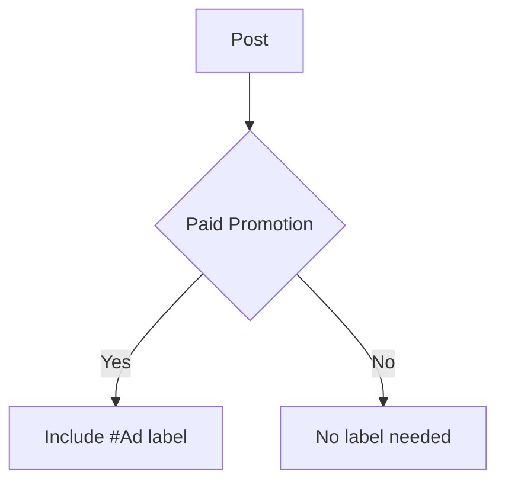
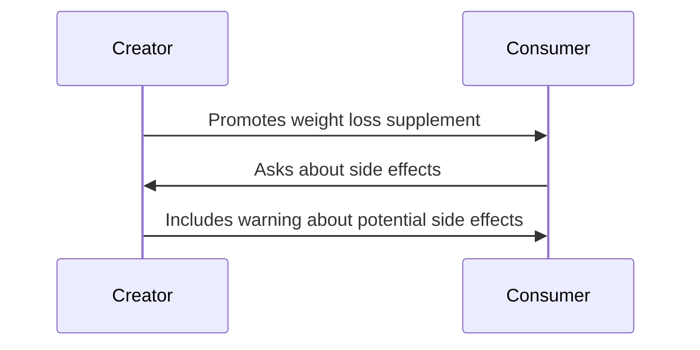
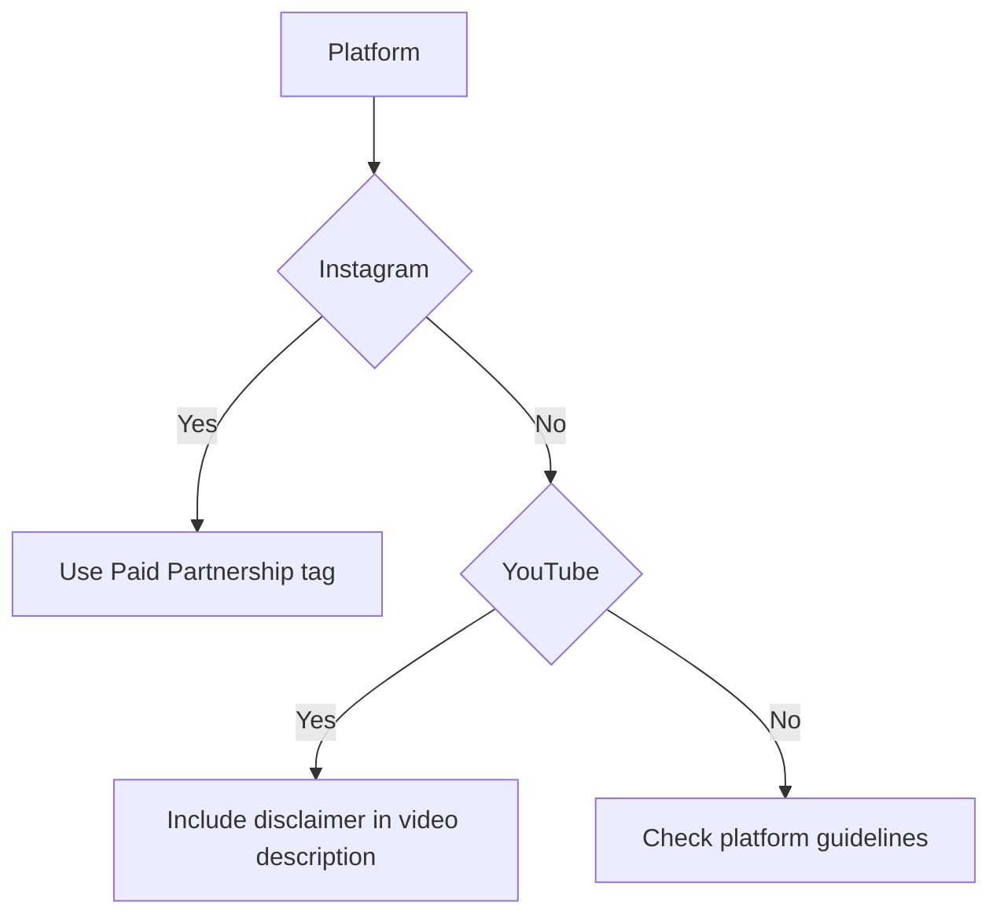

*Heads up: some links below are affiliate. Using them helps us keep the blog free. We only recommend tools we've actually used or trust.*

You're a popular Indian creator with 100,000 followers on Instagram, and you've just partnered with a brand to promote their new energy drink. You'll be paid INR 50,000 for the post, but have you included the required ad label? If not, you might face penalties from the Advertising Standards Council of India (ASCI).

As a creator, you know how important it is to follow the rules and regulations of influencer marketing in India. The ASCI guidelines are in place to ensure that consumers are not misled by advertisements, and it's your responsibility to comply with these guidelines. In this post, we'll break down the ASCI influencer guidelines for India, including the mandatory ad and sponsored labels, placement rules, extra disclosures for health and finance content, and penalties for non-compliance.

## Quick summary
| Guideline | Requirement |
| --- | --- |
| Ad Label | #Ad, #Sponsored, or #Promoted |
| Placement | Above the fold, in the first two lines of the post |
| Health Disclosures | Include warnings and side effects for health-related products |
| Finance Disclosures | Include risk warnings and terms and conditions for financial products |
| Penalties | Up to INR 10 lakh fine for non-compliance |

For example, let's say you're promoting a financial product, such as a credit card. Your post might include a label like this: "#Ad: Get 5% cashback on all purchases with our new credit card!". But what if you're promoting a health-related product, such as a fitness program? Your post might include a label like this: "#Sponsored: Get fit with our new workout program!".

Let's consider another example. Suppose you're promoting a brand's new clothing line, and you're paid INR 30,000 for the post. You'll need to include the #Ad label in your post, like this: "#Ad: Get the latest fashion trends with our new clothing line!". But what if you're promoting a service, such as a fitness class? Your post might include a label like this: "#Sponsored: Get fit with our new fitness class!".

## Understanding the ASCI Guidelines
The ASCI guidelines for influencers in India are clear: any paid promotion must be labeled as an advertisement. This includes sponsored posts, product reviews, and affiliate marketing. The label must be clear and conspicuous, and must be placed above the fold, in the first two lines of the post. For example, if you're promoting a brand's new clothing line, your post might look like this:

Let's consider another example. Suppose you're promoting a brand's new skincare product, and you're paid INR 20,000 for the post. You'll need to include the #Ad label in your post, like this: "#Ad: Get glowing skin with our new skincare product!". But what if you're promoting a service, such as a fitness class? Your post might include a label like this: "#Sponsored: Get fit with our new fitness class!".

Here's a step-by-step procedure to follow the ASCI guidelines:
1. Determine if your post is a paid promotion.
2. Choose the correct label (#Ad, #Sponsored, or #Promoted).
3. Place the label above the fold, in the first two lines of the post.
4. Include any necessary disclosures, such as warnings and side effects for health-related products.
5. Review your post carefully to ensure compliance with the ASCI guidelines.

Additionally, you should also consider the following edge cases:
* If you're promoting a product that has multiple labels (e.g. #Ad and #Sponsored), you should include both labels in your post.
* If you're promoting a product that requires additional disclosures (e.g. a health-related product), you should include those disclosures in your post.

## Placement Rules
The placement of the ad label is crucial. It must be placed above the fold, in the first two lines of the post, so that it's visible to the consumer without having to scroll down. This applies to all platforms, including Instagram, YouTube, and Facebook. For example, if you're posting a sponsored video on YouTube, the ad label must be included in the video title and description.

Let's compare the placement rules across different platforms:
| Platform | Placement Rule |
| --- | --- |
| Instagram | Above the fold, in the first two lines of the post |
| YouTube | In the video title and description |
| Facebook | Above the fold, in the first two lines of the post |

For instance, if you're posting a sponsored post on Instagram, the ad label must be included in the first two lines of the post, like this: "#Ad: Get ready for the summer with our new sunglasses!". But what if you're posting a sponsored video on YouTube? The ad label must be included in the video title and description, like this: "#Ad: Summer vibes with our new sunglasses!".

Let's consider another example. Suppose you're promoting a brand's new energy drink, and you're paid INR 40,000 for the post. You'll need to include the #Ad label in your post, like this: "#Ad: Get energized with our new energy drink!". But what if you're promoting a service, such as a fitness class? Your post might include a label like this: "#Sponsored: Get fit with our new fitness class!".

## Extra Disclosures for Health and Finance Content
If you're promoting health or finance-related products, you'll need to include extra disclosures. For health products, this includes warnings and side effects, as well as any necessary disclaimers. For finance products, this includes risk warnings and terms and conditions. For example, if you're promoting a weight loss supplement, your post might include a warning like this:

Let's consider another example. Suppose you're promoting a financial product, such as a loan. Your post might include a disclosure like this: "#Ad: Get a loan with our new financial product! Terms and conditions apply. Risk warning: Borrowing money can lead to debt.".

Here's a comparison of the extra disclosures required for health and finance content:
| Product Type | Extra Disclosure |
| --- | --- |
| Health | Warnings and side effects, disclaimers |
| Finance | Risk warnings, terms and conditions |

Additionally, you should also consider the following edge cases:
* If you're promoting a health-related product that requires a prescription, you should include a disclosure stating that the product requires a prescription.
* If you're promoting a financial product that has a high risk of debt, you should include a disclosure stating the risks of debt.

## Penalties for Non-Compliance
The penalties for non-compliance with the ASCI guidelines can be severe. If you're found to have promoted a product without including the necessary ad label or disclosures, you could face a fine of up to INR 10 lakh. This applies to both the creator and the brand, so it's essential to ensure that you're following the guidelines carefully.

For example, let's say you're promoting a brand's new energy drink, and you forget to include the #Ad label. You could face a fine of up to INR 10 lakh, depending on the severity of the offense. But what if you're promoting a health-related product, such as a fitness program, and you forget to include the necessary disclosures? You could face an even higher fine, depending on the severity of the offense.

Here's a step-by-step procedure to avoid penalties for non-compliance:
1. Review the ASCI guidelines carefully.
2. Ensure that you're including the necessary ad label and disclosures.
3. Place the ad label above the fold, in the first two lines of the post.
4. Include any necessary warnings and side effects for health-related products.
5. Review your post carefully to ensure compliance with the ASCI guidelines.

## Platform-Specific Tags
Each social media platform has its own set of guidelines and regulations for influencer marketing. For example, Instagram requires that creators use the "Paid Partnership" tag when promoting products, while YouTube requires that creators include a clear disclaimer in their video descriptions. It's essential to familiarize yourself with the guidelines for each platform you use, to ensure that you're complying with the regulations.

Let's compare the platform-specific tags across different platforms:
| Platform | Tag |
| --- | --- |
| Instagram | Paid Partnership |
| YouTube | Disclaimer in video description |
| Facebook | Sponsored |

For instance, if you're posting a sponsored post on Instagram, you'll need to use the "Paid Partnership" tag, like this: "Paid Partnership with [Brand Name]". But what if you're posting a sponsored video on YouTube? You'll need to include a clear disclaimer in your video description, like this: "This video is sponsored by [Brand Name].".

## How CreatorKhata helps
CreatorKhata's Contract Templates feature includes an ASCI-compliant disclosure clause, specifying the exact label and placement, so compliance is agreed in writing upfront. This helps you to ensure that you're following the guidelines carefully, and avoids any potential penalties for non-compliance. [Try CreatorKhata free](https://creatorkhata.com/?utm_source=blog&utm_medium=cta_inline&utm_campaign=asci-influencer-disclosure-guidelines-india).

## Tools that help with this

- **[CreatorKhata](https://creatorkhata.com/?utm_source=blog&utm_medium=affiliate&utm_campaign=asci-influencer-disclosure-guidelines-india)** — All-in-one business app for Indian creators — invoices, brand-deal contracts, payment tracking, GST & TDS-ready
- **[Creator gear on Amazon India](https://www.amazon.in/s?k=youtuber+kit&tag=creatorkhata2-21&utm_campaign=asci-influencer-disclosure-guidelines-india)** — Cameras, mics, lighting, and accessories for content creators
- **[Kit (formerly ConvertKit)](https://partners.kit.com/lmou6iciacgc)** — Email/newsletter platform built for creators

## A note on accuracy
This is general guidance. For your specific situation, consult a chartered accountant.
