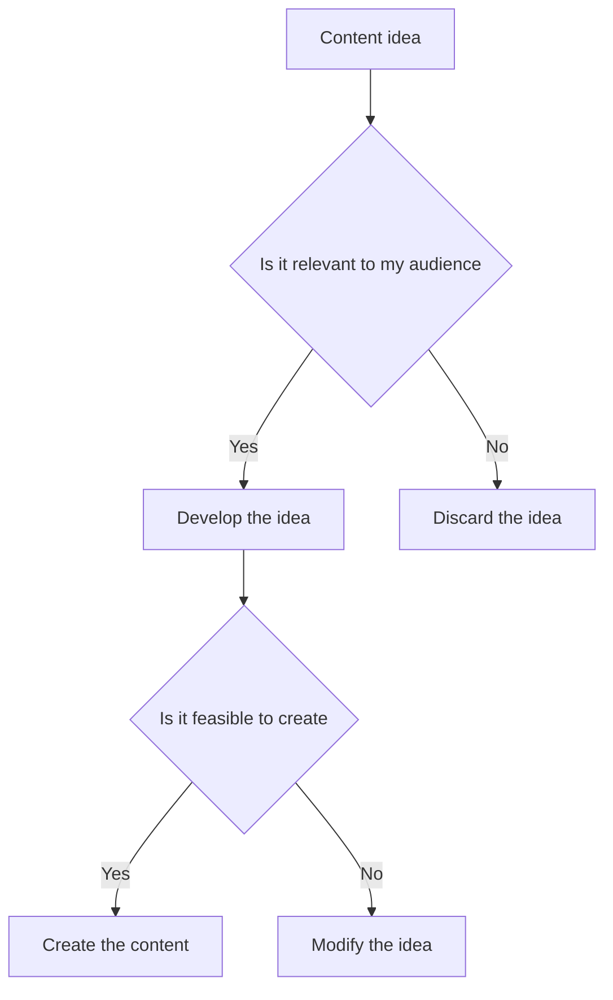
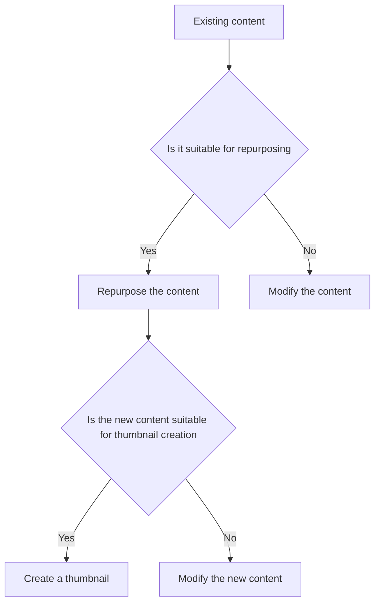
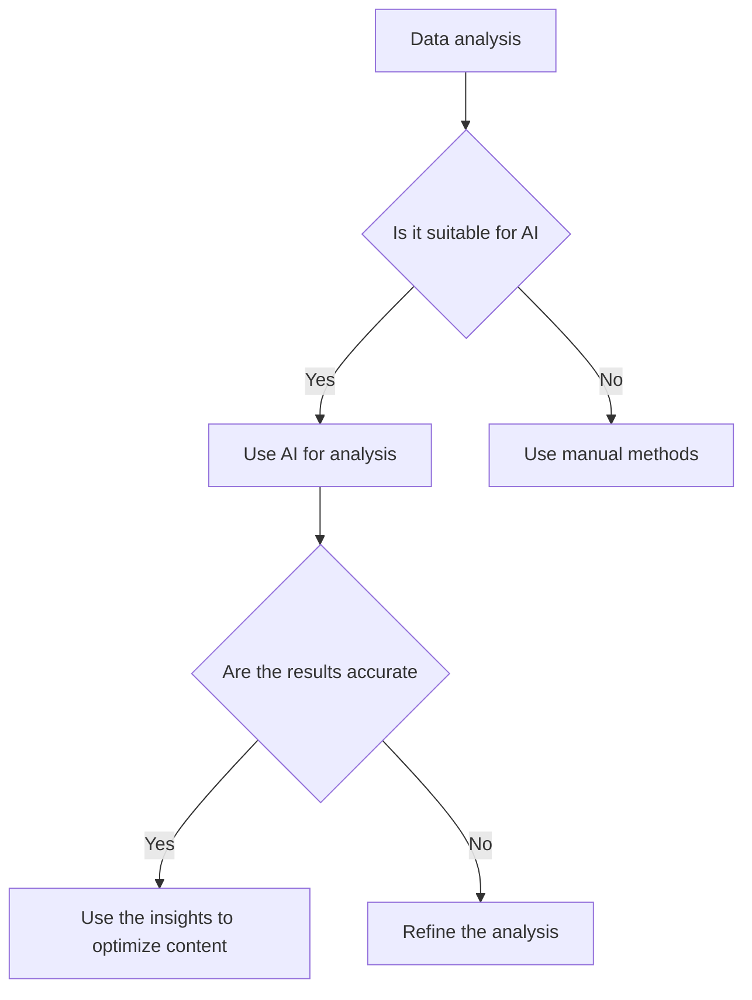

*Heads up: some links below are affiliate. Using them helps us keep the blog free. We only recommend tools we've actually used or trust.*

You're creating content regularly, but you know that coming up with new ideas, scripting, and editing can be time-consuming. You've heard about AI tools that can help, but you're not sure which ones are worth using. You've also seen some creators saving up to Rs 10,000 per month by using AI tools - you want to know their secret.

As a content creator in India, you're likely facing the same challenges: tight deadlines, limited resources, and a constant need for fresh content. You've probably tried a few AI tools, but you're not sure if they're really making a difference. You're looking for honest reviews and advice on how to use AI to save time and money.

## Quick summary
| Tool | Purpose | Pros | Cons |
| --- | --- | --- | --- |
| CreatorKhata AI | Scripting, captions, repurposing, thumbnails, ideas | Easy to use, affordable, integrates with existing workflow | Limited customization options |
| Lumen5 | Video creation, animation | Fast, affordable, high-quality output | Limited control over final product |
| InVideo | Video editing, animation | Advanced features, customizable, affordable | Steep learning curve |
| Canva | Graphic design, social media graphics | Easy to use, affordable, wide range of templates | Limited advanced features |
| TubeBuddy | YouTube optimization, keyword research | Advanced features, customizable, affordable | Limited support for other platforms |

## Scripting and Idea Generation
AI can be a great help when it comes to scripting and idea generation. Tools like CreatorKhata AI can help you come up with new ideas, outline your content, and even write your script. For example, let's say you're a beauty YouTuber and you want to create a video on the best skincare routine for summer. CreatorKhata AI can help you come up with a list of potential topics, such as:
1. Summer skincare tips
2. Best sunscreen for Indian skin
3. DIY face masks for summer
4. How to prevent acne in the summer
5. Summer skincare routine for different skin types

Another example could be if you're a food blogger and you want to create a video on the best Indian recipes for dinner. CreatorKhata AI can help you come up with a list of potential topics, such as:
1. Chicken tikka masala recipe
2. Palak paneer recipe
3. Chana masala recipe
4. Saag aloo recipe
5. Vegetable biryani recipe

Let's consider another scenario where you're a travel vlogger and you want to create a video on the best places to visit in India. CreatorKhata AI can help you come up with a list of potential topics, such as:
1. Best beaches in Goa
2. Top hill stations in Himachal Pradesh
3. Must-visit cities in Rajasthan
4. Best trekking spots in Uttarakhand
5. Most scenic roads in Kerala

To get the most out of AI for scripting and idea generation, follow these steps:
1. Define your content goals and target audience
2. Use AI tools to generate ideas and outlines
3. Refine and customize the ideas to fit your brand and style
4. Use AI to write and edit your script
5. Review and revise your script to ensure it meets your standards

Here's a step-by-step procedure to use AI for scripting and idea generation:
1. Sign up for a CreatorKhata AI account
2. Choose the type of content you want to create (e.g. video, blog post, social media post)
3. Input your topic or keyword
4. Select the tone and style of your content
5. Review and refine the generated ideas and script

## Captioning and Subtitling
AI can also help with captioning and subtitling. Tools like Rev.com and GoTranscript can help you create accurate captions and subtitles for your videos. For example, let's say you have a video that's 10 minutes long and you want to add captions. Rev.com can help you create captions for Rs 2 per minute, which would cost you Rs 20 for the entire video.

Another example could be if you have a video that's 30 minutes long and you want to add subtitles. GoTranscript can help you create subtitles for Rs 3 per minute, which would cost you Rs 90 for the entire video.

Let's consider another scenario where you have a video that's 1 hour long and you want to add both captions and subtitles. Rev.com can help you create captions for Rs 2 per minute, which would cost you Rs 120 for the entire video, and GoTranscript can help you create subtitles for Rs 3 per minute, which would cost you Rs 180 for the entire video.

To get the most out of AI for captioning and subtitling, follow these steps:
1. Choose an AI tool that fits your budget and needs
2. Upload your video to the AI tool
3. Select the language and format for your captions or subtitles
4. Review and revise the captions or subtitles to ensure they are accurate
5. Download and add the captions or subtitles to your video

Here's a comparison table of the costs of different AI captioning and subtitling tools:
| Tool | Cost per minute | Cost for 10-minute video | Cost for 30-minute video |
| --- | --- | --- | --- |
| Rev.com | Rs 2 | Rs 20 | Rs 60 |
| GoTranscript | Rs 3 | Rs 30 | Rs 90 |
| Trint | Rs 4 | Rs 40 | Rs 120 |

## Repurposing and Thumbnail Creation
AI can also help with repurposing and thumbnail creation. Tools like Lumen5 and InVideo can help you create new content from existing content, such as turning a blog post into a video. For example, let's say you have a blog post on the best summer skincare tips and you want to turn it into a video. Lumen5 can help you create a video in minutes, with a cost of Rs 1,000 per month.

Another example could be if you have a video on the best Indian recipes for dinner and you want to create a thumbnail for it. InVideo can help you create a thumbnail in minutes, with a cost of Rs 500 per month.

Let's consider another scenario where you have a podcast and you want to turn it into a video. Lumen5 can help you create a video in minutes, with a cost of Rs 1,500 per month, and InVideo can help you create a thumbnail for it, with a cost of Rs 750 per month.

To get the most out of AI for repurposing and thumbnail creation, follow these steps:
1. Choose an AI tool that fits your budget and needs
2. Upload your existing content to the AI tool
3. Select the format and style for your new content
4. Review and revise the new content to ensure it meets your standards
5. Download and add the new content to your platform

Here's a step-by-step procedure to use AI for repurposing and thumbnail creation:
1. Sign up for a Lumen5 or InVideo account
2. Choose the type of content you want to repurpose (e.g. blog post, video, podcast)
3. Input your existing content
4. Select the format and style for your new content
5. Review and refine the generated content

## Honest Pros and Cons
While AI tools can be incredibly helpful, there are also some pros and cons to consider. For example, AI tools can save you time and money, but they can also be limited in their capabilities. Additionally, some AI tools can be expensive, especially if you're just starting out.

Here's a comparison table of the pros and cons of some popular AI tools:
| Tool | Pros | Cons |
| --- | --- | --- |
| CreatorKhata AI | Easy to use, affordable, integrates with existing workflow | Limited customization options |
| Lumen5 | Fast, affordable, high-quality output | Limited control over final product |
| InVideo | Advanced features, customizable, affordable | Steep learning curve |
| Canva | Easy to use, affordable, wide range of templates | Limited advanced features |
| TubeBuddy | Advanced features, customizable, affordable | Limited support for other platforms |

Let's consider another example where you're using AI tools for data analysis and research. You can use tools like Ahrefs or SEMrush to analyze your website's traffic and optimize your content for better search engine rankings. However, these tools can be expensive, especially if you're just starting out.

To get the most out of AI tools, it's essential to weigh the pros and cons and choose the tools that best fit your needs and budget.

## Where AI Genuinely Helps
AI genuinely helps with tasks that are repetitive, time-consuming, and require a lot of data analysis. For example, AI can help with:
* Scripting and idea generation
* Captioning and subtitling
* Repurposing and thumbnail creation
* Data analysis and research

Some edge cases where AI can be particularly helpful include:
* Creating content for multiple platforms at once
* Managing and scheduling large volumes of content
* Analyzing and responding to comments and engagement
* Identifying and reaching new audiences

Here's a step-by-step procedure to use AI for data analysis and research:
1. Sign up for an Ahrefs or SEMrush account
2. Input your website's URL
3. Select the type of analysis you want to perform (e.g. keyword research, backlink analysis)
4. Review and refine the generated data
5. Use the insights to optimize your content and improve your search engine rankings

## How CreatorKhata helps
CreatorKhata AI - captions, content repurposing and ideas built for creators in one app. It's easy to use, affordable, and integrates with your existing workflow. With CreatorKhata AI, you can save up to Rs 10,000 per month on your content creation workflow. [Try CreatorKhata free](https://creatorkhata.com/?utm_source=blog&utm_medium=cta_inline&utm_campaign=best-ai-tools-for-content-creators-india).

## Tools that help with this

- **[CreatorKhata](https://creatorkhata.com/?utm_source=blog&utm_medium=affiliate&utm_campaign=best-ai-tools-for-content-creators-india)** — All-in-one business app for Indian creators — invoices, brand-deal contracts, payment tracking, GST & TDS-ready
- **[Creator gear on Amazon India](https://www.amazon.in/s?k=youtuber+kit&tag=creatorkhata2-21&utm_campaign=best-ai-tools-for-content-creators-india)** — Cameras, mics, lighting, and accessories for content creators
- **[Kit (formerly ConvertKit)](https://partners.kit.com/lmou6iciacgc)** — Email/newsletter platform built for creators

## A note on accuracy
This is general guidance. For your specific situation, consult a chartered accountant.
