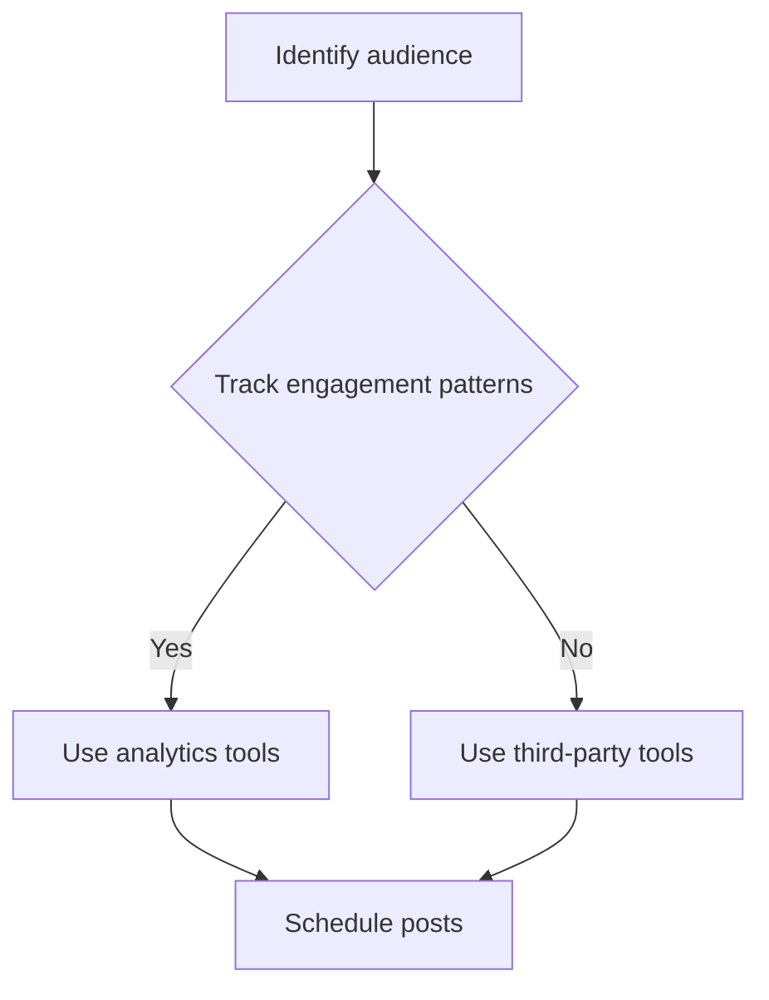
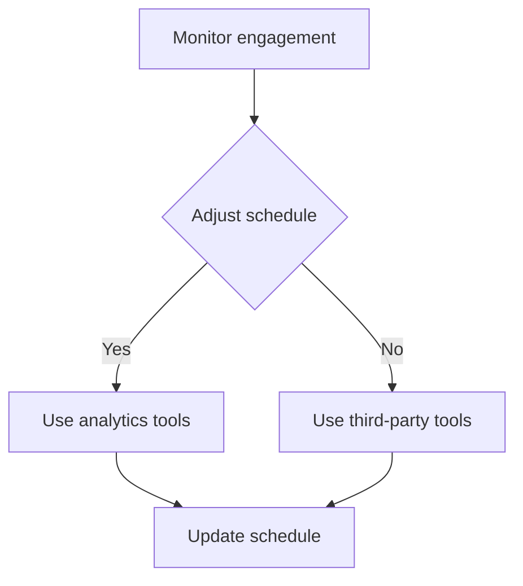
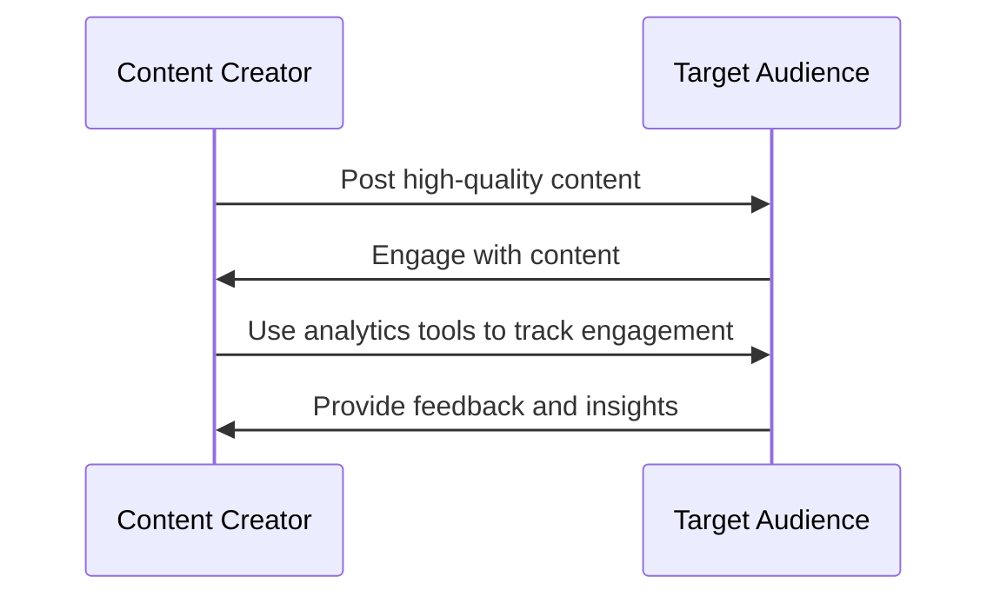

*Heads up: some links below are affiliate. Using them helps us keep the blog free. We only recommend tools we've actually used or trust.*

You're creating content for your Indian audience, but are you posting at the right time to maximize engagement? If you're posting when your audience is asleep or not active, you're essentially wasting your effort. Let's say you have 100,000 followers on Instagram, and your average engagement rate is 2%. If you can increase your engagement rate by just 1% by posting at the right time, that's 1,000 more likes and comments on your post. This can lead to increased brand awareness, more sales, and a stronger online presence. For instance, if you're a fashion influencer, posting at the right time can lead to more people seeing your content, which can result in more sales for the brands you're promoting.

As a content creator in India, you know that your audience is active on both Instagram and YouTube. But have you ever wondered what the best time to post on these platforms is? Let's take a look at some general trends. On weekdays, your Indian audience is most active on Instagram between 12 pm and 4 pm, with a peak at 2 pm. On weekends, the peak hours shift to 10 am to 2 pm, with a peak at 12 pm. On YouTube, the best time to post is between 5 pm and 9 pm on weekdays, with a peak at 7 pm. On weekends, the best time to post is between 2 pm and 6 pm, with a peak at 4 pm. For example, if you post a video on YouTube at 7 pm on a Wednesday, you can expect more views and engagement compared to posting at 10 am on the same day.

## Quick summary
| Platform | Weekday Peak | Weekend Peak |
| --- | --- | --- |
| Instagram | 2 pm | 12 pm |
| YouTube | 7 pm | 4 pm |
| Audience | 12 pm - 4 pm | 10 am - 2 pm |

To further illustrate the difference in engagement, let's consider another example. Suppose you have 50,000 followers on Instagram and you post a picture at 2 pm on a Friday. You get 200 likes and 50 comments within the first hour. If you post a similar picture at 10 am on the same day, you get only 100 likes and 20 comments. This shows that posting at 2 pm is more effective for your audience. Additionally, you can use this information to adjust your posting schedule and maximize your engagement.

## Understanding Your Audience
To find the best time to post for your specific audience, you need to understand their behavior and preferences. You can use analytics tools to track your audience's engagement patterns and identify the times when they are most active. For example, if you notice that your audience is most active on Instagram between 3 pm and 5 pm on weekdays, you can schedule your posts accordingly. Let's say you post a video on Instagram at 3 pm on a Wednesday, and it gets 500 likes and 100 comments within the first hour. If you post a similar video at 10 am on the same day, it only gets 200 likes and 50 comments. This shows that posting at 3 pm is more effective for your audience. Here are some steps to help you understand your audience:

1. **Track engagement patterns**: Use analytics tools to track your audience's engagement patterns, including likes, comments, and shares.
2. **Identify peak hours**: Identify the times when your audience is most active and engage with your content.
3. **Analyze audience behavior**: Analyze your audience's behavior and preferences to understand what type of content they engage with the most.
4. **Adjust your posting schedule**: Adjust your posting schedule to maximize engagement and reach your target audience.

To further understand your audience, you can also create a comparison table to analyze their engagement patterns on different days of the week. For example:

| Day | Engagement Rate |
| --- | --- |
| Monday | 2.5% |
| Tuesday | 2.2% |
| Wednesday | 2.8% |
| Thursday | 2.5% |
| Friday | 3.0% |
| Saturday | 2.0% |
| Sunday | 1.8% |

This table shows that your audience is most engaged on Fridays, with an engagement rate of 3.0%. You can use this information to adjust your posting schedule and maximize your engagement.

## Using Analytics to Find the Best Time
To find the best time to post, you can use analytics tools such as Instagram Insights or YouTube Analytics. These tools provide you with detailed information about your audience's engagement patterns, including the times when they are most active. You can also use third-party analytics tools such as Hootsuite or Buffer to track your audience's engagement patterns and schedule your posts accordingly. For example, you can use Hootsuite to track your Instagram engagement patterns and schedule your posts for the times when your audience is most active. Here are some steps to help you use analytics tools:

1. **Set up analytics tools**: Set up analytics tools such as Instagram Insights or YouTube Analytics to track your audience's engagement patterns.
2. **Track engagement patterns**: Track your audience's engagement patterns, including likes, comments, and shares.
3. **Identify peak hours**: Identify the times when your audience is most active and engage with your content.
4. **Schedule posts**: Schedule your posts for the times when your audience is most active.

To illustrate the effectiveness of using analytics tools, let's consider another example. Suppose you use Hootsuite to track your Instagram engagement patterns and schedule your posts. You notice that your audience is most active on Instagram between 12 pm and 2 pm on weekdays. You schedule your posts accordingly and see a 20% increase in engagement. This shows that using analytics tools can help you maximize your engagement and reach your target audience.

## Weekday vs Weekend Posting
When it comes to posting on weekdays vs weekends, the trends are different for Instagram and YouTube. On Instagram, weekdays are generally better for posting, with a peak at 2 pm. On weekends, the peak hours shift to 10 am to 2 pm, with a peak at 12 pm. On YouTube, weekends are generally better for posting, with a peak at 4 pm. However, it's essential to note that these are general trends, and the best time to post for your specific audience may vary. For example, if you're a travel influencer, your audience may be more active on weekends when they have more free time to plan their trips. Here are some steps to help you determine the best time to post on weekdays vs weekends:

1. **Track engagement patterns**: Track your audience's engagement patterns on weekdays and weekends.
2. **Identify peak hours**: Identify the times when your audience is most active on weekdays and weekends.
3. **Adjust your posting schedule**: Adjust your posting schedule to maximize engagement and reach your target audience.

To further illustrate the difference in engagement on weekdays vs weekends, let's consider another example. Suppose you post a video on YouTube at 4 pm on a Sunday. You get 500 views and 100 comments within the first hour. If you post a similar video at 10 am on a Monday, you get only 200 views and 50 comments. This shows that posting on weekends is more effective for your audience.

## Creating a Posting Schedule
Once you have identified the best time to post for your audience, you can create a posting schedule to ensure that you are consistently posting at the right time. You can use a content calendar to plan and schedule your posts in advance, and use analytics tools to track your audience's engagement patterns and adjust your schedule accordingly. For example, you can create a content calendar that outlines your posting schedule for the next week, including the time and date of each post. Here are some steps to help you create a posting schedule:

1. **Plan your content**: Plan your content in advance, including the type of content, the time, and the date of each post.
2. **Use a content calendar**: Use a content calendar to schedule your posts and ensure that you are consistently posting at the right time.
3. **Track engagement patterns**: Track your audience's engagement patterns and adjust your schedule accordingly.
4. **Adjust your schedule**: Adjust your schedule as needed to maximize engagement and reach your target audience.

To illustrate the effectiveness of creating a posting schedule, let's consider another example. Suppose you create a content calendar that outlines your posting schedule for the next week. You schedule your posts for the times when your audience is most active and see a 30% increase in engagement. This shows that creating a posting schedule can help you maximize your engagement and reach your target audience.

## How to Adjust Your Posting Schedule
To adjust your posting schedule, you need to continuously monitor your audience's engagement patterns and adjust your schedule accordingly. You can use analytics tools to track your audience's engagement patterns and identify the times when they are most active. You can also use third-party tools to schedule your posts and adjust your schedule as needed. For example, you can use Hootsuite to track your Instagram engagement patterns and schedule your posts for the times when your audience is most active. Here are some steps to help you adjust your posting schedule:

1. **Monitor engagement patterns**: Monitor your audience's engagement patterns and adjust your schedule accordingly.
2. **Use analytics tools**: Use analytics tools to track your audience's engagement patterns and identify the times when they are most active.
3. **Adjust your schedule**: Adjust your schedule as needed to maximize engagement and reach your target audience.
4. **Use third-party tools**: Use third-party tools to schedule your posts and adjust your schedule as needed.

## Tips for Maximizing Engagement
To maximize engagement, you need to post high-quality content that resonates with your audience. You can use analytics tools to track your audience's engagement patterns and identify the types of content that work best for them. You can also use hashtags and tag relevant influencers to increase your reach and engagement. For example, if you're a fashion influencer, you can use hashtags such as #fashion or #style to increase your reach and engagement. Here are some tips to help you maximize engagement:

1. **Post high-quality content**: Post high-quality content that resonates with your audience.
2. **Use analytics tools**: Use analytics tools to track your audience's engagement patterns and identify the types of content that work best for them.
3. **Use hashtags**: Use hashtags to increase your reach and engagement.
4. **Tag influencers**: Tag relevant influencers to increase your reach and engagement.

## How CreatorKhata helps
The Analytics feature in CreatorKhata helps you see when your audience is active and which posts actually perform. With this information, you can adjust your posting schedule to maximize engagement and reach your target audience. [Try CreatorKhata free](https://creatorkhata.com/?utm_source=blog&utm_medium=cta_inline&utm_campaign=best-time-to-post-instagram-youtube-india).

## Tools that help with this

- **[CreatorKhata](https://creatorkhata.com/?utm_source=blog&utm_medium=affiliate&utm_campaign=best-time-to-post-instagram-youtube-india)** — All-in-one business app for Indian creators — invoices, brand-deal contracts, payment tracking, GST & TDS-ready
- **[Kit (formerly ConvertKit)](https://partners.kit.com/lmou6iciacgc)** — Email/newsletter platform built for creators
- **[vidIQ](https://vidiq.com/creatorkhata?utm_campaign=best-time-to-post-instagram-youtube-india)** — YouTube analytics + content ideas + competitor tracking

## A note on accuracy
This is general guidance. For your specific situation, consult a chartered accountant.
