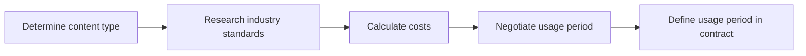

*Heads up: some links below are affiliate. Using them helps us keep the blog free. We only recommend tools we've actually used or trust.*

You've landed a brand deal that could pay you up to ₹50,000, but have you thought about how to protect your interests? As an Indian creator, you need to ensure that your contract includes essential clauses to safeguard your brand and income. Without these clauses, you might end up losing money or facing legal issues.

You've worked hard to build your audience and create engaging content, and now it's time to get paid. But what if the brand doesn't pay you on time or tries to use your content without permission? That's where a solid contract comes in. In this post, we'll explore the 5 must-have contract clauses for Indian creators, including usage period, organic vs paid amplification, kill fee, revision cap, and indemnity.

## Quick summary
| Clause | Description | Importance |
| --- | --- | --- |
| Usage period | Specifies the duration for which the brand can use your content | High |
| Organic vs paid amplification | Defines how the brand can amplify your content | Medium |
| Kill fee | The amount paid to you if the brand cancels the deal | High |
| Revision cap | Limits the number of revisions the brand can request | Medium |
| Indemnity | Protects you against claims made by the brand | High |

## Understanding usage period
The usage period clause specifies the duration for which the brand can use your content. This could be anything from a few months to a year or more. As a creator, you need to ensure that the usage period is clearly defined to avoid any disputes. For example, if you're creating a video for a brand, you might want to limit the usage period to 6 months. After that, the brand would need to obtain your permission to continue using the content. Let's say you're paid ₹20,000 for the video, and the brand wants to use it for a year. You could negotiate a usage period of 6 months, with an additional ₹10,000 for each subsequent 6 months.

To further illustrate this, consider a scenario where you're creating a series of social media posts for a brand. You might want to limit the usage period to 3 months, with an option to renew for an additional ₹5,000. This would ensure that the brand doesn't overuse your content and that you're fairly compensated for your work.

Here's a step-by-step procedure to negotiate a usage period clause:
1. Determine the type of content you're creating and its potential lifespan.
2. Research industry standards for usage periods and fees.
3. Calculate your costs and desired profit margin.
4. Negotiate the usage period and fee with the brand, taking into account any potential renewals or extensions.
5. Ensure that the usage period clause is clearly defined in the contract, including any renewal or extension options.

Another example could be if you're creating a podcast for a brand, and they want to use it for 2 years. You might want to limit the usage period to 1 year, with an option to renew for an additional ₹20,000. This would ensure that the brand doesn't overuse your content and that you're fairly compensated for your work.

You should also consider the different types of content and how they may affect the usage period. For instance, if you're creating a video, you might want to limit the usage period to 6 months, while for a blog post, you might want to limit it to 3 months.

## Organic vs paid amplification
The organic vs paid amplification clause defines how the brand can amplify your content. This could include paid social media ads, email marketing, or other forms of promotion. As a creator, you need to ensure that the brand doesn't over-amplify your content, which could lead to audience fatigue. For instance, if you're creating a sponsored post for a brand, you might want to limit the paid amplification to ₹5,000. This would ensure that the brand doesn't overspend on promoting your content, which could negatively impact your audience engagement.

Let's consider another example. Suppose you're creating a video for a brand, and they want to promote it on their social media channels. You might want to limit the organic amplification to a certain number of posts or stories, with an option to renew for an additional ₹2,000. This would ensure that the brand doesn't over-promote your content and that you're fairly compensated for your work.

Here's a comparison table to illustrate the difference between organic and paid amplification:
| Amplification Type | Description | Cost |
| --- | --- | --- |
| Organic | Promoting content on the brand's social media channels | ₹0 - ₹2,000 |
| Paid | Promoting content through paid social media ads | ₹5,000 - ₹20,000 |

Another comparison table could be:
| Amplification Type | Description | Reach |
| --- | --- | --- |
| Organic | Promoting content on the brand's social media channels | 1,000 - 10,000 |
| Paid | Promoting content through paid social media ads | 10,000 - 100,000 |

You should also consider the different types of amplification and how they may affect your content. For instance, if you're creating a video, you might want to limit the paid amplification to ₹10,000, while for a blog post, you might want to limit it to ₹5,000.

## Kill fee and its importance
The kill fee clause is essential in case the brand cancels the deal. This could happen due to various reasons, such as a change in marketing strategy or a budget cut. As a creator, you need to ensure that you're paid a kill fee, which is a percentage of the total payment. For example, if you're paid ₹50,000 for a brand deal, you might want to negotiate a kill fee of 20%. This would mean that if the brand cancels the deal, you'd still receive ₹10,000.

To further illustrate this, consider a scenario where you're creating a series of blog posts for a brand. You might want to negotiate a kill fee of 30%, which would mean that if the brand cancels the deal, you'd receive ₹15,000.

Here's a step-by-step procedure to negotiate a kill fee clause:
1. Determine the total payment for the brand deal.
2. Calculate the desired kill fee percentage, taking into account industry standards and your costs.
3. Negotiate the kill fee with the brand, ensuring that it's clearly defined in the contract.
4. Consider including a clause that specifies the circumstances under which the kill fee would be paid.
5. Ensure that the kill fee clause is fair and reasonable, taking into account the brand's needs and your own.

Another example could be if you're creating a video for a brand, and they want to cancel the deal due to a change in marketing strategy. You might want to negotiate a kill fee of 25%, which would mean that if the brand cancels the deal, you'd receive ₹12,500.

You should also consider the different types of kill fees and how they may affect your payment. For instance, you might want to negotiate a kill fee that's based on the number of deliverables, or one that's based on the total payment.

## Revision cap and its benefits
The revision cap clause limits the number of revisions the brand can request. This is essential to avoid scope creep, where the brand keeps asking for changes, which could delay the project and increase your costs. As a creator, you need to ensure that the revision cap is clearly defined to avoid any disputes. For instance, you might want to limit the number of revisions to 2, with an additional ₹5,000 for each subsequent revision.

Let's consider another example. Suppose you're creating a video for a brand, and they want to make significant changes to the script. You might want to limit the number of revisions to 1, with an option to renew for an additional ₹10,000. This would ensure that the brand doesn't over-revise your content and that you're fairly compensated for your work.

Here's a comparison table to illustrate the difference between revision caps:
| Revision Cap | Description | Cost |
| --- | --- | --- |
| 1 revision | Limiting the number of revisions to 1 | ₹0 - ₹5,000 |
| 2 revisions | Limiting the number of revisions to 2 | ₹5,000 - ₹10,000 |

Another comparison table could be:
| Revision Cap | Description | Time |
| --- | --- | --- |
| 1 revision | Limiting the number of revisions to 1 | 1-3 days |
| 2 revisions | Limiting the number of revisions to 2 | 3-7 days |

You should also consider the different types of revisions and how they may affect your content. For instance, if you're creating a video, you might want to limit the number of revisions to 1, while for a blog post, you might want to limit it to 2.

## Indemnity and its importance
The indemnity clause protects you against claims made by the brand. This could include claims related to intellectual property, defamation, or other issues. As a creator, you need to ensure that the indemnity clause is clearly defined to avoid any legal issues. For example, if you're creating content for a brand, and the brand makes a claim against you, the indemnity clause would protect you against any damages.

To further illustrate this, consider a scenario where you're creating a series of social media posts for a brand. You might want to include an indemnity clause that protects you against any claims related to copyright infringement or defamation.

Here's a step-by-step procedure to negotiate an indemnity clause:
1. Determine the type of content you're creating and the potential risks involved.
2. Research industry standards for indemnity clauses and damages.
3. Calculate your costs and desired level of protection.
4. Negotiate the indemnity clause with the brand, ensuring that it's clearly defined in the contract.
5. Consider including a clause that specifies the circumstances under which the indemnity clause would be triggered.

Another example could be if you're creating a video for a brand, and they want to use it for commercial purposes. You might want to include an indemnity clause that protects you against any claims related to intellectual property or defamation.

You should also consider the different types of indemnity clauses and how they may affect your protection. For instance, you might want to include an indemnity clause that protects you against any claims related to negligence or gross negligence.

## How CreatorKhata helps
CreatorKhata provides contract templates with five India-specific protective clauses, including usage period, organic-vs-paid, kill fee, revision cap, and indemnity, baked into every template, edit-once-then-reuse, with Contract Templates — five India-specific protective clauses (usage period, organic-vs-paid, kill fee, revision cap, indemnity) baked into every template, edit-once-then-reuse.

## Tools that help with this

- **[CreatorKhata](https://creatorkhata.com/?utm_source=blog&utm_medium=affiliate&utm_campaign=brand-deal-contract-5-clauses-india)** — All-in-one business app for Indian creators — invoices, brand-deal contracts, payment tracking, GST & TDS-ready
- **[Creator gear on Amazon India](https://www.amazon.in/s?k=youtuber+kit&tag=creatorkhata2-21&utm_campaign=brand-deal-contract-5-clauses-india)** — Cameras, mics, lighting, and accessories for content creators
- **[Razorpay](https://rzp.io/rzp/9qjLNw9k?utm_campaign=brand-deal-contract-5-clauses-india)** — Indian payment gateway — accept brand-deal payments, UPI, cards, international

## A note on accuracy
This is general guidance. For your specific situation, consult a chartered accountant.
