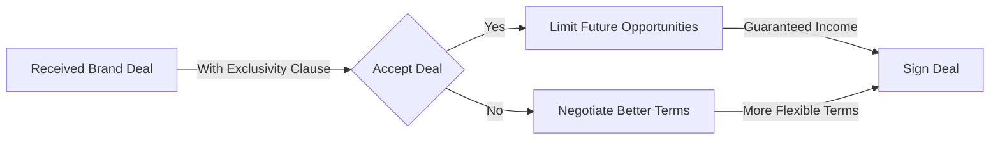

*Heads up: some links below are affiliate. Using them helps us keep the blog free. We only recommend tools we've actually used or trust.*

You've just received a brand deal offer that seems too good to be true. The pay is high, but there's a catch: an exclusivity clause that restricts you from working with similar brands for a certain period. You're not sure what to make of it. Should you accept the deal and risk limiting your future opportunities, or should you negotiate for better terms?

As a content creator, you know that brand deals are a crucial part of your income. But you also know that exclusivity clauses can be a double-edged sword. On one hand, they can guarantee you a steady stream of income from a single brand. On the other hand, they can limit your ability to work with other brands and potentially reduce your overall earnings. Let's take an example: suppose you're a beauty influencer who earns Rs 50,000 per sponsored post. If you sign an exclusivity deal with a makeup brand for 6 months, you might earn Rs 1.5 lakh (3 posts) from that brand, but you'll also miss out on potential deals from other makeup brands. If you could have earned Rs 20,000 per post from those other brands, you'll be missing out on Rs 60,000 (3 posts) in potential earnings.

## Quick summary
| Type of Exclusivity | Description | Rate Premium |
| --- | --- | --- |
| Category Exclusivity | Restricts working with similar brands in the same category | 30-40% |
| Full Exclusivity | Restricts working with any other brand in all categories | 40-50% |
| Time Bounds | Restricts working with other brands for a specific period | 10-30% |
| Geographic Bounds | Restricts working with other brands in specific geographic regions | 20-40% |

## Understanding Exclusivity Clauses
Exclusivity clauses are designed to protect the interests of the brand by ensuring that you don't promote their competitors. There are different types of exclusivity clauses, including category exclusivity, full exclusivity, time bounds, and geographic bounds. Category exclusivity restricts you from working with similar brands in the same category. For example, if you sign a category exclusivity deal with a makeup brand, you might not be able to work with other makeup brands. Full exclusivity, on the other hand, restricts you from working with any other brand in all categories. Time bounds restrict you from working with other brands for a specific period, while geographic bounds restrict you from working with other brands in specific geographic regions.
Here's another example: suppose you're a fitness influencer who earns Rs 30,000 per sponsored post. You're offered a full exclusivity deal with a sports brand for 12 months. The brand is willing to pay a 40% rate premium for the exclusivity clause. To calculate the rate premium, you can multiply your standard rate by the rate premium percentage: Rs 30,000 x 0.4 = Rs 12,000. So, the brand should pay you Rs 42,000 (Rs 30,000 + Rs 12,000) per sponsored post for the full exclusivity deal.
In addition to these examples, it's essential to consider the potential risks and benefits of each type of exclusivity clause. For instance, category exclusivity may limit your ability to work with other brands in the same category, but it may also provide a guaranteed stream of income from the brand. On the other hand, full exclusivity may provide a higher rate premium, but it may also limit your ability to work with other brands in all categories.
To mitigate these risks, you can consider negotiating a tiered exclusivity clause, where the brand pays a higher rate premium for a shorter exclusivity period. For example, you could negotiate a 6-month category exclusivity deal with a 30% rate premium, and then switch to a non-exclusivity deal after the 6-month period.

## Negotiating Exclusivity Clauses
When negotiating exclusivity clauses, it's essential to understand the terms and conditions. You should ask questions like: What type of exclusivity is being requested? What is the duration of the exclusivity period? Are there any geographic restrictions? What is the rate premium being offered for the exclusivity clause? Here are some tips for negotiating exclusivity clauses:
1. **Know your worth**: Before negotiating, make sure you know your worth as a content creator. Research your industry standards and know what other creators are charging for similar deals.
2. **Understand the brand's goals**: Understand what the brand is trying to achieve with the exclusivity clause. Are they trying to protect their market share or increase their brand awareness?
3. **Be flexible**: Be open to negotiating different types of exclusivity clauses. For example, you might be willing to accept a category exclusivity clause but not a full exclusivity clause.
4. **Charge a rate premium**: Make sure you charge a rate premium for the exclusivity clause. The rate premium will depend on the type of exclusivity clause and the duration of the exclusivity period.
5. **Consider the brand's budget**: Consider the brand's budget and be willing to negotiate. You may need to compromise on the rate premium or the duration of the exclusivity period.
6. **Get everything in writing**: Make sure you get everything in writing, including the terms and conditions of the exclusivity clause, the rate premium, and the duration of the exclusivity period.
In addition to these tips, it's essential to consider the potential tax implications of exclusivity clauses. For example, if you're a content creator who earns more than Rs 50 lakh per year, you may need to pay a higher tax rate on your income. You can consult with a chartered accountant to determine the best way to structure your exclusivity clause to minimize your tax liability.

## Calculating the Rate Premium
The rate premium for an exclusivity clause will depend on the type of exclusivity and the duration of the exclusivity period. Here's an example of how you can calculate the rate premium:
Suppose you're a beauty influencer who earns Rs 50,000 per sponsored post. You're offered a category exclusivity deal with a makeup brand for 6 months. The brand is willing to pay a 30% rate premium for the exclusivity clause. To calculate the rate premium, you can multiply your standard rate by the rate premium percentage:
Rs 50,000 x 0.3 = Rs 15,000
So, the brand should pay you Rs 65,000 (Rs 50,000 + Rs 15,000) per sponsored post for the category exclusivity deal.
Here's another example: suppose you're a fitness influencer who earns Rs 30,000 per sponsored post. You're offered a time bounds exclusivity deal with a sports brand for 3 months. The brand is willing to pay a 20% rate premium for the exclusivity clause. To calculate the rate premium, you can multiply your standard rate by the rate premium percentage: Rs 30,000 x 0.2 = Rs 6,000. So, the brand should pay you Rs 36,000 (Rs 30,000 + Rs 6,000) per sponsored post for the time bounds exclusivity deal.
In addition to these examples, you can use the following formula to calculate the rate premium:
Rate Premium = (Exclusivity Period x Rate per Post) x Rate Premium Percentage
For example, if you're a beauty influencer who earns Rs 50,000 per sponsored post, and you're offered a category exclusivity deal with a makeup brand for 6 months, with a 30% rate premium, the rate premium would be:
Rate Premium = (6 months x Rs 50,000 per post) x 0.3 = Rs 90,000
So, the brand should pay you Rs 90,000 (Rs 50,000 x 6 months) + Rs 27,000 (Rs 90,000 x 0.3) = Rs 117,000 for the category exclusivity deal.

## Geographic Bounds and Time Bounds
Geographic bounds and time bounds are two other types of exclusivity clauses that you might encounter. Geographic bounds restrict you from working with other brands in specific geographic regions, while time bounds restrict you from working with other brands for a specific period. For example, a brand might request a geographic bound that restricts you from working with other brands in the Indian market. Alternatively, a brand might request a time bound that restricts you from working with other brands for 3 months. Here are some examples of how you can charge a rate premium for geographic bounds and time bounds:
* Geographic bounds: 20-40% rate premium
* Time bounds: 10-30% rate premium
In addition to these examples, you can consider the following factors when negotiating geographic bounds and time bounds:
* The size of the geographic region
* The duration of the time bound
* The type of brand and industry
* The level of competition in the market
For example, if you're a beauty influencer who earns Rs 50,000 per sponsored post, and you're offered a geographic bounds exclusivity deal with a makeup brand that restricts you from working with other brands in the Indian market for 6 months, you might charge a 30% rate premium. On the other hand, if you're a fitness influencer who earns Rs 30,000 per sponsored post, and you're offered a time bounds exclusivity deal with a sports brand that restricts you from working with other brands for 3 months, you might charge a 20% rate premium.

## How to Charge for Exclusivity Clauses
Charging for exclusivity clauses can be a challenge, especially if you're new to the industry. Here are some tips for charging for exclusivity clauses:
1. **Research industry standards**: Research what other creators are charging for similar deals.
2. **Know your worth**: Know your worth as a content creator and charge accordingly.
3. **Be transparent**: Be transparent about your rates and the exclusivity clause.
4. **Negotiate**: Negotiate the rate premium with the brand.
5. **Consider the brand's budget**: Consider the brand's budget and be willing to negotiate. You may need to compromise on the rate premium or the duration of the exclusivity period.
6. **Get everything in writing**: Make sure you get everything in writing, including the terms and conditions of the exclusivity clause, the rate premium, and the duration of the exclusivity period.
In addition to these tips, you can use the following table to determine your rate premium:
| Type of Exclusivity | Rate Premium Percentage |
| --- | --- |
| Category Exclusivity | 30-40% |
| Full Exclusivity | 40-50% |
| Time Bounds | 10-30% |
| Geographic Bounds | 20-40% |
For example, if you're a beauty influencer who earns Rs 50,000 per sponsored post, and you're offered a category exclusivity deal with a makeup brand, you might charge a 35% rate premium, which would be Rs 17,500 (Rs 50,000 x 0.35).

## How CreatorKhata helps
CreatorKhata provides contract templates that include named clauses for category exclusivity, full exclusivity, geographic and time bounds, each with a default 30-50% rate premium pre-filled. This helps you to easily negotiate and charge for exclusivity clauses. [Try CreatorKhata free](https://creatorkhata.com).

## Tools that help with this

- **[CreatorKhata](https://creatorkhata.com/?utm_source=blog&utm_medium=affiliate&utm_campaign=brand-deal-exclusivity-clauses-cost)** — All-in-one business app for Indian creators — invoices, brand-deal contracts, payment tracking, GST & TDS-ready
- **[Creator gear on Amazon India](https://www.amazon.in/s?k=youtuber+kit&tag=creatorkhata2-21&utm_campaign=brand-deal-exclusivity-clauses-cost)** — Cameras, mics, lighting, and accessories for content creators
- **[Razorpay](https://rzp.io/rzp/9qjLNw9k?utm_campaign=brand-deal-exclusivity-clauses-cost)** — Indian payment gateway — accept brand-deal payments, UPI, cards, international

## A note on accuracy
This is general guidance. For your specific situation, consult a chartered accountant.
