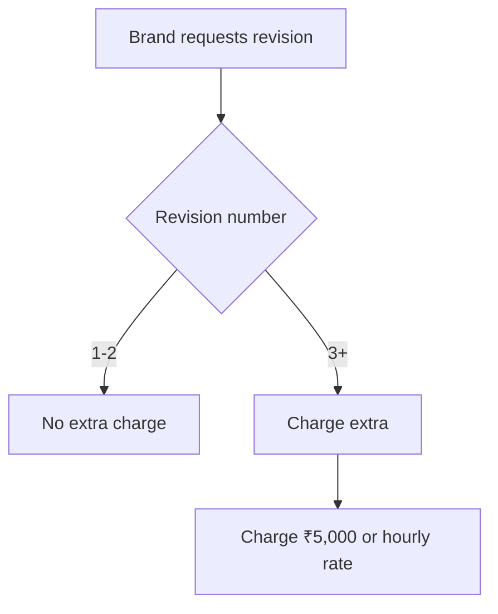
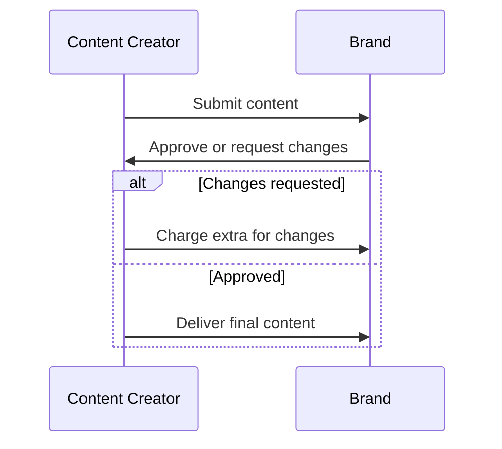

*Heads up: some links below are affiliate. Using them helps us keep the blog free. We only recommend tools we've actually used or trust.*

You've landed a brand deal and are excited to start working on the content. However, as you begin to collaborate with the brand, you realize that they have multiple revisions in mind. Each revision eats into your time and profits, and before you know it, you've spent hours working on the project without getting paid for the extra work. This is where the concept of scope creep comes in, and it's essential to understand how to cap brand deal revisions in your contract.

If you're a content creator working with brands, you know how quickly revisions can add up. Let's say you're charging ₹50,000 for a sponsored post, and you've allocated 5 hours for the project. If the brand asks for 3-4 revisions, you'll end up spending 10-12 hours on the project, effectively reducing your hourly rate to ₹4,167 - ₹5,000. This is a significant reduction in your earnings, and it's crucial to have a contract that protects your interests.

To illustrate this further, let's consider another example. Suppose you're creating a video for a brand, and you've agreed to charge ₹1,00,000 for the project. You've allocated 10 hours for the project, but the brand asks for 5 revisions. If each revision takes 2 hours, you'll end up spending 20 hours on the project, reducing your hourly rate to ₹5,000. By capping revisions at two rounds, you can ensure that you're not losing money on the project.

Consider a scenario where you're working with a brand that has a complex approval process. They have multiple stakeholders who need to review and approve the content, which can lead to multiple revisions. In this case, capping revisions at two rounds can help you avoid scope creep and ensure that you're paid fairly for your work.

## Quick summary
| Concept | Description |
| --- | --- |
| Scope Creep | Uncontrolled changes to the project scope |
| Brand Deal Revisions | Changes requested by the brand after the initial brief |
| Contract Templates | Pre-defined templates for contracts |
| Hourly Rate | The rate at which you charge for your services |
| Revision Cap | The maximum number of revisions allowed in a contract |

## Understanding Scope Creep
Scope creep occurs when the brand's requirements change during the project, leading to additional work and time spent on the project. This can be due to various reasons, such as changes in the brand's marketing strategy or the need for additional content. As a content creator, it's essential to understand that scope creep can significantly impact your earnings and reputation.

To avoid scope creep, it's crucial to have a clear understanding of the project scope and to communicate effectively with the brand. Here are some steps you can follow:

1. Define the project scope clearly in the contract, including the deliverables and timelines.
2. Establish a clear communication channel with the brand to ensure that you're aware of any changes to the project scope.
3. Include a clause in the contract that outlines the process for requesting changes and the charges for additional work.
4. Regularly review the project scope with the brand to ensure that you're on track to meet the deliverables.
5. Consider having a project management tool to track changes and revisions.
6. Make sure to document all communication with the brand, including emails, calls, and meetings.

By following these steps, you can minimize the risk of scope creep and ensure that you're paid fairly for your work. For instance, let's say you're working on a project with a brand that has a history of scope creep. You can include a clause in the contract that outlines the process for requesting changes and the charges for additional work. This can help you avoid scope creep and ensure that you're paid fairly for your work.

## The Two-Revision Standard
To avoid scope creep, it's common to include a two-revision standard in your contract. This means that the brand is allowed two revisions to the content, and any additional revisions will be charged extra. This standard helps to protect your time and earnings while also ensuring that the brand gets the content they need.

For example, let's say you're creating a social media post for a brand, and you've agreed to charge ₹20,000 for the project. You've allocated 2 hours for the project, and the brand asks for 2 revisions. If each revision takes 1 hour, you'll end up spending 4 hours on the project. By capping revisions at two rounds, you can ensure that you're not losing money on the project.

Here's a comparison of the two-revision standard with other revision caps:

| Revision Cap | Description |
| --- | --- |
| One-revision cap | The brand is allowed one revision, and any additional revisions will be charged extra |
| Two-revision cap | The brand is allowed two revisions, and any additional revisions will be charged extra |
| Three-revision cap | The brand is allowed three revisions, and any additional revisions will be charged extra |

Let's consider another example. Suppose you're creating a blog post for a brand, and you've agreed to charge ₹30,000 for the project. You've allocated 5 hours for the project, and the brand asks for 3 revisions. If each revision takes 2 hours, you'll end up spending 11 hours on the project. By capping revisions at two rounds, you can ensure that you're not losing money on the project.

## Charging for Extra Rounds
When the brand requests additional revisions beyond the two-revision standard, you can charge them for the extra work. This can be done by including a clause in your contract that outlines the charges for additional revisions. For example, you can charge ₹5,000 for each additional revision, or you can charge an hourly rate of ₹2,500 for the extra work.

To illustrate this further, let's consider another example. Suppose you're creating a video for a brand, and you've agreed to charge ₹1,00,000 for the project. You've allocated 10 hours for the project, and the brand asks for 5 revisions. If each revision takes 2 hours, you'll end up spending 20 hours on the project. By charging ₹5,000 for each additional revision, you can ensure that you're paid fairly for your work.

Here's a step-by-step procedure for charging for extra rounds:

1. Define the charges for additional revisions in the contract.
2. Communicate the charges to the brand before starting the project.
3. Track the time spent on additional revisions.
4. Invoice the brand for the extra work.
5. Consider having a payment schedule that outlines the payment terms for additional revisions.
6. Make sure to document all communication with the brand, including emails, calls, and meetings.

## Defining Final and Approval Timelines
To avoid scope creep, it's essential to define what constitutes a final version of the content and to establish approval timelines. This can be done by including a clause in your contract that outlines the process for approving the content and the timelines for each stage. For example, you can specify that the brand has 3 days to approve the content after it's been submitted, and any changes requested after this period will be charged extra.

Here's an example of how you can define the approval process:

1. The brand will review the content and provide feedback within 3 days of submission.
2. If the brand requests changes, you will revise the content and resubmit it within 2 days.
3. If the brand approves the content, you will deliver the final version within 1 day.
4. Consider having a project management tool to track the approval process and deadlines.
5. Make sure to document all communication with the brand, including emails, calls, and meetings.
6. Establish a clear communication channel with the brand to ensure that you're aware of any changes to the project scope.

By defining the approval process clearly, you can ensure that both you and the brand are on the same page and that any changes are properly documented and charged for. For instance, let's say you're working on a project with a brand that has a complex approval process. You can include a clause in the contract that outlines the process for approving the content and the timelines for each stage. This can help you avoid scope creep and ensure that you're paid fairly for your work.

## Approval Process
The approval process is critical in avoiding scope creep. You should include a clear outline of the approval process in your contract, including the timelines for each stage and the charges for any changes requested after the approval period. This will help to ensure that both you and the brand are on the same page and that any changes are properly documented and charged for.

Here's a comparison of different approval processes:

| Approval Process | Description |
| --- | --- |
| Simple approval | The brand reviews and approves the content in one stage |
| Multi-stage approval | The brand reviews and approves the content in multiple stages |
| Conditional approval | The brand approves the content conditionally, subject to certain changes |

Let's consider another example. Suppose you're working on a project with a brand that has a simple approval process. You can include a clause in the contract that outlines the process for approving the content and the timelines for each stage. This can help you avoid scope creep and ensure that you're paid fairly for your work.

## How CreatorKhata helps
CreatorKhata's Contract Templates feature can help you cap brand deal revisions and avoid scope creep. Every template caps revisions at two rounds by default and prices additional rounds, so scope creep becomes a paid change-order not free re-work. [Try CreatorKhata free](https://creatorkhata.com/?utm_source=blog&utm_medium=cta_inline&utm_campaign=brand-deal-revisions-scope-creep-creator).

## Tools that help with this

- **[CreatorKhata](https://creatorkhata.com/?utm_source=blog&utm_medium=affiliate&utm_campaign=brand-deal-revisions-scope-creep-creator)** — All-in-one business app for Indian creators — invoices, brand-deal contracts, payment tracking, GST & TDS-ready
- **[Creator gear on Amazon India](https://www.amazon.in/s?k=youtuber+kit&tag=creatorkhata2-21&utm_campaign=brand-deal-revisions-scope-creep-creator)** — Cameras, mics, lighting, and accessories for content creators
- **[Kit (formerly ConvertKit)](https://partners.kit.com/lmou6iciacgc)** — Email/newsletter platform built for creators

## A note on accuracy
This is general guidance. For your specific situation, consult a chartered accountant.
