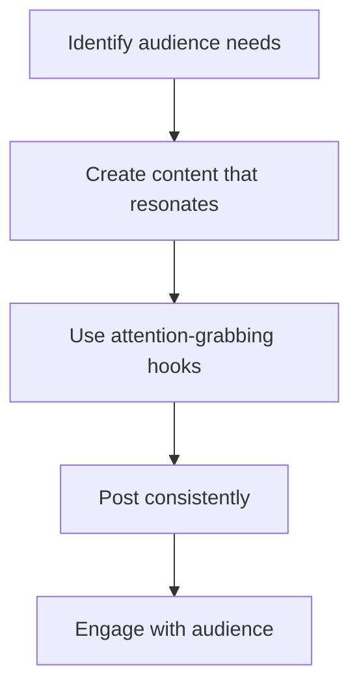
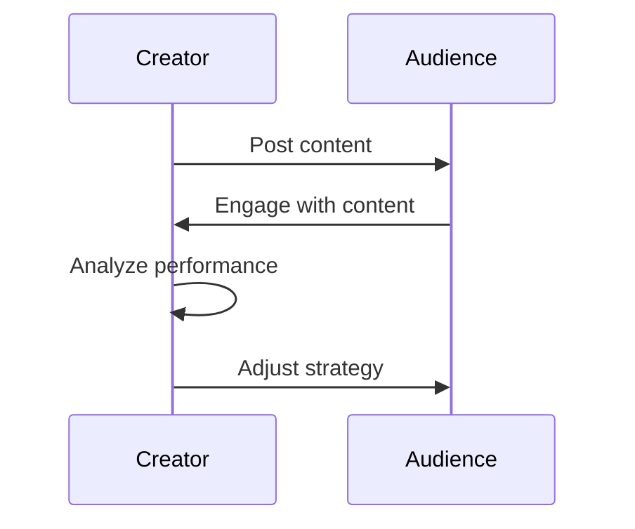
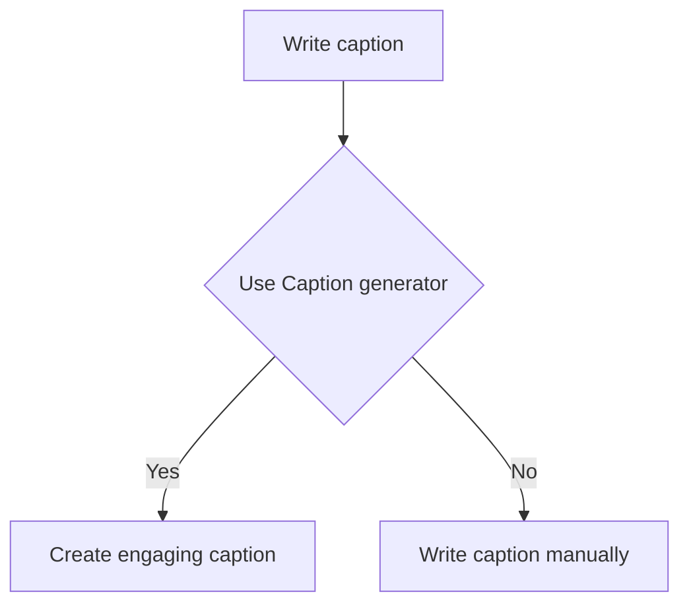

*Heads up: some links below are affiliate. Using them helps us keep the blog free. We only recommend tools we've actually used or trust.*

You're creating content on Instagram, but your follower growth is slow. You want to reach more people in India without spending money on ads. You've heard that organic growth is possible, but you're not sure where to start. With 10,000 to 500,000 followers, you're looking to take your Instagram presence to the next level.

You know that having a strong online presence is crucial for your brand, and Instagram is one of the most popular platforms in India. You want to learn how to create content that resonates with your audience, how to engage with them, and how to grow your followers organically. You're willing to put in the effort, but you need a clear plan to follow.

## Quick summary
| Step | Description | Goal |
| --- | --- | --- |
| 1 | Define your niche | Clear brand identity |
| 2 | Create engaging Reels | Increase reach and engagement |
| 3 | Develop strong hooks | Grab audience attention |
| 4 | Post consistently | Build audience expectation |
| 5 | Engage with your audience | Build loyal community |
| 6 | Collaborate with other creators | Expand your reach |
| 7 | Analyze and adjust | Optimize your strategy |

## Defining your niche
To grow your Instagram followers organically in India, you need to define your niche. What are you passionate about? What do you want to talk about? What sets you apart from others? Your niche is the foundation of your brand identity. It helps you create content that resonates with your target audience and attracts like-minded followers. For example, if you're a fashion creator, your niche could be sustainable fashion, Indian clothing, or street style.

Here's a step-by-step procedure to help you define your niche:
1. Identify your passions: What are you passionate about? What do you enjoy talking about?
2. Research your audience: Who are they? What are their interests? What problems do they face?
3. Analyze your competitors: Who are they? What are they talking about? How can you differentiate yourself?
4. Create a unique value proposition: What sets you apart from others? What unique perspective or expertise do you bring to the table?

For instance, let's say you're a beauty creator, and you're passionate about skincare. You could define your niche as 'natural skincare for Indian skin types'. This niche is specific, targeted, and resonates with your audience.

## Creating engaging Reels
Reels are a great way to showcase your creativity and showcase your personality. They're short, engaging, and can be used to tell a story, showcase a product, or provide tips and advice. To create engaging Reels, you need to think about what your audience wants to see. What problems do they face? What are their interests? What makes them laugh or cry? For instance, if you're a beauty creator, you could create Reels showcasing makeup tutorials, product reviews, or skincare routines.

Here's an example of how you can create engaging Reels:
Let's say you're a travel creator, and you want to create a Reel showcasing a destination. You could:
* Start with a hook: A stunning photo or video of the destination
* Provide valuable information: Share interesting facts, tips, or advice about the destination
* Engage with your audience: Ask them to share their own experiences or tips about the destination
* End with a call-to-action: Encourage your audience to follow you for more travel content

## Developing strong hooks
Your hook is the first thing your audience sees when they scroll through their feed. It's the caption, the image, or the video that grabs their attention and makes them want to learn more. A strong hook can make or break your post. It's what sets you apart from others and makes your content memorable. For example, if you're a travel creator, your hook could be a stunning photo of a destination, a fascinating fact about a place, or a personal anecdote about your travels.

Here are some tips to help you create strong hooks:
* Use attention-grabbing headlines: Create headlines that are informative, yet attention-grabbing
* Use high-quality visuals: Use high-quality images or videos that are visually appealing
* Use humor or surprise: Use humor or surprise to grab your audience's attention
* Use questions or prompts: Ask your audience questions or prompts to encourage engagement

For instance, let's say you're a food creator, and you want to create a hook for a recipe post. You could use a photo of the finished dish, a headline that highlights the unique ingredients, or a question that asks your audience if they've tried the recipe before.

## Posting consistently
Consistency is key to growing your Instagram followers organically in India. Your audience needs to know when to expect new content from you. It helps build anticipation and excitement around your posts. It also helps you stay top of mind and increases the chances of your audience engaging with your content. For instance, if you post every Monday, Wednesday, and Friday, your audience will know when to expect new content from you.

Here's a comparison table to help you decide on a posting schedule:
| Posting schedule | Pros | Cons |
| --- | --- | --- |
| Posting daily | Increased engagement, more content | Burnout, decreased quality |
| Posting weekly | Consistent schedule, quality content | Less engagement, less content |
| Posting monthly | Less burnout, high-quality content | Less engagement, less consistent |

For example, let's say you're a fashion creator, and you want to post content three times a week. You could post on Monday, Wednesday, and Friday, and use the other days to engage with your audience, respond to comments, and create new content.

## Engaging with your audience
Engagement is a two-way street. It's not just about posting content and waiting for likes and comments. It's about interacting with your audience, responding to their comments, and creating a community around your brand. It helps build trust, loyalty, and advocacy. For example, if someone comments on your post, you could respond with a personalized message, ask for their opinion, or share a related story.

Here's a step-by-step procedure to help you engage with your audience:
1. Respond to comments: Respond to every comment on your post, even if it's just a simple 'thank you'
2. Ask for feedback: Ask your audience for feedback, suggestions, or opinions
3. Share user-generated content: Share content created by your audience to encourage engagement and loyalty
4. Collaborate with your audience: Collaborate with your audience on content, projects, or events to build a community around your brand

For instance, let's say you're a beauty creator, and you've posted a makeup tutorial. You could respond to comments by answering questions, providing tips, or sharing related content.

## Collaborating with other creators
Collaborating with other creators is a great way to expand your reach and grow your Instagram followers organically in India. It helps you tap into new audiences, build relationships with other creators, and create content that's fresh and exciting. For instance, if you're a food creator, you could collaborate with a chef, a food blogger, or a restaurant owner to create new and interesting content.

Here are some tips to help you collaborate with other creators:
* Research potential collaborators: Research creators who have a similar niche, audience, or style
* Reach out to collaborators: Reach out to potential collaborators and propose a collaboration idea
* Plan the collaboration: Plan the collaboration, including the content, the format, and the promotion
* Promote the collaboration: Promote the collaboration on your social media channels to increase reach and engagement

For example, let's say you're a travel creator, and you want to collaborate with a photographer. You could propose a collaboration idea, plan the content and format, and promote the collaboration on your social media channels.

## Analyzing and adjusting
Finally, you need to analyze and adjust your strategy. You need to track your performance, identify what's working and what's not, and make changes accordingly. It helps you optimize your content, increase your reach, and grow your Instagram followers organically in India. For example, you could use Instagram Insights to track your engagement rates, reach, and audience growth, and adjust your strategy based on the data.

Here's a comparison table to help you analyze your performance:
| Metric | Target | Actual |
| --- | --- | --- |
| Engagement rate | 2% | 1.5% |
| Reach | 10,000 | 8,000 |
| Audience growth | 100 | 50 |

For instance, let's say you're a fashion creator, and you've tracked your performance for a month. You could analyze the data, identify areas for improvement, and adjust your strategy to increase engagement, reach, and audience growth.

## How CreatorKhata helps
The Caption generator feature in CreatorKhata helps you write scroll-stopping hooks and captions in seconds. With this feature, you can create engaging captions that grab your audience's attention and make them want to learn more. 

## Tools that help with this

- **[CreatorKhata](https://creatorkhata.com/?utm_source=blog&utm_medium=affiliate&utm_campaign=get-instagram-followers-organically-india)** — All-in-one business app for Indian creators — invoices, brand-deal contracts, payment tracking, GST & TDS-ready
- **[vidIQ](https://vidiq.com/creatorkhata?utm_campaign=get-instagram-followers-organically-india)** — YouTube analytics + content ideas + competitor tracking
- **[Creator gear on Amazon India](https://www.amazon.in/s?k=youtuber+kit&tag=creatorkhata2-21&utm_campaign=get-instagram-followers-organically-india)** — Cameras, mics, lighting, and accessories for content creators

## A note on accuracy
This is general guidance. For your specific situation, consult a chartered accountant.
