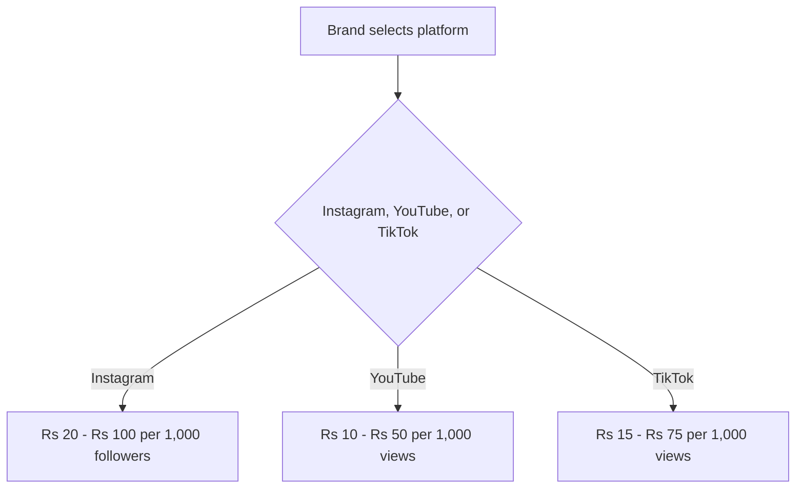
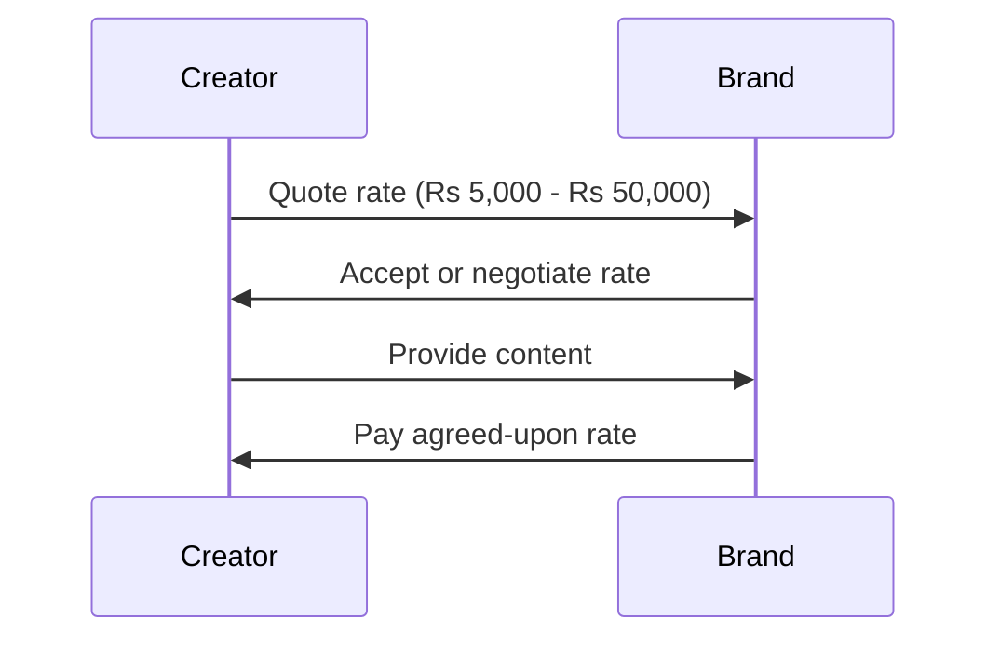
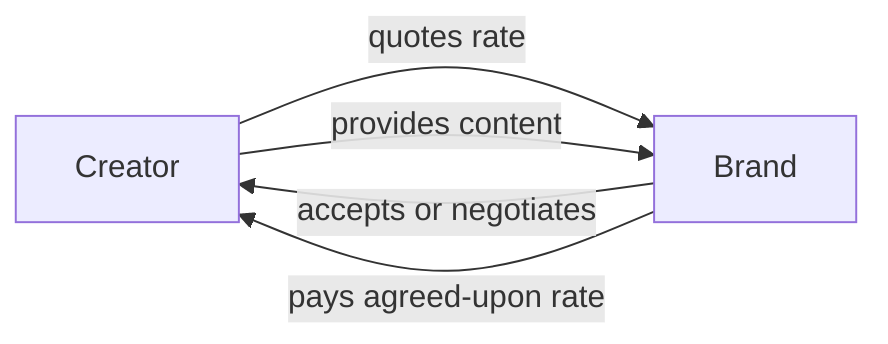

*Heads up: some links below are affiliate. Using them helps us keep the blog free. We only recommend tools we've actually used or trust.*

You're about to collaborate with a brand, but you're unsure how much to charge. You've heard of per-follower and per-view pricing, but what are the actual numbers for Indian creators in 2026? Let's say you have 100,000 followers on Instagram and 50,000 views per video on YouTube. If you charge Rs 50 per 1,000 followers, you'd make Rs 5,000 for an Instagram post. But is that enough?

As an Indian creator, you know the market is different from the US. Indian brands often have smaller budgets, and the cost of living varies greatly across the country. You need to consider these factors when deciding your rates. For example, a nano influencer with 10,000 followers might charge Rs 2,000 for a sponsored post, while a mid-tier influencer with 500,000 followers could charge Rs 50,000 or more.

## Quick summary
| Platform | Niche | Follower Count | Per-Follower Rate | Per-View Rate |
| --- | --- | --- | --- | --- |
| Instagram | Beauty | 10,000 - 100,000 | Rs 20 - Rs 100 | Rs 5 - Rs 20 |
| YouTube | Gaming | 10,000 - 100,000 | Rs 10 - Rs 50 | Rs 2 - Rs 10 |
| TikTok | Entertainment | 10,000 - 100,000 | Rs 15 - Rs 75 | Rs 3 - Rs 15 |

Let's consider another example. Suppose you have 500,000 followers on Instagram and 200,000 views per video on YouTube. Using the per-follower pricing, you could charge Rs 100 per 1,000 followers for an Instagram post, earning you Rs 50,000. Alternatively, using per-view pricing, you could charge Rs 20 per 1,000 views for a YouTube video, earning you Rs 4,000.

To further illustrate this, let's consider a nano influencer with 50,000 followers on TikTok, charging Rs 30 per 1,000 followers for a sponsored post. This would earn them Rs 1,500. On the other hand, a micro influencer with 200,000 followers on Instagram could charge Rs 80 per 1,000 followers, earning them Rs 16,000 for a sponsored post.

## Understanding Per-Follower and Per-View Pricing
Per-follower pricing is based on the number of followers you have, while per-view pricing is based on the number of views your content receives. Brands often prefer per-view pricing, as it's more closely tied to the actual engagement with their content. However, per-follower pricing can be more lucrative for creators with highly engaged audiences.

Here's a step-by-step procedure to help you decide between per-follower and per-view pricing:
1. Determine your niche and target audience.
2. Research your competition and their pricing strategies.
3. Calculate your engagement rates (e.g., likes, comments, shares).
4. Consider the brand's goals and objectives.
5. Decide on a pricing strategy that aligns with your goals and the brand's objectives.

Additionally, you should consider the following edge cases:
* If you have a highly engaged audience, per-follower pricing might be more beneficial.
* If you have a large following but low engagement, per-view pricing might be more suitable.
* If you're working with a brand that has a specific goal in mind (e.g., increasing brand awareness), you may need to adjust your pricing strategy accordingly.

## Nano, Micro, and Mid-Tier Influencer Rates
Nano influencers (10,000 - 100,000 followers) often charge lower rates due to their smaller audience size. Micro influencers (100,000 - 500,000 followers) can charge higher rates due to their larger audience and greater engagement. Mid-tier influencers (500,000 - 1,000,000 followers) can charge the highest rates, as they have a significant audience and often work with larger brands.

Here's a comparison table to illustrate the differences in rates:
| Influencer Tier | Follower Count | Per-Follower Rate | Per-View Rate |
| --- | --- | --- | --- |
| Nano | 10,000 - 100,000 | Rs 10 - Rs 50 | Rs 2 - Rs 10 |
| Micro | 100,000 - 500,000 | Rs 20 - Rs 100 | Rs 5 - Rs 20 |
| Mid-Tier | 500,000 - 1,000,000 | Rs 50 - Rs 200 | Rs 10 - Rs 50 |

For instance, let's consider a micro influencer with 300,000 followers on Instagram, charging Rs 60 per 1,000 followers for a sponsored post. This would earn them Rs 18,000. On the other hand, a mid-tier influencer with 750,000 followers on YouTube could charge Rs 120 per 1,000 views for a video, earning them Rs 90,000.

## Why Indian Rates Differ from US Rates
Indian rates differ from US rates due to various factors, including the cost of living, brand budgets, and audience engagement. Indian brands often have smaller budgets, which means they can't afford to pay as much as US brands. Additionally, the cost of living in India is generally lower than in the US, which affects the rates creators can charge.

For instance, a nano influencer in the US might charge $100 per 1,000 followers, while a nano influencer in India might charge Rs 50 per 1,000 followers (approximately $0.67 USD). This disparity is due to the differences in cost of living and brand budgets between the two countries.

To further illustrate this, let's consider the following comparison table:
| Country | Nano Influencer Rate | Micro Influencer Rate | Mid-Tier Influencer Rate |
| --- | --- | --- | --- |
| US | $100 - $500 per 1,000 followers | $500 - $2,000 per 1,000 followers | $2,000 - $5,000 per 1,000 followers |
| India | Rs 50 - Rs 200 per 1,000 followers | Rs 100 - Rs 500 per 1,000 followers | Rs 500 - Rs 2,000 per 1,000 followers |

## Calculating Your Rates
To calculate your rates, consider your niche, follower count, and engagement. Research what other creators in your niche are charging and adjust your rates accordingly. You can also use online tools to help you determine your rates.

Here's a step-by-step procedure to calculate your rates:
1. Determine your niche and target audience.
2. Research your competition and their pricing strategies.
3. Calculate your engagement rates (e.g., likes, comments, shares).
4. Consider the brand's goals and objectives.
5. Decide on a pricing strategy that aligns with your goals and the brand's objectives.
6. Use online tools or consult with a chartered accountant to determine your rates.

Additionally, you should consider the following factors when calculating your rates:
* Your content quality and production costs
* Your audience demographics and engagement
* The brand's marketing goals and budget
* The platform's advertising costs and competition

## Actual Rupee Ranges
Here are some actual rupee ranges for Indian creators in 2026:
* Nano influencers: Rs 2,000 - Rs 10,000 per sponsored post
* Micro influencers: Rs 10,000 - Rs 50,000 per sponsored post
* Mid-tier influencers: Rs 50,000 - Rs 200,000 per sponsored post

Let's consider another example. Suppose you're a mid-tier influencer with 750,000 followers on Instagram and 300,000 views per video on YouTube. You could charge Rs 150 per 1,000 followers for an Instagram post, earning you Rs 112,500. Alternatively, you could charge Rs 30 per 1,000 views for a YouTube video, earning you Rs 9,000.

To further illustrate this, let's consider a nano influencer with 20,000 followers on TikTok, charging Rs 1,000 per sponsored post. This would earn them Rs 1,000. On the other hand, a micro influencer with 150,000 followers on Instagram could charge Rs 3,000 per sponsored post, earning them Rs 3,000.

## How CreatorKhata helps
The Rate Card Calculator feature in CreatorKhata helps you determine your rates by converting your follower and view counts into India-specific 2026 price bands by niche and platform, so you quote market rate not guesswork.

## Tools that help with this

- **[CreatorKhata](https://creatorkhata.com/?utm_source=blog&utm_medium=affiliate&utm_campaign=how-much-charge-brand-deal-india-2026)** — All-in-one business app for Indian creators — invoices, brand-deal contracts, payment tracking, GST & TDS-ready
- **[Creator gear on Amazon India](https://www.amazon.in/s?k=youtuber+kit&tag=creatorkhata2-21&utm_campaign=how-much-charge-brand-deal-india-2026)** — Cameras, mics, lighting, and accessories for content creators
- **[Kit (formerly ConvertKit)](https://partners.kit.com/lmou6iciacgc)** — Email/newsletter platform built for creators

## A note on accuracy
This is general guidance. For your specific situation, consult a chartered accountant.
