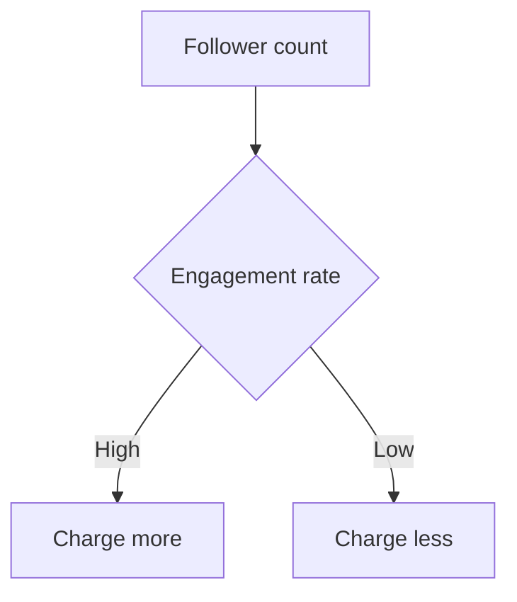
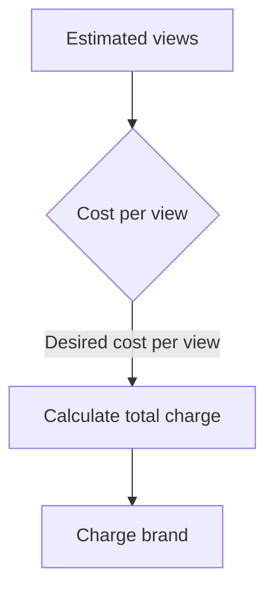
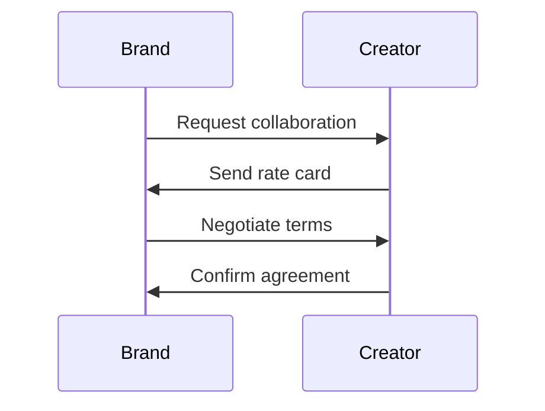

*Heads up: some links below are affiliate. Using them helps us keep the blog free. We only recommend tools we've actually used or trust.*

You're a successful Indian content creator with a sizable following on YouTube, Instagram, or other platforms. Brands are approaching you for collaborations, but you're unsure how much to charge. You don't want to underprice your services, but you also don't want to scare off potential clients. As of writing, the Indian influencer marketing industry is growing rapidly, with brands allocating larger budgets to partner with creators like you.

Let's consider a concrete example. Suppose you have 100,000 followers on Instagram and an engagement rate of 2%. A brand approaches you to promote their product in a single post. Using the cost-per-view method, you estimate that the brand will reach approximately 2,000 people (2% of 100,000). If the brand's desired cost-per-view is ₹5, you could charge ₹10,000 for the post (2,000 views * ₹5 per view). However, this is just one approach, and you need to consider other factors like your production costs, the brand's budget, and the industry standards.

For instance, let's say you have 500,000 followers on YouTube with an engagement rate of 1%. A brand wants you to create a sponsored video. Using the cost-per-view method, you estimate that the brand will reach approximately 5,000 people (1% of 500,000). If the brand's desired cost-per-view is ₹10, you could charge ₹50,000 for the video (5,000 views * ₹10 per view). Additionally, you should consider your video production costs, such as equipment, editing software, and crew expenses, which could be around ₹20,000. In this case, your total charge would be ₹70,000.

To give you a better understanding, let's consider another example. Suppose you have 200,000 followers on TikTok with an engagement rate of 3%. A brand approaches you to create a series of sponsored videos. Using the cost-per-view method, you estimate that the brand will reach approximately 6,000 people (3% of 200,000) per video. If the brand's desired cost-per-view is ₹8, you could charge ₹48,000 per video (6,000 views * ₹8 per view). Considering your video production costs, you decide to charge ₹60,000 per video.

## Quick summary
| Platform | Follower Count | Average Charge per Post |
| --- | --- | --- |
| Instagram | 10,000 - 100,000 | ₹5,000 - ₹50,000 |
| YouTube | 10,000 - 100,000 | ₹10,000 - ₹100,000 |
| TikTok | 10,000 - 100,000 | ₹3,000 - ₹30,000 |
| Facebook | 10,000 - 100,000 | ₹5,000 - ₹50,000 |
| Twitter | 10,000 - 100,000 | ₹3,000 - ₹30,000 |

To give you a better idea, here are some sample India ranges for different platforms and follower counts:
- Instagram: 10,000 - 100,000 followers, ₹5,000 - ₹50,000 per post
- YouTube: 10,000 - 100,000 followers, ₹10,000 - ₹100,000 per video
- TikTok: 10,000 - 100,000 followers, ₹3,000 - ₹30,000 per video
- Facebook: 10,000 - 100,000 followers, ₹5,000 - ₹50,000 per post
- Twitter: 10,000 - 100,000 followers, ₹3,000 - ₹30,000 per tweet

Another example to consider is for a brand that wants to partner with you for a long-term collaboration. Let's say you have 500,000 followers on Instagram with an engagement rate of 2%. The brand wants to partner with you for 6 months, with a minimum of 2 posts per month. Using the cost-per-view method, you estimate that the brand will reach approximately 4,000 people (2% of 500,000) per post. If the brand's desired cost-per-view is ₹10, you could charge ₹40,000 per post (4,000 views * ₹10 per view). Considering your production costs and the long-term nature of the collaboration, you decide to charge ₹60,000 per post.

## Pricing by Follower Count and Engagement
When determining your rates, consider your follower count and engagement. A general rule of thumb is to charge more for platforms with higher engagement rates. For example, if you have 100,000 followers on Instagram with an engagement rate of 2%, you could charge more than someone with 100,000 followers on Twitter with an engagement rate of 0.5%. To give you a better idea, here are some sample India ranges for different platforms and follower counts:
- Instagram: 10,000 - 100,000 followers, ₹5,000 - ₹50,000 per post
- YouTube: 10,000 - 100,000 followers, ₹10,000 - ₹100,000 per video
- TikTok: 10,000 - 100,000 followers, ₹3,000 - ₹30,000 per video
- Facebook: 10,000 - 100,000 followers, ₹5,000 - ₹50,000 per post
- Twitter: 10,000 - 100,000 followers, ₹3,000 - ₹30,000 per tweet

Here's a step-by-step procedure to calculate your rates based on follower count and engagement:
1. Determine your follower count on each platform.
2. Calculate your engagement rate on each platform (e.g., likes, comments, shares).
3. Research industry standards for your niche and platform.
4. Consider your production costs, such as equipment, editing software, and crew expenses.
5. Calculate your minimum charge based on your production costs and desired profit margin.
6. Adjust your charge based on your engagement rate and industry standards.

For example, let's say you have 200,000 followers on Instagram with an engagement rate of 3%. Using the above steps, you calculate your minimum charge to be ₹15,000 per post. However, considering your high engagement rate and industry standards, you decide to charge ₹30,000 per post.

Another example is for a brand that wants to partner with you for a sponsored video on YouTube. Let's say you have 500,000 followers on YouTube with an engagement rate of 1%. The brand wants to partner with you for a video that will reach approximately 5,000 people (1% of 500,000). If the brand's desired cost-per-view is ₹15, you could charge ₹75,000 for the video (5,000 views * ₹15 per view). Considering your video production costs, you decide to charge ₹100,000 for the video.

## Per-Platform Rates
Different platforms have different pricing standards. For example, YouTube creators tend to charge more than Instagram influencers due to the video production costs and the platform's algorithms. Here are some per-platform rates to consider:
- Instagram: ₹5,000 - ₹50,000 per post
- YouTube: ₹10,000 - ₹100,000 per video
- TikTok: ₹3,000 - ₹30,000 per video
- Facebook: ₹5,000 - ₹50,000 per post
- Twitter: ₹3,000 - ₹30,000 per tweet

Here's a comparison table of per-platform rates:
| Platform | Average Charge per Post | Production Costs |
| --- | --- | --- |
| Instagram | ₹5,000 - ₹50,000 | ₹1,000 - ₹10,000 |
| YouTube | ₹10,000 - ₹100,000 | ₹5,000 - ₹50,000 |
| TikTok | ₹3,000 - ₹30,000 | ₹500 - ₹5,000 |
| Facebook | ₹5,000 - ₹50,000 | ₹1,000 - ₹10,000 |
| Twitter | ₹3,000 - ₹30,000 | ₹500 - ₹5,000 |

Another example to consider is for a brand that wants to partner with you for a series of sponsored posts on Facebook. Let's say you have 200,000 followers on Facebook with an engagement rate of 2%. The brand wants to partner with you for 3 posts, with a minimum of 2,000 people reached per post. If the brand's desired cost-per-view is ₹10, you could charge ₹20,000 per post (2,000 views * ₹10 per view). Considering your production costs, you decide to charge ₹30,000 per post.

## The Cost-Per-View Method
Another way to determine your rates is by using the cost-per-view method. This involves estimating the number of views your content will receive and charging the brand accordingly. For example, if you estimate that a brand will reach 10,000 people with your content, and the brand's desired cost-per-view is ₹5, you could charge ₹50,000 for the collaboration.

Here's a step-by-step procedure to calculate your rates using the cost-per-view method:
1. Estimate the number of views your content will receive.
2. Determine the brand's desired cost-per-view.
3. Calculate your total charge based on the estimated views and cost-per-view.
4. Consider your production costs and adjust your charge accordingly.
5. Negotiate with the brand to agree on a final charge.

For instance, let's say you estimate that a brand will reach 20,000 people with your content, and the brand's desired cost-per-view is ₹10. Using the above steps, you calculate your total charge to be ₹200,000. However, considering your production costs, you decide to charge ₹250,000 for the collaboration.

Another example to consider is for a brand that wants to partner with you for a sponsored video on TikTok. Let's say you estimate that the brand will reach 15,000 people with your content, and the brand's desired cost-per-view is ₹12. Using the above steps, you calculate your total charge to be ₹180,000. Considering your production costs, you decide to charge ₹220,000 for the collaboration.

## Negotiating with Brands
When negotiating with brands, it's essential to be flexible and open to different pricing models. Some brands may want to pay you a flat fee, while others may want to pay you based on performance (e.g., per view or per engagement). Be prepared to negotiate and find a mutually beneficial agreement. You can also use [the TDS guide for creators](/blog/tds-for-youtubers-india) to understand how taxes will impact your earnings.

Here are some tips for negotiating with brands:
1. Research the brand's budget and pricing standards.
2. Determine your minimum charge based on your production costs and desired profit margin.
3. Be flexible and open to different pricing models.
4. Consider offering discounts for long-term collaborations or bulk content creation.
5. Ensure you have a clear contract outlining the terms of the collaboration.

For example, let's say a brand approaches you to partner for a series of sponsored posts on Instagram. The brand offers to pay you a flat fee of ₹50,000 per post. However, you estimate that the brand will reach 10,000 people with each post, and the brand's desired cost-per-view is ₹5. Using the cost-per-view method, you calculate your total charge to be ₹50,000 per post (10,000 views * ₹5 per view). You decide to negotiate with the brand to increase the flat fee to ₹60,000 per post, considering your production costs and the brand's desired cost-per-view.

## Creating a Rate Card
To make it easier for brands to understand your pricing, consider creating a rate card that outlines your services and corresponding prices. This can include different tiers of service, such as:
- Basic: ₹5,000 per post (includes one post on one platform)
- Premium: ₹20,000 per post (includes multiple posts on multiple platforms, plus additional services like content creation and promotion)
- Enterprise: ₹50,000 per post (includes comprehensive services like strategy development, content creation, and campaign management)

Here's an example of a rate card:
| Service | Price |
| --- | --- |
| Social media post | ₹5,000 |
| Sponsored video | ₹20,000 |
| Influencer takeover | ₹50,000 |
| Content creation | ₹10,000 |
| Promotion | ₹5,000 |

For instance, let's say you create a rate card with the following services and prices:
- Social media post: ₹5,000
- Sponsored video: ₹20,000
- Influencer takeover: ₹50,000
You can offer discounts for long-term collaborations or bulk content creation. For example, you can offer a 10% discount for 3-month collaborations or a 20% discount for 6-month collaborations.

## How CreatorKhata helps
The Rate Card feature in CreatorKhata helps you generate a defensible, professional rate card so you stop undercharging. With this feature, you can easily create a customized rate card that reflects your services and pricing. [Try CreatorKhata free](https://creatorkhata.com/?utm_source=blog&utm_medium=cta_inline&utm_campaign=how-much-to-charge-brands-india).

## Tools that help with this

- **[CreatorKhata](https://creatorkhata.com/?utm_source=blog&utm_medium=affiliate&utm_campaign=how-much-to-charge-brands-india)** — All-in-one business app for Indian creators — invoices, brand-deal contracts, payment tracking, GST & TDS-ready
- **[Creator gear on Amazon India](https://www.amazon.in/s?k=youtuber+kit&tag=creatorkhata2-21&utm_campaign=how-much-to-charge-brands-india)** — Cameras, mics, lighting, and accessories for content creators
- **[Kit (formerly ConvertKit)](https://partners.kit.com/lmou6iciacgc)** — Email/newsletter platform built for creators

## A note on accuracy
This is general guidance. For your specific situation, consult a chartered accountant.
