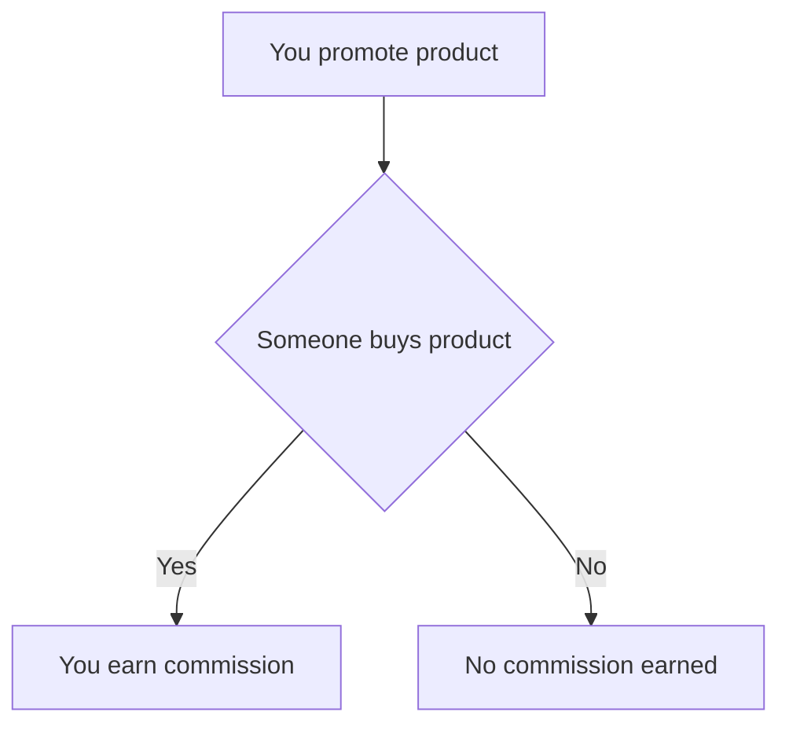
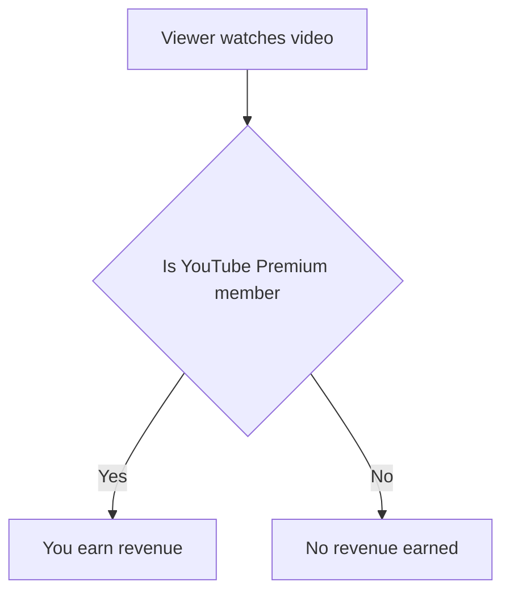
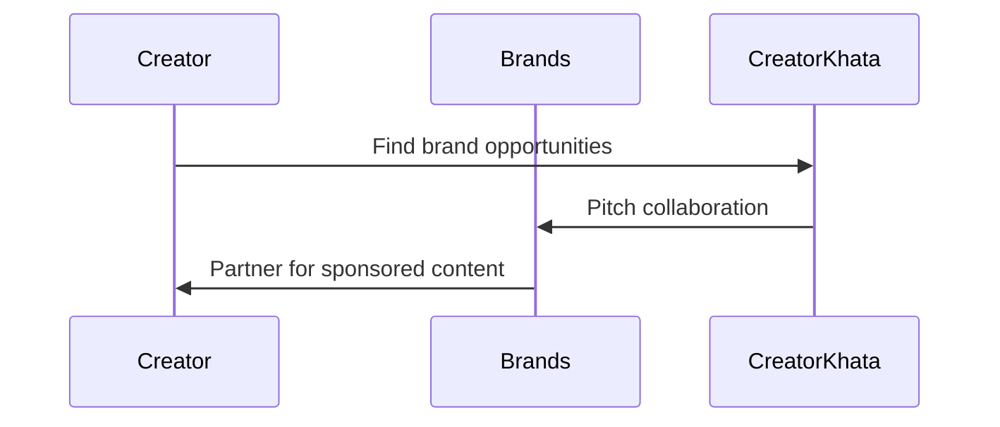

*Heads up: some links below are affiliate. Using them helps us keep the blog free. We only recommend tools we've actually used or trust.*

You're creating content on YouTube, but your channel is still small, with under 1,000 subscribers. You're wondering how you can start earning from your channel before you reach the AdSense monetization threshold. The good news is that there are several ways to earn from a small YouTube channel, and we'll explore them in this post.

You might have heard that it's impossible to earn from a small channel, but that's not true. With the right strategies, you can start earning your first rupee from your channel, even with a tiny audience. For example, let's say you have a channel with 500 subscribers, and you partner with a brand to promote their product. You can earn a commission of Rs 5,000 for every sale made through your unique referral link. That's a significant amount of money, considering you're just starting out.

## Quick summary
| Method | Description | Potential Earning |
| --- | --- | --- |
| Affiliate Marketing | Promote products and earn a commission | Rs 5,000 - Rs 20,000 per month |
| Brand Deals | Partner with brands to promote their products | Rs 10,000 - Rs 50,000 per deal |
| Services | Offer services like consulting, coaching, or freelancing | Rs 20,000 - Rs 100,000 per month |
| Memberships | Offer exclusive content or perks to loyal viewers | Rs 5,000 - Rs 20,000 per month |
| Selling Products | Sell merchandise, ebooks, or courses | Rs 10,000 - Rs 50,000 per month |
| Sponsorships | Partner with brands to create sponsored content | Rs 10,000 - Rs 50,000 per deal |
| YouTube Premium | Earn from YouTube Premium revenue | Rs 1,000 - Rs 5,000 per month |

## Affiliate Marketing
Affiliate marketing is a great way to earn from your small YouTube channel. You can promote products from companies like Amazon, Flipkart, or other affiliate networks. When someone buys a product through your unique referral link, you earn a commission. For example, let's say you promote a product that costs Rs 1,000, and you earn a 10% commission. If 10 people buy the product through your link, you'll earn Rs 1,000.

To get started with affiliate marketing, you'll need to:
1. Research affiliate programs that are relevant to your niche
2. Sign up for the affiliate program
3. Get your unique referral link
4. Create content that promotes the product
5. Share the content with your audience

For instance, let's say you have a channel about fitness, and you promote a fitness tracker that costs Rs 5,000. You earn a 15% commission for every sale made through your link. If 5 people buy the tracker, you'll earn Rs 3,750. That's a significant amount of money, considering you're just starting out.

## Brand Deals
Brand deals are another way to earn from your small YouTube channel. You can partner with brands to promote their products or services. For example, let's say you have a channel about beauty products, and a brand approaches you to promote their new lipstick. They offer you Rs 10,000 to create a video showcasing their product. That's a significant amount of money, considering you're just starting out.

To increase your chances of getting brand deals, you'll need to:
1. Build a loyal audience
2. Create high-quality content
3. Engage with your audience
4. Reach out to brands that are relevant to your niche
5. Negotiate the terms of the deal

For instance, let's say you have a channel about travel, and a brand approaches you to promote their hotel. They offer you Rs 20,000 to create a video showcasing their hotel, and you'll also get to stay at the hotel for free. That's a great deal, considering you get to earn money and experience a new hotel.

| Brand | Product | Potential Earning |
| --- | --- | --- |
| Beauty Brand | Lipstick | Rs 10,000 |
| Travel Brand | Hotel | Rs 20,000 |
| Fitness Brand | Fitness Tracker | Rs 15,000 |

## Services
Offering services is a great way to earn from your expertise. You can offer consulting, coaching, or freelancing services to your viewers. For example, let's say you have a channel about photography, and you offer photography services to your viewers. You can charge Rs 5,000 per session, and if you get 5 clients per month, you'll earn Rs 25,000.

To get started with offering services, you'll need to:
1. Identify your area of expertise
2. Create a portfolio of your work
3. Set your pricing
4. Create a contract for your services
5. Promote your services to your audience

For instance, let's say you have a channel about cooking, and you offer cooking classes to your viewers. You can charge Rs 2,000 per class, and if you get 10 clients per month, you'll earn Rs 20,000. That's a significant amount of money, considering you're just starting out.

## Memberships
Memberships are a great way to earn from your loyal viewers. You can offer exclusive content, perks, or benefits to your members. For example, let's say you have a channel about fitness, and you offer a membership program that includes exclusive workout videos, personalized coaching, and access to a private Facebook group. You can charge Rs 1,000 per month, and if you get 20 members, you'll earn Rs 20,000.

To get started with memberships, you'll need to:
1. Identify what exclusive content you can offer
2. Set your pricing
3. Create a membership program
4. Promote your membership program to your audience
5. Deliver exclusive content to your members

For instance, let's say you have a channel about gaming, and you offer a membership program that includes exclusive gaming content, access to a private Discord server, and exclusive merchandise. You can charge Rs 500 per month, and if you get 50 members, you'll earn Rs 25,000. That's a significant amount of money, considering you're just starting out.

## Selling Products
Selling products is another way to earn from your small YouTube channel. You can sell merchandise, ebooks, or courses related to your niche. For example, let's say you have a channel about cooking, and you sell a cookbook that includes your favorite recipes. You can charge Rs 500 per book, and if you sell 20 books per month, you'll earn Rs 10,000.

To get started with selling products, you'll need to:
1. Identify what products you can sell
2. Create the product
3. Set your pricing
4. Create a sales page
5. Promote your product to your audience

For instance, let's say you have a channel about beauty, and you sell a skincare course that includes video lessons and a private Facebook group. You can charge Rs 2,000 per course, and if you sell 10 courses per month, you'll earn Rs 20,000. That's a significant amount of money, considering you're just starting out.

## Sponsorships
Sponsorships are similar to brand deals, but they involve creating sponsored content. For example, let's say you have a channel about travel, and a brand approaches you to create a sponsored video showcasing their hotel. They offer you Rs 20,000 to create the video, and you'll also get to stay at the hotel for free. That's a great deal, considering you get to earn money and experience a new hotel.

To increase your chances of getting sponsorships, you'll need to:
1. Build a loyal audience
2. Create high-quality content
3. Engage with your audience
4. Reach out to brands that are relevant to your niche
5. Negotiate the terms of the sponsorship

For instance, let's say you have a channel about fitness, and a brand approaches you to create a sponsored video showcasing their fitness tracker. They offer you Rs 15,000 to create the video, and you'll also get to keep the fitness tracker. That's a great deal, considering you get to earn money and get a free product.

## YouTube Premium
YouTube Premium is a service that allows viewers to watch videos without ads. As a creator, you can earn from YouTube Premium revenue. For example, let's say you have a channel with 1,000 subscribers, and 100 of them are YouTube Premium members. You'll earn a portion of the revenue generated from those members, which can be around Rs 1,000 per month.

To get started with YouTube Premium, you'll need to:
1. Meet the YouTube Partner Program requirements
2. Enable YouTube Premium on your channel
3. Promote YouTube Premium to your audience
4. Create content that is eligible for YouTube Premium revenue
5. Track your YouTube Premium earnings

For instance, let's say you have a channel with 500 subscribers, and 50 of them are YouTube Premium members. You'll earn a portion of the revenue generated from those members, which can be around Rs 500 per month. That's a significant amount of money, considering you're just starting out.

## How CreatorKhata helps
Outreach - pitch brands for paid collaborations even before you hit AdSense eligibility. With CreatorKhata, you can find and connect with brands that are interested in partnering with creators like you. This feature helps you earn from your small YouTube channel by providing you with opportunities to partner with brands and create sponsored content. [Try CreatorKhata free](https://creatorkhata.com/?utm_source=blog&utm_medium=cta_inline&utm_campaign=how-to-earn-from-small-youtube-channel).

## Tools that help with this

- **[CreatorKhata](https://creatorkhata.com/?utm_source=blog&utm_medium=affiliate&utm_campaign=how-to-earn-from-small-youtube-channel)** — All-in-one business app for Indian creators — invoices, brand-deal contracts, payment tracking, GST & TDS-ready
- **[vidIQ](https://vidiq.com/creatorkhata?utm_campaign=how-to-earn-from-small-youtube-channel)** — YouTube analytics + content ideas + competitor tracking

## A note on accuracy
This is general guidance. For your specific situation, consult a chartered accountant.
