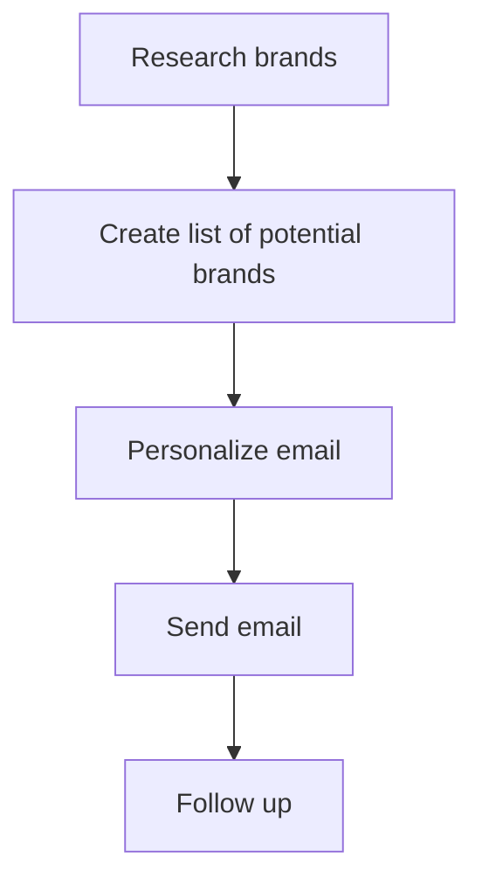
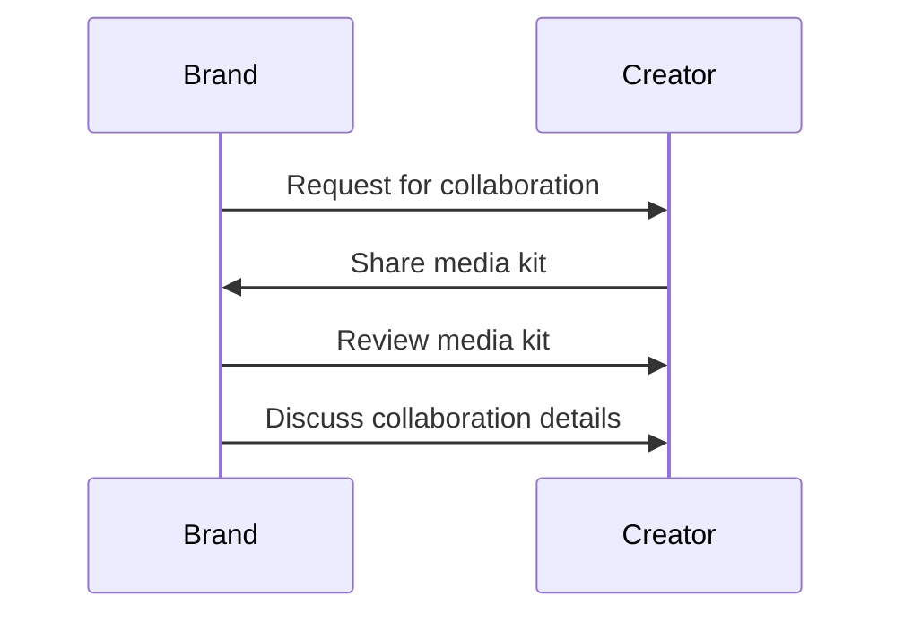
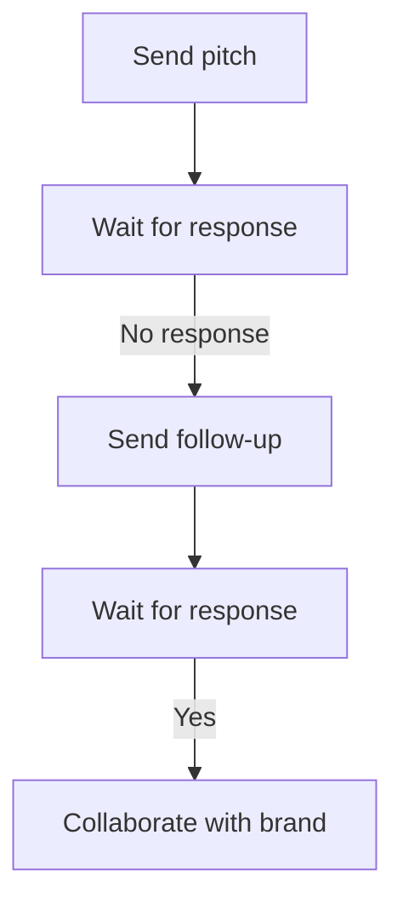

*Heads up: some links below are affiliate. Using them helps us keep the blog free. We only recommend tools we've actually used or trust.*

You're a small creator in India with a modest following of 5,000 to 50,000 fans. You've been creating content for a while now, and you're eager to start monetizing your influence. One way to do this is by getting brand deals. But how do you get started? You've probably heard of big creators with millions of followers getting paid lakhs of rupees for promoting brands. But what about you? Can you still get brand deals with a smaller following?

You can. In fact, many brands are now looking for micro-influencers like you to promote their products. Micro-influencers have a smaller, but more engaged audience, which can be more valuable to brands than a large, but disengaged following. So, how do you get brand deals as a small creator in India? Let's break it down.

## Quick summary
| Topic | Description |
| --- | --- |
| Finding brands | Research brands that align with your niche |
| Cold pitching | Reach out to brands with a personalized email |
| Media kit | Create a professional document showcasing your stats |
| What brands look for | Engagement, audience demographics, and content quality |
| Micro-influencer advantage | Smaller, but more engaged audience |
| Pitching tips | Personalize your email, highlight your unique selling points |
| Follow-up | Send a follow-up email if you don't hear back |

## Finding brands
The first step to getting brand deals is to find brands that align with your niche. You can do this by researching brands that are already working with creators in your space. Look at their social media pages, websites, and advertising campaigns. Make a list of brands that you think would be a good fit for your content. For example, if you're a beauty creator, you might look at brands like Lakme, Maybelline, or L'Oreal. You can also use tools like [Ahrefs](https://ahrefs.com/) or [BuzzStream](https://www.buzzstream.com/) to find brands that are already working with influencers in your niche.

To give you a better idea, let's consider an example. Suppose you're a fashion creator with 10,000 followers on Instagram. You've noticed that brands like Zara and H&M often collaborate with fashion influencers. You could research these brands and see if they have any upcoming campaigns or product launches that might be a good fit for your content.

Here's a step-by-step procedure to find brands:

1. Identify your niche and the types of brands that typically work with creators in that space.
2. Research brands that are already working with influencers in your niche.
3. Look at their social media pages, websites, and advertising campaigns to get an idea of their brand voice and the types of content they typically create.
4. Make a list of brands that you think would be a good fit for your content.
5. Use tools like Ahrefs or BuzzStream to find brands that are already working with influencers in your niche.

## Cold pitching
Once you have a list of brands, it's time to start cold pitching. Cold pitching is when you reach out to a brand without being approached by them first. This can be intimidating, but it's a great way to get your foot in the door. When cold pitching, make sure to personalize your email. Address the brand by name, and mention specific products or campaigns that you like. Keep your email short and to the point, and make sure to include a clear call-to-action. For example, you might say something like, 'Hi [Brand Name], I love your [product/campaign] and think it would be a great fit for my audience. I'd love to discuss potential collaboration opportunities.'

To illustrate this, let's consider another example. Suppose you're a food creator with 20,000 followers on YouTube. You've noticed that a brand like Nestle often collaborates with food influencers. You could send them a personalized email, mentioning their recent campaign and how your content could be a good fit for their brand.

Here's a comparison table to help you understand the importance of personalization in cold pitching:

| Personalization | Non-Personalization |
| --- | --- |
| Address the brand by name | Use a generic greeting |
| Mention specific products or campaigns | Don't mention any specific products or campaigns |
| Keep the email short and to the point | Send a long, generic email |
| Include a clear call-to-action | Don't include a clear call-to-action |

## Building a media kit
A media kit is a professional document that showcases your stats, audience demographics, and content quality. This is something that you'll want to have ready when reaching out to brands. Your media kit should include information like your follower count, engagement rate, and audience demographics. You should also include examples of your content, as well as any relevant metrics like website traffic or email subscribers. For example, if you're a beauty creator, your media kit might include before-and-after photos of your makeup looks, as well as screenshots of your social media engagement.

To give you a better idea, let's consider an example. Suppose you're a travel creator with 15,000 followers on Instagram. Your media kit might include the following information:

* Follower count: 15,000
* Engagement rate: 2.5%
* Audience demographics: 70% female, 30% male, aged 25-45
* Examples of content: Photos of your travel destinations, screenshots of your social media engagement
* Relevant metrics: 1,000 website visitors per month, 500 email subscribers

Here's a step-by-step procedure to build a media kit:

1. Gather your stats, including your follower count, engagement rate, and audience demographics.
2. Collect examples of your content, including photos, videos, or blog posts.
3. Include any relevant metrics, such as website traffic or email subscribers.
4. Use a template or design tool to create a visually appealing media kit.
5. Review and update your media kit regularly to ensure it remains accurate and up-to-date.

## What brands look for
So, what do brands look for when partnering with creators? The answer is, it depends. Some brands may prioritize engagement, while others may care more about audience demographics or content quality. As a small creator, you may not have the largest following, but you can still offer brands something unique. For example, you might have a highly engaged audience, or a very specific niche that aligns with the brand's products. When reaching out to brands, be sure to highlight your unique selling points.

To illustrate this, let's consider an example. Suppose you're a fitness creator with 10,000 followers on YouTube. You've noticed that a brand like Nike often collaborates with fitness influencers. You could highlight your unique selling points, such as your highly engaged audience or your specific niche, to show the brand why you'd be a good fit for their products.

Here's a comparison table to help you understand what brands look for in creators:

| Brand Priority | What to Highlight |
| --- | --- |
| Engagement | Highly engaged audience, high engagement rate |
| Audience demographics | Specific niche, targeted audience demographics |
| Content quality | High-quality content, unique and engaging |

## The micro-influencer advantage
As a micro-influencer, you have a smaller, but more engaged audience. This can be more valuable to brands than a large, but disengaged following. Micro-influencers are also often more authentic and relatable, which can make their endorsements more effective. When reaching out to brands, be sure to highlight your micro-influencer status and the benefits that come with it.

To give you a better idea, let's consider an example. Suppose you're a beauty creator with 5,000 followers on Instagram. You've noticed that a brand like Sephora often collaborates with micro-influencers. You could highlight your micro-influencer status, as well as the benefits that come with it, such as a highly engaged audience and authentic endorsements.

Here's a step-by-step procedure to highlight your micro-influencer advantage:

1. Identify your niche and the types of brands that typically work with micro-influencers in that space.
2. Research brands that are already working with micro-influencers in your niche.
3. Look at their social media pages, websites, and advertising campaigns to get an idea of their brand voice and the types of content they typically create.
4. Highlight your micro-influencer status and the benefits that come with it, such as a highly engaged audience and authentic endorsements.
5. Use a template or design tool to create a visually appealing media kit that showcases your micro-influencer advantage.

## Pitching tips
When pitching to brands, there are a few tips to keep in mind. First, personalize your email. Address the brand by name, and mention specific products or campaigns that you like. Second, highlight your unique selling points. What makes you different from other creators? What can you offer the brand that others can't? Finally, be clear and concise. Keep your email short and to the point, and make sure to include a clear call-to-action.

To illustrate this, let's consider an example. Suppose you're a food creator with 20,000 followers on YouTube. You've noticed that a brand like Nestle often collaborates with food influencers. You could send them a personalized email, mentioning their recent campaign and how your content could be a good fit for their brand.

Here's a step-by-step procedure to pitch to brands:

1. Research the brand and their recent campaigns or product launches.
2. Personalize your email, addressing the brand by name and mentioning specific products or campaigns that you like.
3. Highlight your unique selling points, such as your highly engaged audience or specific niche.
4. Keep your email short and to the point, and make sure to include a clear call-to-action.
5. Review and update your pitch regularly to ensure it remains accurate and up-to-date.

## Follow-up
If you don't hear back from a brand after sending a pitch, don't be discouraged. It's common for brands to receive many pitches, and it may take some time for them to get back to you. If you don't hear back after a week or two, consider sending a follow-up email. This can help remind the brand of your pitch and show that you're still interested in collaborating.

To give you a better idea, let's consider an example. Suppose you're a travel creator with 15,000 followers on Instagram. You've sent a pitch to a brand like Expedia, but you haven't heard back after a week. You could send a follow-up email, reiterating your interest in collaborating and asking if they've had a chance to review your pitch.

Here's a step-by-step procedure to follow up with brands:

1. Wait for a week or two after sending your initial pitch.
2. Send a follow-up email, reiterating your interest in collaborating and asking if they've had a chance to review your pitch.
3. Keep your follow-up email short and to the point, and make sure to include a clear call-to-action.
4. Review and update your follow-up email regularly to ensure it remains accurate and up-to-date.
5. Consider sending a second follow-up email if you still haven't heard back after another week or two.

## How CreatorKhata helps
The Media Kit and Outreach feature on CreatorKhata can help you build a professional media kit and pitch brands in minutes. With this feature, you can create a customized media kit that showcases your stats, audience demographics, and content quality. You can also use the outreach feature to send personalized emails to brands and track your responses. [Try CreatorKhata free](https://creatorkhata.com/?utm_source=blog&utm_medium=cta_inline&utm_campaign=how-to-get-brand-deals-small-creator-india).

## Tools that help with this

- **[CreatorKhata](https://creatorkhata.com/?utm_source=blog&utm_medium=affiliate&utm_campaign=how-to-get-brand-deals-small-creator-india)** — All-in-one business app for Indian creators — invoices, brand-deal contracts, payment tracking, GST & TDS-ready
- **[Creator gear on Amazon India](https://www.amazon.in/s?k=youtuber+kit&tag=creatorkhata2-21&utm_campaign=how-to-get-brand-deals-small-creator-india)** — Cameras, mics, lighting, and accessories for content creators
- **[Kit (formerly ConvertKit)](https://partners.kit.com/lmou6iciacgc)** — Email/newsletter platform built for creators

## A note on accuracy
This is general guidance. For your specific situation, consult a chartered accountant.
