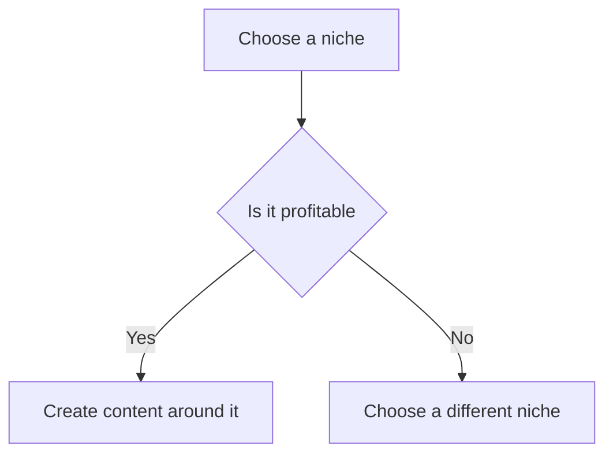
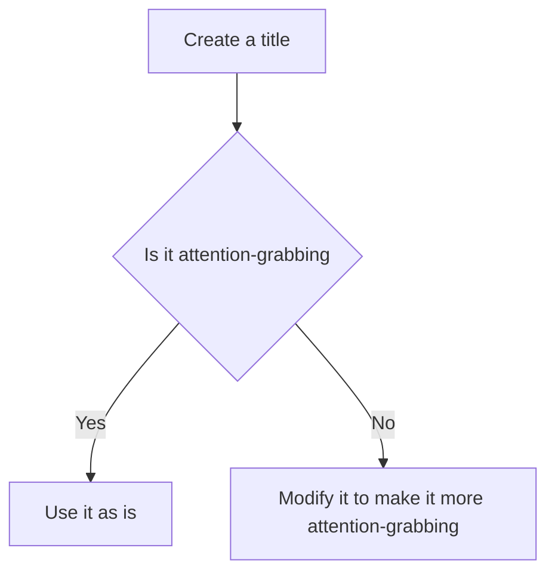
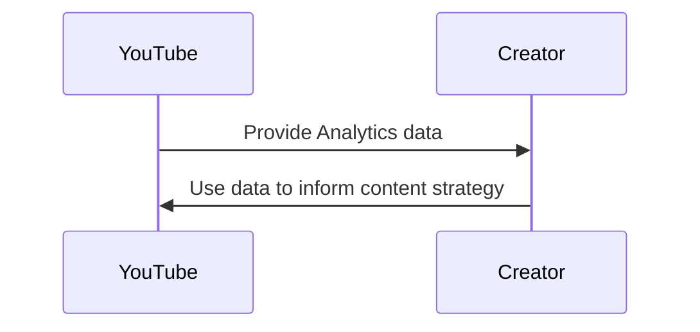

*Heads up: some links below are affiliate. Using them helps us keep the blog free. We only recommend tools we've actually used or trust.*

You're about to start your YouTube journey in India, but you have no idea where to begin. You've heard stories of creators earning lakhs of rupees from their channels, but you're still struggling to get your first 1,000 subscribers. You've tried uploading videos, but they're not getting the views you expected. You're wondering what you're doing wrong and how you can improve.

You're not alone. Many Indian creators face the same challenges when starting their YouTube channels. But with the right strategy and consistency, you can grow your channel from zero and start earning money from your content. In this post, we'll share 7 steps to help you grow your YouTube channel from zero in India, including picking a niche, creating engaging titles and thumbnails, utilizing YouTube Shorts, and avoiding common mistakes.

## Quick summary
| Step | Description | Importance |
| --- | --- | --- |
| 1 | Pick a niche | High |
| 2 | Create a content calendar | Medium |
| 3 | Optimize titles and thumbnails | High |
| 4 | Utilize YouTube Shorts | Medium |
| 5 | Engage with your audience | High |
| 6 | Collaborate with other creators | Medium |
| 7 | Analyze your performance | High |

## Picking a niche
Picking a niche is one of the most important steps in growing your YouTube channel. You need to choose a topic that you're passionate about and that has a large enough audience in India. Some popular niches for Indian creators include cooking, beauty, gaming, and education. But you don't have to stick to these niches. You can choose any topic that you're interested in and that you think will resonate with your audience.

For example, let's say you're interested in creating content around personal finance. You can create videos about budgeting, saving, and investing, and share your own experiences and tips with your audience. You can also collaborate with other creators in the personal finance space and create content that's relevant to the Indian audience.

To give you a better idea, let's consider another example. Suppose you're interested in creating content around health and wellness. You can create videos about yoga, meditation, or fitness, and share your own experiences and tips with your audience. You can also collaborate with other creators in the health and wellness space and create content that's relevant to the Indian audience.

Here's a step-by-step procedure to help you pick a niche:

1. **Brainstorm ideas**: Take a few hours to brainstorm ideas for your niche. Think about what you're passionate about and what you're good at.
2. **Research your audience**: Research your potential audience to see what they're interested in and what they're looking for.
3. **Analyze your competition**: Analyze your competition to see what they're doing and how you can differentiate yourself.
4. **Choose a niche**: Based on your research and analysis, choose a niche that you think will work for you.
5. **Create content**: Start creating content around your chosen niche and see how it performs.

## Creating a content calendar
Creating a content calendar is essential to ensuring consistency on your channel. You need to plan out your content in advance and make sure that you're uploading videos regularly. You can use a spreadsheet or a tool like CreatorKhata to plan your content and schedule your uploads.

For example, let's say you want to upload 3 videos per week. You can plan out your content for the next month and make sure that you have enough videos to upload every Monday, Wednesday, and Friday. You can also use this calendar to track your performance and see what's working and what's not.

To give you a better idea, let's consider another example. Suppose you want to upload 5 videos per week. You can plan out your content for the next two months and make sure that you have enough videos to upload every Monday, Tuesday, Wednesday, Thursday, and Friday. You can also use this calendar to track your performance and see what's working and what's not.

Here's a comparison table to help you decide on a content calendar tool:

| Tool | Features | Pricing |
| --- | --- | --- |
| CreatorKhata | Content calendar, idea generator, analytics | ₹500/month |
| Google Sheets | Content calendar, collaboration | Free |
| Trello | Content calendar, project management | ₹800/month |

## Optimizing titles and thumbnails
Your title and thumbnail are the first things that your audience will see when they come across your video. You need to make sure that they're attention-grabbing and relevant to your content. You can use keywords in your title to help your video rank better in search results, and you can use eye-catching images in your thumbnail to grab the attention of your audience.

For example, let's say you're creating a video about how to make a popular Indian dish. You can use keywords like "Indian recipe" or "vegetarian cooking" in your title, and you can use an image of the finished dish in your thumbnail.

To give you a better idea, let's consider another example. Suppose you're creating a video about a popular Indian festival. You can use keywords like "Diwali celebration" or "Navratri recipes" in your title, and you can use an image of the festival decorations or food in your thumbnail.

Here's a step-by-step procedure to help you optimize your titles and thumbnails:

1. **Research keywords**: Research keywords that are relevant to your content and audience.
2. **Create a title**: Create a title that includes your target keywords and is attention-grabbing.
3. **Create a thumbnail**: Create a thumbnail that is eye-catching and relevant to your content.
4. **Test and optimize**: Test your title and thumbnail and optimize them based on your performance data.

## Utilizing YouTube Shorts
YouTube Shorts are a great way to create short, engaging videos that can help you grow your channel. You can use Shorts to create teasers for your longer videos, or you can use them to create standalone content that's relevant to your audience.

For example, let's say you're creating a video about a popular Indian festival. You can create a Short that shows a sneak peek of the festival, or you can create a Short that shares a tip or trick related to the festival.

To give you a better idea, let's consider another example. Suppose you're creating a video about a popular Indian recipe. You can create a Short that shows a quick cooking tip, or you can create a Short that shares a variation of the recipe.

Here's a step-by-step procedure to help you create effective YouTube Shorts:

1. **Plan your content**: Plan your content in advance and make sure it's relevant to your audience.
2. **Keep it short**: Keep your Shorts short and engaging, ideally under 60 seconds.
3. **Use eye-catching visuals**: Use eye-catching visuals and music to grab the attention of your audience.
4. **Optimize for search**: Optimize your Shorts for search by using relevant keywords in your title and description.

## Engaging with your audience
Engaging with your audience is essential to building a loyal following on YouTube. You need to respond to comments and messages, and you need to create content that's relevant to your audience. You can use social media to engage with your audience and promote your channel, and you can use YouTube's community features to create a community around your channel.

For example, let's say you're creating a video about a popular Indian topic. You can ask your audience to share their thoughts and opinions in the comments, and you can respond to their comments to create a conversation.

To give you a better idea, let's consider another example. Suppose you're creating a video about a popular Indian recipe. You can ask your audience to share their favorite variations of the recipe, and you can respond to their comments to create a conversation.

Here's a comparison table to help you decide on a social media platform for engagement:

| Platform | Features | Pricing |
| --- | --- | --- |
| Facebook | Groups, messaging, advertising | Free |
| Instagram | Stories, reels, messaging | Free |
| Twitter | Tweets, messaging, advertising | Free |

## Collaborating with other creators
Collaborating with other creators is a great way to grow your channel and reach a wider audience. You can collaborate with creators in your niche, or you can collaborate with creators in other niches to reach a different audience.

For example, let's say you're creating content around personal finance. You can collaborate with a creator who specializes in investing, or you can collaborate with a creator who specializes in budgeting.

To give you a better idea, let's consider another example. Suppose you're creating content around health and wellness. You can collaborate with a creator who specializes in yoga, or you can collaborate with a creator who specializes in nutrition.

Here's a step-by-step procedure to help you collaborate with other creators:

1. **Find a collaborator**: Find a creator who is relevant to your niche and audience.
2. **Reach out**: Reach out to the creator and propose a collaboration idea.
3. **Plan your content**: Plan your content in advance and make sure it's relevant to your audience.
4. **Create and promote**: Create and promote your collaborative content to reach a wider audience.

## Analyzing your performance
Analyzing your performance is essential to understanding what's working and what's not on your channel. You can use YouTube Analytics to track your views, engagement, and earnings, and you can use this data to make informed decisions about your content and strategy.

For example, let's say you're creating content around a popular Indian topic. You can use Analytics to see how your videos are performing, and you can use this data to create more content that's relevant to your audience.

To give you a better idea, let's consider another example. Suppose you're creating content around a popular Indian recipe. You can use Analytics to see how your videos are performing, and you can use this data to create more content that's relevant to your audience.

Here's a step-by-step procedure to help you analyze your performance:

1. **Set up Analytics**: Set up YouTube Analytics and connect it to your channel.
2. **Track your metrics**: Track your views, engagement, and earnings to see how your channel is performing.
3. **Analyze your data**: Analyze your data to see what's working and what's not.
4. **Make informed decisions**: Make informed decisions about your content and strategy based on your performance data.

## How CreatorKhata helps
CreatorKhata's idea generator and content calendar feature can help you plan ahead and never run out of video ideas. With this feature, you can generate ideas based on your niche and audience, and you can schedule your uploads in advance to ensure consistency. [Try CreatorKhata free](https://creatorkhata.com/?utm_source=blog&utm_medium=cta_inline&utm_campaign=how-to-grow-youtube-channel-from-zero-india).

## Tools that help with this

- **[vidIQ](https://vidiq.com/creatorkhata?utm_campaign=how-to-grow-youtube-channel-from-zero-india)** — YouTube analytics + content ideas + competitor tracking
- **[CreatorKhata](https://creatorkhata.com/?utm_source=blog&utm_medium=affiliate&utm_campaign=how-to-grow-youtube-channel-from-zero-india)** — All-in-one business app for Indian creators — invoices, brand-deal contracts, payment tracking, GST & TDS-ready
- **[Creator gear on Amazon India](https://www.amazon.in/s?k=youtuber+kit&tag=creatorkhata2-21&utm_campaign=how-to-grow-youtube-channel-from-zero-india)** — Cameras, mics, lighting, and accessories for content creators

## A note on accuracy
This is general guidance. For your specific situation, consult a chartered accountant.
