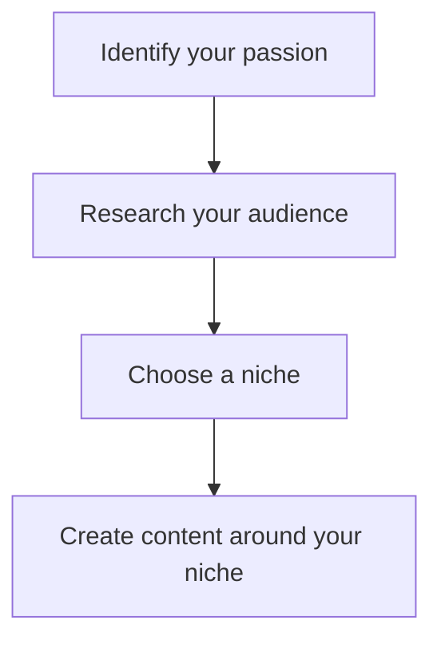
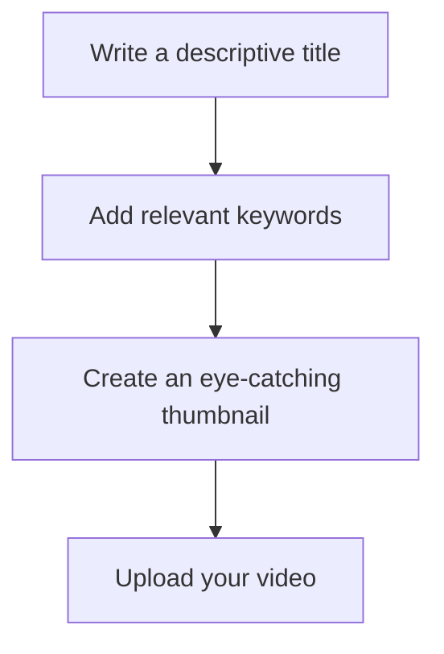
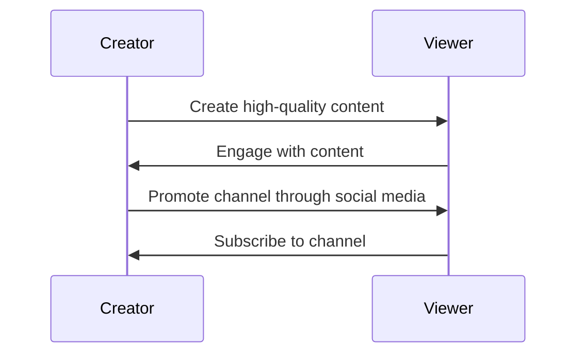

*Heads up: some links below are affiliate. Using them helps us keep the blog free. We only recommend tools we've actually used or trust.*

You're starting your YouTube journey from scratch, with zero subscribers and an empty slate. You've got a passion for creating content, but you're not sure where to begin. You're wondering how to grow your YouTube channel from zero in India, and make it stand out in a crowded online space. With over 400 million internet users in India, the potential for growth is immense, but so is the competition.

As you start creating content, you'll realize that growing a YouTube channel from zero requires more than just uploading videos. It needs a well-thought-out strategy, consistency, and a deep understanding of your target audience. You'll need to navigate the complexities of titles, thumbnails, and tags, all while creating content that resonates with your viewers. And, as an Indian creator, you'll need to be aware of the unique challenges and opportunities that come with creating content for a diverse and vibrant audience.

## Quick summary
| Step | Description |
| --- | --- |
| 1 | Pick a niche that resonates with your audience |
| 2 | Create a content calendar for consistency |
| 3 | Craft engaging titles and thumbnails |
| 4 | Leverage YouTube Shorts for growth |
| 5 | Optimize your videos for Indian audiences |
| 6 | Engage with your audience and build a community |
| 7 | Analyze your performance and adjust your strategy |

## Picking a niche
Choosing a niche is the first step to growing your YouTube channel from zero in India. With so many creators vying for attention, it's essential to focus on a specific area of expertise that sets you apart. Consider what you're passionate about, what you're knowledgeable about, and what your target audience is interested in. For example, if you're a foodie, you could create a channel dedicated to Indian cuisine, with recipes, cooking challenges, and restaurant reviews. 

To illustrate this, let's consider two examples. Suppose you're a beauty enthusiast, and you want to create a channel focused on makeup tutorials and product reviews. You could choose a niche like 'Indian bridal makeup' or 'natural skincare routines'. Alternatively, if you're a fitness enthusiast, you could create a channel dedicated to workout routines, nutrition advice, or yoga tutorials. 

Here's a step-by-step procedure to help you pick a niche:
1. **Brainstorm ideas**: Write down a list of topics you're interested in and have knowledge about.
2. **Research your audience**: Use tools like Google Trends or social media to see what topics are currently trending and what your target audience is interested in.
3. **Analyze your competition**: Look at existing channels in your desired niche and see what they're doing well and what areas they're lacking in.
4. **Refine your niche**: Based on your research, narrow down your niche to a specific area of expertise.

## Consistency is key
Consistency is crucial to growing your YouTube channel from zero in India. Your audience needs to know when to expect new content from you, and a consistent schedule helps build anticipation and loyalty. Create a content calendar that outlines your upcoming videos, and stick to it. You can use tools like Google Calendar or Trello to plan and organize your content in advance.

For instance, suppose you want to upload videos three times a week. You could create a content calendar that looks like this:
| Day | Video Title | Description |
| --- | --- | --- |
| Monday | 'Morning Routine' | A vlog about your morning routine, including your skincare and makeup routine |
| Wednesday | 'Q&A Session' | A live stream where you answer questions from your audience |
| Friday | 'Product Review' | A review of a new product, including its features and benefits |

Here's a deeper edge case to consider: what if you're unable to upload videos consistently due to personal or professional commitments? In this case, you could consider batch recording videos in advance, or using a scheduling tool to automate your uploads. 

## Crafting engaging titles and thumbnails
Your title and thumbnail are the first things your audience sees when they come across your video. They need to be attention-grabbing, informative, and relevant to your content. Use keywords that your audience is searching for, and make sure your title is descriptive and concise. Your thumbnail should be eye-catching, with bright colors, bold text, and an image that represents your content.

To illustrate this, let's consider an example. Suppose you're creating a video about a new skincare product. Your title could be 'Get Glowing Skin with This New Skincare Product!' and your thumbnail could be an image of the product with a bright, colorful background. 

Here's a comparison table to help you craft engaging titles and thumbnails:
| Title | Thumbnail | Description |
| --- | --- | --- |
| 'Morning Routine' | Image of a person waking up | A vlog about your morning routine, including your skincare and makeup routine |
| 'Q&A Session' | Image of a person speaking | A live stream where you answer questions from your audience |
| 'Product Review' | Image of a product | A review of a new product, including its features and benefits |

## Leveraging YouTube Shorts
YouTube Shorts are a great way to grow your channel from zero in India. These short-form videos can be up to 60 seconds long, and are perfect for showcasing your creativity, humor, or expertise. You can use Shorts to promote your longer videos, share behind-the-scenes content, or provide quick tips and tutorials. 

For example, suppose you're a fashion enthusiast, and you want to create a Short about a new fashion trend. You could create a 60-second video showcasing the trend, with a catchy background music and eye-catching visuals. 

Here's a step-by-step procedure to help you create engaging Shorts:
1. **Plan your content**: Decide on the topic of your Short, and plan out the visuals and music.
2. **Record your video**: Use a high-quality camera or smartphone to record your video.
3. **Edit your video**: Use a video editing app to edit your video, adding music, transitions, and effects.
4. **Upload your video**: Upload your video to YouTube, with a catchy title and thumbnail.

## Optimize your videos for Indian audiences
As an Indian creator, you need to be aware of the unique challenges and opportunities that come with creating content for a diverse and vibrant audience. Use Indian keywords, tags, and descriptions to help your videos reach a wider audience. You can also use Indian music, graphics, and footage to make your content more relatable and engaging.

For instance, suppose you're creating a video about a popular Indian festival. You could use Indian keywords like 'Diwali' or 'Holi', and add Indian music and graphics to make your content more relatable. 

Here's a deeper edge case to consider: what if you're creating content for a regional audience in India? In this case, you could use regional keywords, music, and graphics to make your content more relatable and engaging. 

## Engage with your audience and build a community
Engaging with your audience is essential to growing your YouTube channel from zero in India. Respond to comments, answer questions, and interact with your viewers on social media. You can also collaborate with other creators, participate in online communities, and host live streams to build a loyal following.

For example, suppose you're creating a video about a new product, and a viewer asks a question in the comments. You could respond to the comment, thanking the viewer for their question and providing a helpful answer. 

Here's a step-by-step procedure to help you engage with your audience:
1. **Respond to comments**: Respond to comments on your videos, thanking viewers for their feedback and answering their questions.
2. **Use social media**: Use social media platforms to interact with your viewers, sharing behind-the-scenes content and sneak peeks.
3. **Collaborate with other creators**: Collaborate with other creators in your niche, creating content that showcases your expertise and builds your audience.
4. **Host live streams**: Host live streams, answering questions and interacting with your viewers in real-time.

## Getting your first 1,000 subscribers
Getting your first 1,000 subscribers is a significant milestone for any YouTube creator. To achieve this, focus on creating high-quality content that resonates with your audience, and promote your channel through social media, collaborations, and optimization. You can also use paid advertising, such as Google AdWords or Facebook Ads, to reach a wider audience.

For example, suppose you're creating a video about a new fashion trend, and you want to promote it to a wider audience. You could use Google AdWords to create a targeted ad campaign, reaching viewers who are interested in fashion and beauty. 

Here's a comparison table to help you get your first 1,000 subscribers:
| Strategy | Description | Cost |
| --- | --- | --- |
| Social media promotion | Promote your channel on social media platforms | Free |
| Collaborations | Collaborate with other creators in your niche | Free |
| Paid advertising | Use paid advertising platforms like Google AdWords or Facebook Ads | ₹500 - ₹5,000 |

## Mistakes to avoid
There are several mistakes that you should avoid when growing your YouTube channel from zero in India. These include uploading low-quality videos, ignoring your audience, and not optimizing your content for search. You should also avoid buying subscribers or engagement, as this can lead to penalties from YouTube.

For instance, suppose you're uploading low-quality videos with poor sound and video quality. This can lead to a high bounce rate, and viewers may not engage with your content. 

Here's a step-by-step procedure to help you avoid common mistakes:
1. **Upload high-quality videos**: Ensure that your videos are high-quality, with good sound and video quality.
2. **Engage with your audience**: Respond to comments, answer questions, and interact with your viewers on social media.
3. **Optimize your content**: Use keywords, tags, and descriptions to help your videos reach a wider audience.
4. **Avoid buying subscribers or engagement**: Avoid buying subscribers or engagement, as this can lead to penalties from YouTube.

## How CreatorKhata helps
The Idea generator and content calendar feature in CreatorKhata helps you plan and organize your content in advance, ensuring that you're consistent and always have a steady stream of ideas. This feature is especially useful for Indian creators who need to navigate the complexities of creating content for a diverse and vibrant audience. [Try CreatorKhata free](https://creatorkhata.com/?utm_source=blog&utm_medium=cta_inline&utm_campaign=how-to-grow-youtube-channel-from-zero-india).

## Tools that help with this

- **[vidIQ](https://vidiq.com/creatorkhata?utm_campaign=how-to-grow-youtube-channel-from-zero-india)** — YouTube analytics + content ideas + competitor tracking
- **[CreatorKhata](https://creatorkhata.com/?utm_source=blog&utm_medium=affiliate&utm_campaign=how-to-grow-youtube-channel-from-zero-india)** — All-in-one business app for Indian creators — invoices, brand-deal contracts, payment tracking, GST & TDS-ready
- **[Creator gear on Amazon India](https://www.amazon.in/s?k=youtuber+kit&tag=creatorkhata2-21&utm_campaign=how-to-grow-youtube-channel-from-zero-india)** — Cameras, mics, lighting, and accessories for content creators

## A note on accuracy
This is general guidance. For your specific situation, consult a chartered accountant.
