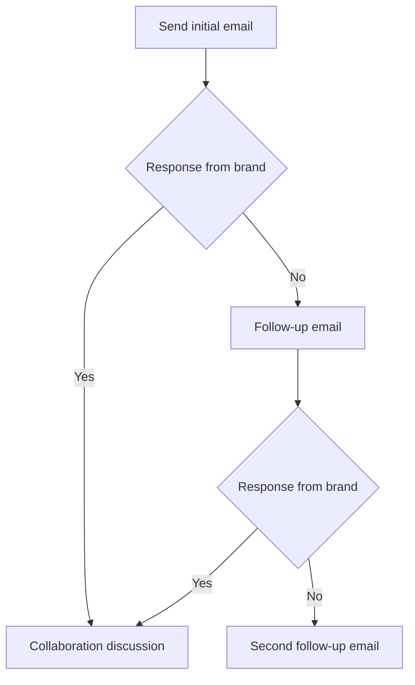
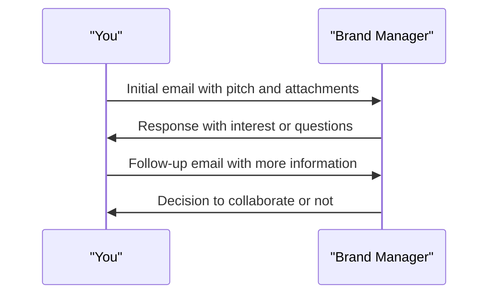

*Heads up: some links below are affiliate. Using them helps us keep the blog free. We only recommend tools we've actually used or trust.*

You're a small creator in India with a growing audience, and you want to start working with brands. But where do you start? You've heard that pitching brands is the key to getting sponsored content opportunities, but you're not sure who to email or what to say. Let's say you have 10,000 followers on Instagram and you want to pitch a brand for a sponsored post worth Rs 5,000. You'll need to craft a compelling pitch that showcases your audience and the value you can bring to the brand.

You've tried reaching out to brands before, but you've been met with crickets. You're starting to think that pitching brands is a waste of time, but you know that it's a crucial part of growing your influencer business. What if you could increase your chances of getting a response from brands? What if you could pitch like a pro and land sponsored content opportunities that help you earn up to Rs 50,000 per month?

## Quick summary
| Topic | Description |
| --- | --- |
| Who to email | Brand managers, marketing teams, or founders |
| Subject lines | Personalized, attention-grabbing, and relevant to the brand |
| Four-line pitch | Introduce yourself, highlight your audience, showcase your content, and propose a collaboration |
| Attachments | Media kit, rate card, or portfolio |
| Follow-up cadence | 7-10 days after initial email, then 14-21 days if no response |

For example, let's say you're a beauty creator with 20,000 followers on YouTube, and you want to pitch a brand for a sponsored video worth Rs 20,000. Your pitch would look like this:
* Introduce yourself: 'Hi [Brand Manager], I'm [Your Name], a beauty creator with 20,000 followers on YouTube.'
* Highlight your audience: 'My audience is interested in makeup tutorials and product reviews, and I've created content around these topics.'
* Showcase your content: 'I've worked with several brands in the past, and my content has received an average of 1,000 views per video.'
* Propose a collaboration: 'I think my audience would love [Brand Name], and I'd love to collaborate with you on a sponsored video. Let's discuss how we can work together to create engaging content for my followers.'

## Understanding who to email
When it comes to pitching brands, it's essential to know who to email. You want to reach out to the person who has the power to make decisions about influencer partnerships. This could be a brand manager, a marketing team member, or even the founder of the company. Make sure you research the brand and find the right contact information. You can use LinkedIn or the brand's website to find the right person to email.

Here's a step-by-step procedure to find the right contact person:
1. Visit the brand's website and look for a 'Contact Us' or 'About Us' page.
2. Check the brand's LinkedIn page and look for the marketing team or brand management team.
3. Use a tool like Hunter or Email Finder to find the email address of the brand manager or marketing team member.
4. Make sure you verify the email address before sending your pitch.

For instance, let's say you want to pitch a brand like Sephora, and you're not sure who to email. You can visit their website and look for a 'Contact Us' page, or check their LinkedIn page to find the marketing team. You can also use a tool like Hunter to find the email address of the brand manager.

## Crafting a compelling subject line
Your subject line is the first thing that the brand will see, so it needs to be attention-grabbing and relevant to the brand. Use the brand's name, and make sure the subject line is personalized and creative. For example, 'Collaboration Opportunity for [Brand Name] with [Your Name]' or 'Sponsored Content Proposal for [Brand Name]'. You want to stand out from the crowd and show the brand that you've taken the time to research them.

Here's a comparison table of different subject line examples:
| Subject Line | Description |
| --- | --- |
| Collaboration Opportunity for [Brand Name] | Personalized and attention-grabbing |
| Sponsored Content Proposal for [Brand Name] | Relevant to the brand and showcases your content |
| Let's Work Together on a Sponsored Post | Short and to the point, but may not be as attention-grabbing |
| [Brand Name] Partnership Opportunity | Uses the brand's name, but may not be as personalized |

## The four-line pitch
When it comes to the pitch itself, keep it short and sweet. You want to introduce yourself, highlight your audience, showcase your content, and propose a collaboration. Here's an example of a four-line pitch:
'Hi [Brand Manager], I'm [Your Name], a creator with [Number] followers on [Platform]. My audience is interested in [Niche], and I've created content around [Topic]. I think my audience would love [Brand Name], and I'd love to collaborate with you on a sponsored post. Let's discuss how we can work together to create engaging content for my followers.'

Let's say you're a fashion creator with 15,000 followers on TikTok, and you want to pitch a brand for a sponsored post worth Rs 10,000. Your pitch would look like this:
* Introduce yourself: 'Hi [Brand Manager], I'm [Your Name], a fashion creator with 15,000 followers on TikTok.'
* Highlight your audience: 'My audience is interested in fashion trends and styling tips, and I've created content around these topics.'
* Showcase your content: 'I've worked with several brands in the past, and my content has received an average of 500 views per video.'
* Propose a collaboration: 'I think my audience would love [Brand Name], and I'd love to collaborate with you on a sponsored post. Let's discuss how we can work together to create engaging content for my followers.'

## What to attach
When it comes to attachments, you want to make sure you're providing the brand with all the information they need to make a decision. This could be a media kit, a rate card, or a portfolio of your work. Make sure your attachments are well-designed and easy to read. You want to showcase your professionalism and attention to detail.

Here's a step-by-step procedure to create a media kit:
1. Gather your audience demographics and engagement metrics.
2. Create a document that showcases your content and your audience.
3. Include your contact information and a brief introduction.
4. Make sure your media kit is well-designed and easy to read.
5. Attach your media kit to your pitch email.

For example, let's say you're a beauty creator, and you want to create a media kit. You can gather your audience demographics and engagement metrics, and create a document that showcases your content and your audience. You can include your contact information and a brief introduction, and make sure your media kit is well-designed and easy to read.

## Follow-up cadence
After you've sent your initial email, you want to follow up with the brand to make sure they've received your pitch. Wait 7-10 days after your initial email, and then send a follow-up email to check in. If you still haven't heard back, wait another 14-21 days and send another follow-up email. You want to be persistent but not annoying. Remember, the brand is busy, and they may not have had a chance to review your pitch yet.

Here's an example of a follow-up email:
'Hi [Brand Manager], I wanted to follow up on my pitch email from [Date]. I understand that you're busy, but I wanted to make sure you received my email and had a chance to review my proposal. If you have any questions or would like to discuss further, please let me know.'

## Common mistakes to avoid
When it comes to pitching brands, there are several common mistakes that can get your email ignored. Make sure you avoid these mistakes to increase your chances of getting a response from brands:
* Not researching the brand or the right contact person
* Sending a generic pitch that doesn't showcase your unique value proposition
* Not following up with the brand after your initial email
* Not providing the brand with all the information they need to make a decision
* Being too pushy or aggressive in your pitch

For instance, let's say you're a fashion creator, and you send a generic pitch to a brand without researching them. The brand may not respond to your email because they don't see the value in working with you. On the other hand, if you research the brand and send a personalized pitch, the brand is more likely to respond and consider working with you.

## Example email template
Here's an example email template you can use as a starting point:
Subject: Collaboration Opportunity for [Brand Name] with [Your Name]
Dear [Brand Manager],
I'm [Your Name], a creator with [Number] followers on [Platform]. My audience is interested in [Niche], and I've created content around [Topic]. I think my audience would love [Brand Name], and I'd love to collaborate with you on a sponsored post. Let's discuss how we can work together to create engaging content for my followers.
Best,
[Your Name]
Attachments: Media Kit, Rate Card

## How CreatorKhata helps
Outreach is a crucial part of pitching brands, and it can be time-consuming to keep track of who you've emailed and when to follow up. That's where CreatorKhata comes in - our Outreach feature stores your pitch templates and tracks which brands you have emailed and when to follow up, so cold outreach is a pipeline not a memory test. [Try CreatorKhata free](https://creatorkhata.com/?utm_source=blog&utm_medium=cta_inline&utm_campaign=how-to-pitch-brands-small-creator-india).

## Tools that help with this

- **[CreatorKhata](https://creatorkhata.com/?utm_source=blog&utm_medium=affiliate&utm_campaign=how-to-pitch-brands-small-creator-india)** — All-in-one business app for Indian creators — invoices, brand-deal contracts, payment tracking, GST & TDS-ready
- **[Kit (formerly ConvertKit)](https://partners.kit.com/lmou6iciacgc)** — Email/newsletter platform built for creators
- **[Creator gear on Amazon India](https://www.amazon.in/s?k=youtuber+kit&tag=creatorkhata2-21&utm_campaign=how-to-pitch-brands-small-creator-india)** — Cameras, mics, lighting, and accessories for content creators

## A note on accuracy
This is general guidance. For your specific situation, consult a chartered accountant.
