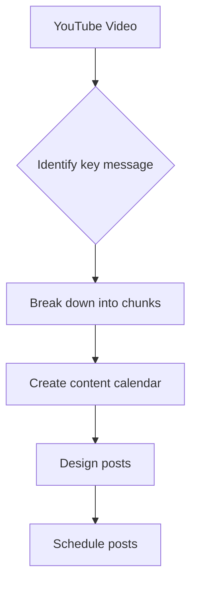
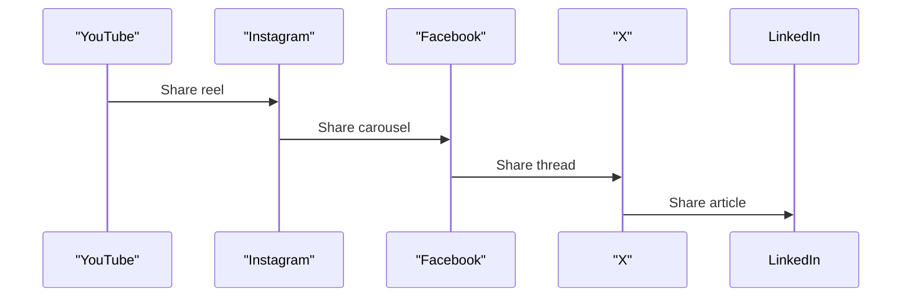

*Heads up: some links below are affiliate. Using them helps us keep the blog free. We only recommend tools we've actually used or trust.*

You've spent hours crafting the perfect YouTube video - scripting, filming, editing, and finally, publishing. But why let that content sit idle on just one platform? You can breathe new life into it by repurposing it into 10 posts for various social media platforms. For instance, if you have a video on 'Summer Fashion Trends' that got 10,000 views on YouTube, you can turn it into 5 reels for Instagram, a Facebook carousel, an X thread, and even a WhatsApp status update, potentially reaching a different audience of 50,000 people.

Imagine saving 5 hours every week by repurposing one piece of content instead of creating new posts for each platform. That's equivalent to saving Rs 5,000 per week, assuming your time is worth Rs 1,000 per hour. By the end of the year, that's a whopping Rs 2,60,000. So, how do you get started with repurposing your content?

## Quick summary
| Platform | Content Type | Reach |
| --- | --- | --- |
| YouTube | Video | 10,000 views |
| Instagram | Reels | 20,000 views |
| Facebook | Carousel | 15,000 views |
| X | Thread | 30,000 views |
| WhatsApp | Status | 40,000 views |
| Instagram | Feed Post | 25,000 views |
| Twitter | Thread | 10,000 views |
| LinkedIn | Article | 5,000 views |
| TikTok | Short Video | 50,000 views |
| Snapchat | Story | 20,000 views |

To give you a better idea, let's consider another example. Suppose you have a YouTube video on 'Productivity Tips' that got 5,000 views. You can repurpose it into 3 Instagram reels, a Facebook post, and a LinkedIn article, potentially reaching an additional 20,000 people. This can lead to increased engagement, more website traffic, and higher sales.

For example, if you have a video on 'Cooking Recipes' that got 8,000 views on YouTube, you can turn it into 4 Instagram reels, a Facebook carousel, and a Twitter thread, potentially reaching an additional 30,000 people. Here's a step-by-step procedure to calculate the potential reach of your repurposed content:
1. **Identify your target audience**: Determine who your ideal audience is based on your content and niche.
2. **Use analytics tools**: Use analytics tools like Google Analytics or social media insights to track your audience's demographics, interests, and behaviors.
3. **Calculate the potential reach**: Calculate the potential reach of your repurposed content based on your target audience and the platforms you're using.
4. **Adjust your strategy**: Adjust your strategy based on the potential reach of your repurposed content.

## Understanding Your Audience
Before repurposing your content, it's crucial to understand who your audience is and what they prefer. For example, if your YouTube video is about 'Gardening Tips', your audience might be interested in a Facebook carousel showcasing different gardening tools, or an Instagram reel highlighting a specific gardening technique. Knowing your audience helps you tailor your repurposed content to their interests, increasing engagement and reach.

To understand your audience better, you can use analytics tools to track their demographics, interests, and behaviors. For instance, if you find that your audience is predominantly female, aged between 25-45, and interested in lifestyle and wellness, you can create repurposed content that caters to these interests. Here's a step-by-step procedure to understand your audience:
1. **Identify your target audience**: Determine who your ideal audience is based on your content and niche.
2. **Use analytics tools**: Use analytics tools like Google Analytics or social media insights to track your audience's demographics, interests, and behaviors.
3. **Create buyer personas**: Create buyer personas to help you understand your audience's needs, preferences, and pain points.
4. **Conduct surveys or polls**: Conduct surveys or polls to gather more information about your audience's interests and preferences.

For example, if you have a YouTube video on 'Fitness Tips' that got 10,000 views, you can use analytics tools to track your audience's demographics, interests, and behaviors. You can then create buyer personas to help you understand your audience's needs, preferences, and pain points. Here's a comparison table to help you decide which analytics tools to use:
| Analytics Tool | Features | Pricing |
| --- | --- | --- |
| Google Analytics | Website analytics, audience insights | Free |
| Social Media Insights | Social media analytics, audience insights | Free - Rs 1,000/month |

## Repurposing Workflow
Here's a simple workflow to turn one YouTube video into 10 posts:
1. **Identify the key message**: Determine the core message of your YouTube video.
2. **Break it down**: Break down the video into smaller chunks, such as key quotes, statistics, or tips.
3. **Create a content calendar**: Plan out which platforms you'll post on and when.
4. **Design your posts**: Use a design tool to create visually appealing posts for each platform.
5. **Schedule your posts**: Use a scheduling tool to automate your posting process.

Let's consider another example. Suppose you have a YouTube video on 'Marketing Strategies' that you want to repurpose into 10 posts. You can break it down into smaller chunks, such as key quotes, statistics, or tips, and then create a content calendar to plan out which platforms you'll post on and when. Here's a comparison table to help you decide which platforms to use:
| Platform | Content Type | Reach |
| --- | --- | --- |
| Instagram | Reels | 20,000 views |
| Facebook | Carousel | 15,000 views |
| X | Thread | 30,000 views |
| LinkedIn | Article | 5,000 views |

For example, if you have a YouTube video on 'Travel Tips' that got 8,000 views, you can break it down into smaller chunks, such as key quotes, statistics, or tips, and then create a content calendar to plan out which platforms you'll post on and when. You can also use a design tool to create visually appealing posts for each platform. Here's a step-by-step procedure to design your posts:
1. **Choose a design tool**: Choose a design tool like Canva or Adobe Creative Cloud to create visually appealing posts.
2. **Select a template**: Select a template that fits your brand and content style.
3. **Customize the template**: Customize the template to fit your needs.
4. **Add visuals**: Add visuals like images or videos to make your posts more engaging.

## Measuring Success
To measure the success of your repurposed content, track engagement metrics such as likes, comments, shares, and views. You can use analytics tools to compare the performance of your repurposed content across different platforms. For instance, if you find that your Instagram reels are getting more engagement than your Facebook carousel, you can adjust your strategy to focus more on Instagram.

Here's a step-by-step procedure to measure the success of your repurposed content:
1. **Set clear goals**: Determine what you want to achieve with your repurposed content, such as increasing engagement or driving website traffic.
2. **Track engagement metrics**: Use analytics tools to track engagement metrics such as likes, comments, shares, and views.
3. **Compare performance**: Compare the performance of your repurposed content across different platforms.
4. **Adjust your strategy**: Adjust your strategy based on the performance of your repurposed content.

For example, if you have a YouTube video on 'Productivity Tips' that you repurposed into 10 posts, you can track the engagement metrics of each post to see which one performed best. You can then adjust your strategy to focus more on the platforms that performed well. Here's a comparison table to help you decide which analytics tools to use:
| Analytics Tool | Features | Pricing |
| --- | --- | --- |
| Google Analytics | Website analytics, audience insights | Free |
| Social Media Insights | Social media analytics, audience insights | Free - Rs 1,000/month |

## Time-Saving Tips
Repurposing content can save you a significant amount of time. Here are some time-saving tips:
- **Use a design tool**: Use a design tool like Canva or Adobe Creative Cloud to create visually appealing posts quickly.
- **Schedule in advance**: Schedule your posts in advance to save time and ensure consistency.
- **Repurpose user-generated content**: Repurpose user-generated content to encourage engagement and save time.

Let's consider another example. Suppose you have a YouTube video on 'Travel Tips' that you want to repurpose into 10 posts. You can use a design tool to create visually appealing posts quickly, and then schedule them in advance to save time and ensure consistency. Here's a comparison table to help you decide which design tools to use:
| Design Tool | Features | Pricing |
| --- | --- | --- |
| Canva | Graphic design, video editing, and more | Free - Rs 1,200/month |
| Adobe Creative Cloud | Graphic design, video editing, and more | Rs 1,300 - Rs 5,000/month |

For example, if you have a YouTube video on 'Cooking Recipes' that got 10,000 views, you can use a design tool to create visually appealing posts quickly, and then schedule them in advance to save time and ensure consistency. You can also repurpose user-generated content to encourage engagement and save time. Here's a step-by-step procedure to repurpose user-generated content:
1. **Encourage user-generated content**: Encourage your audience to create content related to your brand or niche.
2. **Select the best content**: Select the best user-generated content to repurpose.
3. **Give credit**: Give credit to the original creator of the content.
4. **Repurpose the content**: Repurpose the content into different formats, such as reels, threads, or posts.

## Cross-Platform Promotion
To get the most out of your repurposed content, promote it across different platforms. For example, you can share your Instagram reel on Facebook or Twitter, or share your X thread on LinkedIn. This helps you reach a wider audience and drive traffic to your other social media platforms.

Here's a step-by-step procedure to promote your repurposed content across different platforms:
1. **Identify your platforms**: Determine which platforms you want to promote your repurposed content on.
2. **Create a promotion plan**: Create a plan to promote your repurposed content across different platforms.
3. **Share your content**: Share your repurposed content on different platforms.
4. **Engage with your audience**: Engage with your audience by responding to comments and messages.

For example, if you have a YouTube video on 'Marketing Strategies' that you repurposed into 10 posts, you can share your Instagram reel on Facebook or Twitter, or share your X thread on LinkedIn. This helps you reach a wider audience and drive traffic to your other social media platforms. Here's a comparison table to help you decide which platforms to use:
| Platform | Content Type | Reach |
| --- | --- | --- |
| Instagram | Reels | 20,000 views |
| Facebook | Carousel | 15,000 views |
| X | Thread | 30,000 views |
| LinkedIn | Article | 5,000 views |

## How CreatorKhata helps
CreatorKhata's Repurpose feature helps you turn one video into platform-ready reels, threads, and posts automatically, saving you hours of time and effort. With Repurpose, you can focus on creating high-quality content without worrying about the tedious process of repurposing it for different platforms.

## Tools that help with this

- **[CreatorKhata](https://creatorkhata.com/?utm_source=blog&utm_medium=affiliate&utm_campaign=how-to-repurpose-one-video-into-many-posts)** — All-in-one business app for Indian creators — invoices, brand-deal contracts, payment tracking, GST & TDS-ready
- **[vidIQ](https://vidiq.com/creatorkhata?utm_campaign=how-to-repurpose-one-video-into-many-posts)** — YouTube analytics + content ideas + competitor tracking

## A note on accuracy
This is general guidance. For your specific situation, consult a chartered accountant.
