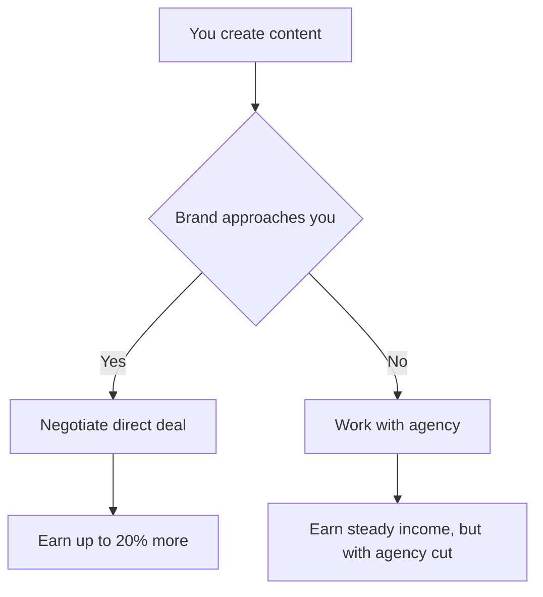
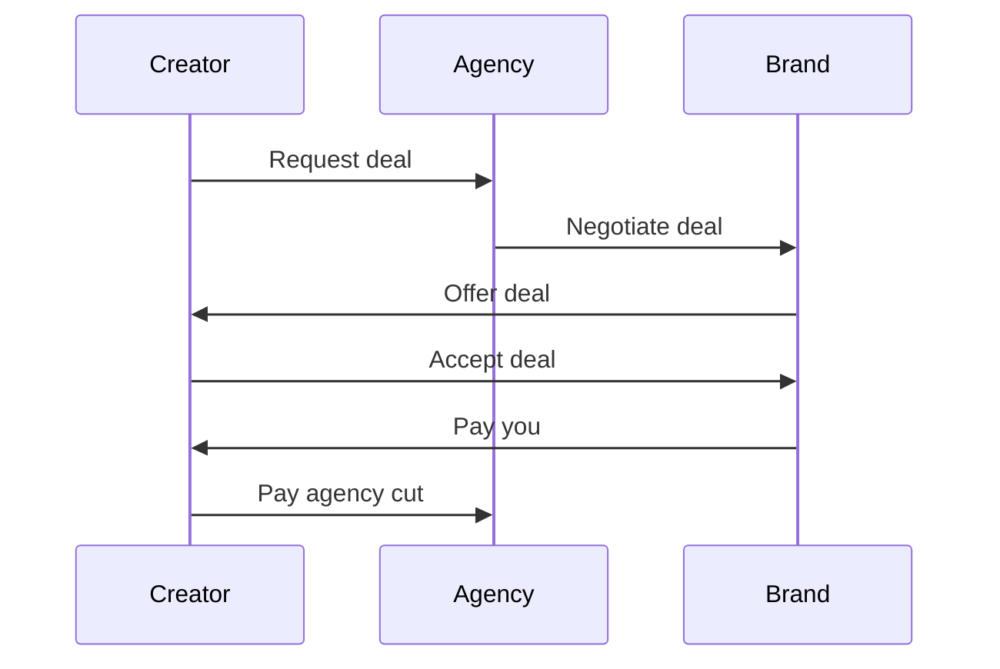
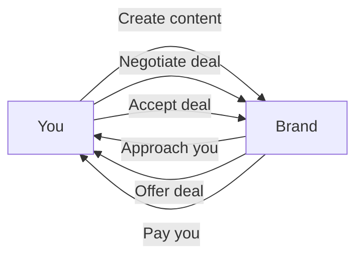

*Heads up: some links below are affiliate. Using them helps us keep the blog free. We only recommend tools we've actually used or trust.*

You're a successful Indian creator with a large following on YouTube or Instagram. You've worked with both influencer agencies and direct brand deals. But have you ever wondered which one pays more? Let's say you earn Rs 1 lakh per month from brand deals through an agency, but you've heard that direct deals can pay up to Rs 1.2 lakh per month. That's a 20% difference.

As an Indian creator, you want to maximize your earnings. But before we dive into the numbers, let's consider the pros and cons of working with an influencer agency. On the one hand, agencies can provide you with a steady volume of brand deals, saving you time and effort in finding and negotiating with brands. They also handle the paperwork and payment processing, making it easier for you to focus on creating content. However, agencies typically take a 15-30% cut of your earnings, which can reduce your net income.

## Quick summary
| Deal Type | Earnings | Agency Cut | Net Income |
| --- | --- | --- | --- |
| Agency Deal | Rs 1 lakh | 20% | Rs 80,000 |
| Direct Deal | Rs 1.2 lakh | 0% | Rs 1.2 lakh |
| Hybrid Approach | Rs 1.5 lakh | 10% | Rs 1.35 lakh |

For example, let's say you have two brand deals: one through an agency for Rs 80,000 and another direct deal for Rs 1.2 lakh. In this case, the direct deal pays more, but you'll need to handle the paperwork and payment processing yourself. On the other hand, if you have a brand deal through an agency for Rs 1 lakh, and the agency takes a 20% cut, you'll be left with Rs 80,000. But if you negotiate a direct deal for the same brand, you could earn up to Rs 1.2 lakh, which is a 20% increase.

Let's consider another example. Suppose you have a brand deal through an agency for Rs 50,000, and the agency takes a 25% cut. You'll be left with Rs 37,500. But if you negotiate a direct deal for the same brand, you could earn up to Rs 60,000, which is a 20% increase.

## Understanding Agency Cuts
Influencer agencies charge a commission on the deals they facilitate. This commission can range from 15% to 30% of the total deal value. For example, if an agency negotiates a Rs 1 lakh deal for you, they might take a 20% cut, leaving you with Rs 80,000. Another example is if an agency negotiates a Rs 50,000 deal, and they take a 25% cut, you'll be left with Rs 37,500.

Here's a step-by-step procedure to calculate the agency cut:
1. Determine the total deal value.
2. Calculate the agency commission as a percentage of the deal value.
3. Subtract the agency commission from the deal value to get your net income.

For instance, let's say an agency negotiates a Rs 75,000 deal for you, and they take a 20% cut. To calculate the agency cut, you would:
1. Determine the total deal value: Rs 75,000
2. Calculate the agency commission: 20% of Rs 75,000 = Rs 15,000
3. Subtract the agency commission from the deal value: Rs 75,000 - Rs 15,000 = Rs 60,000

## Pros of Direct Brand Deals
Direct brand deals can be more lucrative than agency-facilitated deals. Without the agency cut, you can earn up to 20% more per deal. Additionally, direct deals give you more control over the content and the brand partnership, allowing you to negotiate terms that better suit your needs. For instance, you can negotiate the content type, the number of posts, and the payment terms.

Here's a comparison table of the pros and cons of direct brand deals:
| Pros | Cons |
| --- | --- |
| More control over content and partnership | Time-consuming to negotiate and manage |
| Potential for higher earnings | Requires more effort to find and secure deals |
| More creative freedom | May require more paperwork and payment processing |

Let's consider a specific example. Suppose you're a fashion influencer with a large following on Instagram. You can negotiate a direct deal with a fashion brand for Rs 1.5 lakh per month, which is more than what an agency would offer. You can also negotiate the terms of the deal, such as the number of posts, the content type, and the payment terms.

## Cons of Direct Brand Deals
However, direct brand deals can be time-consuming to negotiate and manage. You'll need to handle the paperwork, payment processing, and communication with the brand, which can take away from the time you have to create content. Moreover, finding and securing direct deals can be challenging, especially if you're just starting out. You may need to invest time in building relationships with brands, creating a portfolio, and marketing yourself.

To overcome these challenges, you can follow these steps:
1. Identify your strengths and weaknesses as a creator.
2. Develop a strong personal brand and portfolio.
3. Network with brands and other creators in your niche.
4. Create a marketing strategy to promote yourself and your content.
5. Use social media to reach out to brands and negotiate deals.
6. Be prepared to negotiate and communicate with brands regularly.

For example, let's say you're a beauty influencer with a small following on YouTube. You may not be able to secure direct deals with larger brands, but you can start by reaching out to smaller brands and negotiating deals. As you grow your following, you can start pursuing direct partnerships with larger brands.

## When Direct Deals Win
Direct deals are often more profitable when you have a strong personal brand and a large, engaged following. Brands are more likely to want to work with you directly, and you can negotiate better terms. Additionally, direct deals can provide more creative freedom and control over the content, which can be beneficial for your personal brand.

For example, let's say you're a fitness influencer with a large following on Instagram. You can negotiate a direct deal with a sports brand for Rs 1.5 lakh per month, which is more than what an agency would offer. You can also negotiate the terms of the deal, such as the number of posts, the content type, and the payment terms.

Here's a comparison table of when direct deals win:
| Scenario | Agency Deal | Direct Deal |
| --- | --- | --- |
| Strong personal brand | Less profitable | More profitable |
| Large, engaged following | Less control | More control |
| Creative freedom | Limited | More |

Let's consider another scenario. Suppose you're a gaming influencer with a small following on YouTube. You may not be able to secure direct deals with larger brands, but you can start by negotiating deals with smaller brands. As you grow your following, you can start pursuing direct partnerships with larger brands.

## The Hybrid Approach
A hybrid approach can be the best of both worlds. You can work with an agency to secure some deals, while also pursuing direct brand partnerships. This approach allows you to leverage the agency's network and expertise while also maintaining control over your personal brand and earnings.

For instance, let's say you work with an agency to secure deals with smaller brands, earning Rs 50,000 per month. At the same time, you pursue direct partnerships with larger brands, earning an additional Rs 1 lakh per month. Your total earnings are Rs 1.5 lakh per month, with a mix of direct and agency-facilitated deals.

Here's a step-by-step procedure to implement the hybrid approach:
1. Identify your strengths and weaknesses as a creator.
2. Determine your goals and objectives for your brand partnerships.
3. Research and shortlist potential agencies and brands to work with.
4. Negotiate the terms of the deals, including the agency cut and the payment terms.
5. Monitor and adjust your approach as needed.

## How to Implement the Hybrid Approach
To implement the hybrid approach, start by identifying your strengths and weaknesses. If you have a strong personal brand and a large following, you may be able to secure direct deals. However, if you're just starting out, working with an agency may be a better option. Consider your time and resources, and allocate them accordingly. You can also use tools like [the TDS guide for creators](/blog/tds-for-youtubers-india) to help you navigate the financial aspects of brand deals.

For example, let's say you're a beauty influencer with a large following on Instagram. You work with an agency to secure deals with smaller brands, earning Rs 50,000 per month. At the same time, you pursue direct partnerships with larger brands, earning an additional Rs 1 lakh per month. Your total earnings are Rs 1.5 lakh per month, with a mix of direct and agency-facilitated deals.

Here's another example: let's say you're a gaming influencer with a small following on YouTube. You may not be able to secure direct deals with larger brands, but you can work with an agency to secure deals with smaller brands, earning Rs 20,000 per month. As you grow your following, you can start pursuing direct partnerships with larger brands, earning more money.

## How CreatorKhata helps
The Payment Tracker feature in CreatorKhata helps you compare your earnings from agency-facilitated deals and direct deals. You can see which channel actually pays you more, and make informed decisions about your brand partnerships. The Payment Tracker shows your net-per-deal after agency commission next to direct deals, so you can see which channel actually pays you more. [Try CreatorKhata free](https://creatorkhata.com/?utm_source=blog&utm_medium=cta_inline&utm_campaign=influencer-agency-vs-direct-deals-india).

## Tools that help with this

- **[CreatorKhata](https://creatorkhata.com/?utm_source=blog&utm_medium=affiliate&utm_campaign=influencer-agency-vs-direct-deals-india)** — All-in-one business app for Indian creators — invoices, brand-deal contracts, payment tracking, GST & TDS-ready

## A note on accuracy
This is general guidance. For your specific situation, consult a chartered accountant.
