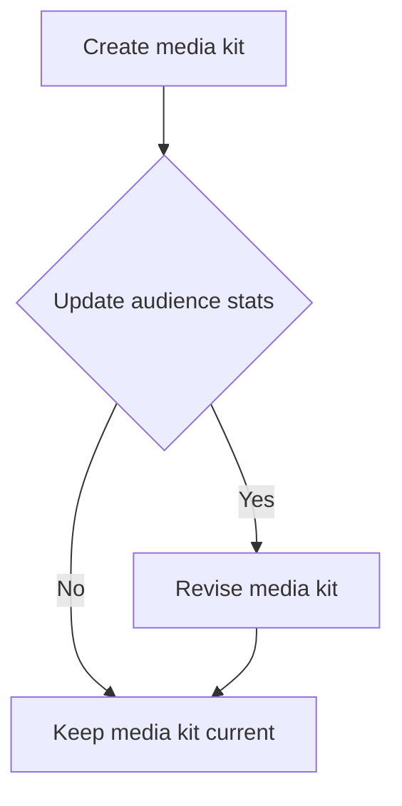
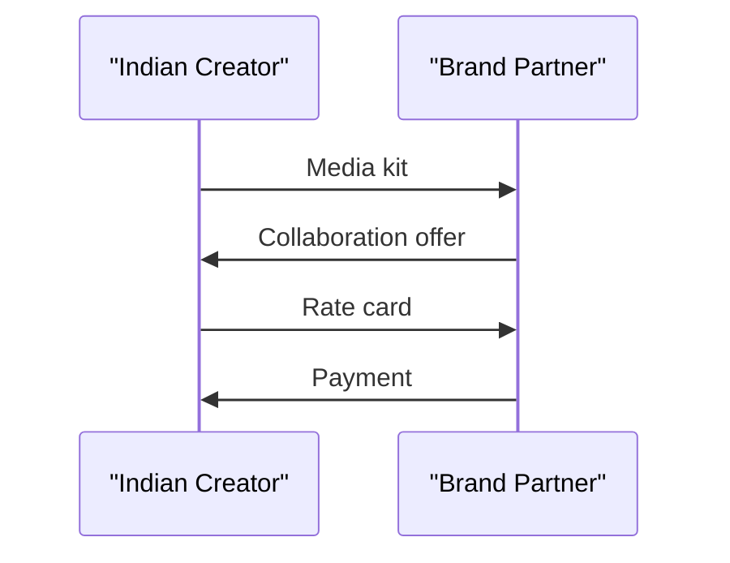
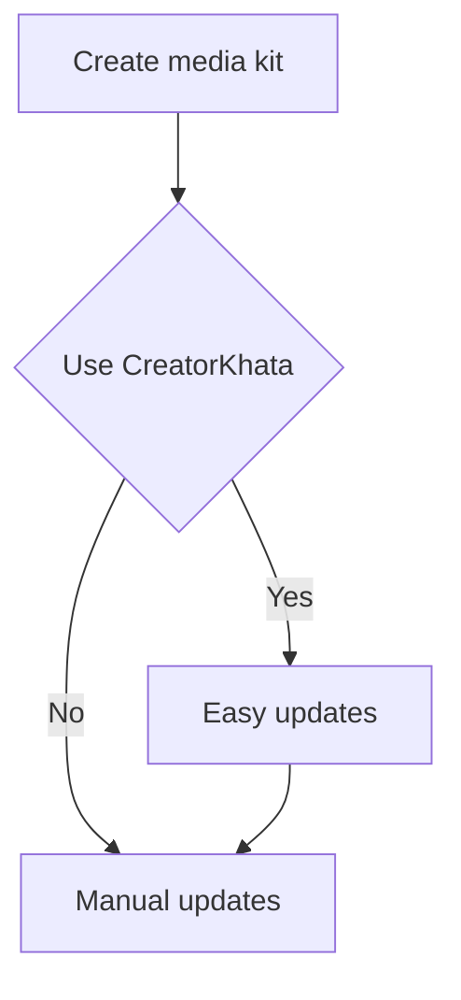

*Heads up: some links below are affiliate. Using them helps us keep the blog free. We only recommend tools we've actually used or trust.*

You're a successful Indian creator with a sizable following on YouTube or Instagram, and you're looking to take your brand collaborations to the next level. You've heard that having a media kit is essential, but you're not sure what to include or how to make it effective. You've spent hours crafting the perfect pitch, only to have brands lose interest or never respond. You're leaving money on the table, and it's time to stop.

As a creator in India, you know how competitive the market is. With thousands of other creators vying for brand attention, you need to stand out from the crowd. A well-crafted media kit can be your secret weapon, showcasing your unique strengths and value proposition to potential brand partners. But what should you include in your media kit, and how can you keep it current without redoing it every month?

## Quick summary
| Element | Description | Importance |
| --- | --- | --- |
| Audience stats | Follower count, engagement rates, demographics | High |
| Niche | Specific area of expertise or content focus | High |
| Past brand deals | Logos or testimonials from previous collaborations | Medium |
| Rate card | Link to a separate document outlining pricing and services | High |
| Contact | Email address, phone number, or contact form | High |
| Updates | Regular updates to reflect changes in audience stats or niche | Medium |
For example, let's say you're a fashion creator with 50,000 followers on Instagram. Your quick summary might include:
- Audience stats: 50,000 followers, 2% engagement rate, 70% female audience
- Niche: Fashion, specifically plus-size fashion
- Past brand deals: Collaborations with two major fashion brands
- Rate card: Link to a separate document outlining pricing for sponsored posts and product reviews
- Contact: Email address and contact form
- Updates: Quarterly updates to reflect changes in audience stats or niche
Another example could be a gaming creator with 200,000 followers on YouTube. Their quick summary might include:
- Audience stats: 200,000 followers, 4% engagement rate, 80% male audience
- Niche: Gaming, specifically PC gaming
- Past brand deals: Collaborations with three major gaming brands
- Rate card: Link to a separate document outlining pricing for sponsored videos and product reviews
- Contact: Email address and contact form
- Updates: Monthly updates to reflect changes in audience stats or niche

## Understanding your audience
To create an effective media kit, you need to understand what brands are looking for. They want to know that your audience is engaged, relevant to their product or service, and likely to convert into customers. You should include metrics such as follower count, engagement rates, and demographics to give brands a clear picture of your audience. For example, if you're a beauty creator with 100,000 followers on Instagram, you might include a breakdown of your audience demographics, such as age, location, and interests.
Here's a step-by-step procedure to understand your audience:
1. **Analyze your follower count**: Look at your total number of followers and how it has changed over time.
2. **Calculate your engagement rates**: Calculate your engagement rates by dividing the number of likes and comments by your follower count.
3. **Determine your audience demographics**: Use analytics tools to determine the age, location, and interests of your audience.
4. **Identify your audience's pain points**: Use surveys or feedback forms to understand what your audience is looking for and what problems they are trying to solve.
5. **Create buyer personas**: Create detailed profiles of your ideal audience members, including their demographics, interests, and pain points.
By understanding your audience, you can create a media kit that speaks directly to them and showcases your value proposition to potential brand partners.
For instance, let's say you're a fitness creator with 20,000 followers on Instagram. Your audience analysis might reveal that:
- 60% of your audience is between the ages of 25-35
- 70% of your audience is female
- 80% of your audience is interested in weight loss
- The average engagement rate is 3%
With this information, you can create a media kit that targets this specific audience and showcases your expertise in fitness and weight loss.

## Crafting your niche
Your niche is what sets you apart from other creators and makes you unique. It's essential to clearly define your niche and showcase it in your media kit. This could be a specific area of expertise, such as fashion or gaming, or a particular tone or style, such as humorous or inspirational. Brands want to know that you can help them reach their target audience, so make sure your niche is well-defined and aligned with their goals.
Here's a comparison table to help you define your niche:
| Niche | Description | Target Audience |
| --- | --- | --- |
| Fashion | Clothing, accessories, beauty | Young adults, fashion-conscious individuals |
| Gaming | PC gaming, console gaming, esports | Gamers, gaming enthusiasts |
| Beauty | Skincare, makeup, haircare | Beauty enthusiasts, individuals interested in self-care |
| Fitness | Weight loss, exercise, nutrition | Fitness enthusiasts, individuals interested in health and wellness |
For example, let's say you're a travel creator with a focus on adventure travel. Your niche might include:
- Destination guides
- Travel tips
- Gear reviews
- Cultural experiences
By clearly defining your niche, you can attract brands that are looking to reach your specific audience and create content that resonates with them.
Another example could be a food creator with a focus on vegan recipes. Their niche might include:
- Recipe videos
- Cooking challenges
- Product reviews
- Restaurant reviews
By showcasing your niche in your media kit, you can demonstrate your expertise and attract brands that are looking to partner with creators in your niche.

## Showcasing past brand deals
Including past brand deals in your media kit can help establish credibility and trust with potential brand partners. You can include logos or testimonials from previous collaborations to demonstrate your ability to work with brands and deliver results. For example, if you've worked with a major beauty brand in the past, you might include a testimonial from their marketing team or a logo with a brief description of the collaboration.
Here's a step-by-step procedure to showcase past brand deals:
1. **Gather logos and testimonials**: Collect logos and testimonials from previous brand collaborations.
2. **Write a brief description**: Write a brief description of each collaboration, including the brand name, collaboration type, and results achieved.
3. **Include metrics**: Include metrics such as engagement rates, reach, and conversions to demonstrate the success of the collaboration.
4. **Use visuals**: Use visuals such as images or videos to showcase the collaboration and make it more engaging.
5. **Keep it concise**: Keep the description concise and to the point, focusing on the key results and achievements.
By showcasing past brand deals, you can demonstrate your ability to work with brands and deliver results, making you a more attractive partner for future collaborations.
For instance, let's say you're a lifestyle creator who has worked with a major fashion brand. Your past brand deals section might include:
- Logo of the fashion brand
- Testimonial from the marketing team
- Brief description of the collaboration, including the type of content created and the results achieved
- Metrics such as engagement rates and reach
- Visuals such as images or videos showcasing the collaboration

## Creating a rate card
Your rate card should be a separate document that outlines your pricing and services. This could include rates for sponsored posts, product reviews, or other types of collaborations. Make sure your rate card is clear, concise, and easy to understand, and include a link to it in your media kit. For example, you might include a table with different tiers of service, such as a basic package for Rs 10,000 or a premium package for Rs 50,000.
Here's an example of a rate card:
| Service | Description | Price |
| --- | --- | --- |
| Sponsored post | One sponsored post on Instagram | Rs 5,000 |
| Product review | In-depth review of a product on YouTube | Rs 10,000 |
| Brand ambassador | Long-term partnership with a brand | Rs 50,000 |
For instance, let's say you're a beauty creator with a rate card that includes:
- Sponsored posts: Rs 8,000 per post
- Product reviews: Rs 15,000 per review
- Brand ambassador: Rs 100,000 per year
You can adjust your rate card based on your niche, audience, and services offered.
Another example could be a gaming creator with a rate card that includes:
- Sponsored videos: Rs 10,000 per video
- Product reviews: Rs 20,000 per review
- Brand ambassador: Rs 200,000 per year
By including a clear and concise rate card in your media kit, you can help brands understand your pricing and services, making it easier for them to decide whether to collaborate with you.

## Keeping it current
One of the biggest challenges with media kits is keeping them current. You don't want to have to redo your media kit every month, but you also want to make sure it reflects changes in your audience stats or niche. One solution is to use a tool that allows you to update your media kit in real-time, such as a Google Doc or a website builder. This way, you can make changes as needed without having to start from scratch.
Here's a step-by-step procedure to keep your media kit current:
1. **Use a cloud-based tool**: Use a cloud-based tool such as Google Docs or a website builder to create and update your media kit.
2. **Set reminders**: Set reminders to update your media kit regularly, such as every quarter or every six months.
3. **Monitor your analytics**: Monitor your analytics to track changes in your audience stats and adjust your media kit accordingly.
4. **Keep it concise**: Keep your media kit concise and focused on the most important information, making it easier to update and maintain.
5. **Make it a habit**: Make updating your media kit a habit, so it becomes a regular part of your content creation routine.
By keeping your media kit current, you can ensure that it always reflects your latest audience stats, niche, and services, making it a valuable resource for brands looking to collaborate with you.
For example, let's say you're a travel creator who updates your media kit every quarter. Your updates might include:
- New audience stats, such as follower count and engagement rates
- New niche focuses, such as sustainable travel or adventure travel
- New services, such as travel planning or tour guiding
- New testimonials from previous brand collaborations
By keeping your media kit up-to-date, you can attract new brands and collaborations, and maintain a strong reputation in your industry.

## One-page vs deck
When it comes to media kits, there are two common formats: one-page and deck. A one-page media kit is a single page that includes all the essential information, while a deck is a longer, more detailed document that may include additional information such as case studies or testimonials. The choice between a one-page and a deck ultimately depends on your goals and the type of collaborations you're seeking. If you're looking for quick, easy collaborations, a one-page media kit may be sufficient. But if you're looking for more in-depth, long-term partnerships, a deck may be a better choice.
Here's a comparison table to help you decide between a one-page and a deck:
| Format | Description | Pros | Cons |
| --- | --- | --- | --- |
| One-page | Single page with essential information | Easy to create, concise, easy to share | Limited space, may not include all necessary information |
| Deck | Longer, more detailed document | Includes more information, can be more persuasive, can be used for multiple collaborations | More time-consuming to create, may be overwhelming for brands |
For example, let's say you're a fashion creator looking for quick, easy collaborations. A one-page media kit might be sufficient, including:
- Audience stats
- Niche
- Past brand deals
- Rate card
- Contact information
On the other hand, if you're a gaming creator looking for more in-depth, long-term partnerships, a deck might be a better choice, including:
- Case studies
- Testimonials
- Detailed audience analysis
- Services offered
- Pricing and packages
By choosing the right format for your media kit, you can effectively communicate your value proposition to brands and attract the right collaborations.

## Tips for Indian creators
As an Indian creator, you have a unique set of challenges and opportunities. You may need to navigate complex regulations and taxes, such as GST and TDS, and you may need to adapt to changing market trends and consumer behaviors. To succeed, you'll need to be flexible, adaptable, and willing to learn and evolve. You can find more information on GST and TDS for Indian creators in our [GST guide for Indian creators](/blog/gst-for-indian-creators) and [TDS guide for Indian creators](/blog/tds-for-youtubers-india).
Here are some additional tips for Indian creators:
1. **Understand your taxes**: Understand your tax obligations, including GST and TDS, and make sure you're compliant.
2. **Stay up-to-date with regulations**: Stay up-to-date with the latest regulations and laws affecting creators in India.
3. **Be prepared for changes**: Be prepared for changes in the market and consumer behaviors, and be willing to adapt your strategy accordingly.
4. **Focus on quality content**: Focus on creating high-quality content that resonates with your audience and attracts brands.
5. **Build a strong online presence**: Build a strong online presence, including a website and social media profiles, to showcase your work and attract brands.
By following these tips, you can succeed as an Indian creator and attract the right collaborations and opportunities.
For instance, let's say you're a beauty creator in India who wants to understand your taxes. You might:
- Research the latest GST and TDS regulations
- Consult with a chartered accountant to ensure compliance
- Stay up-to-date with the latest market trends and consumer behaviors
- Focus on creating high-quality content that resonates with your audience
- Build a strong online presence to showcase your work and attract brands

## How CreatorKhata helps
The Media Kit feature in CreatorKhata helps you build a shareable one-page media kit that pulls your latest audience stats and rate card into a single link, always up to date. This way, you can easily share your media kit with potential brand partners and keep it current without having to redo it every month. [Try CreatorKhata free](https://creatorkhata.com/?utm_source=blog&utm_medium=cta_inline&utm_campaign=media-kit-indian-creator-what-to-include).

## Tools that help with this

- **[CreatorKhata](https://creatorkhata.com/?utm_source=blog&utm_medium=affiliate&utm_campaign=media-kit-indian-creator-what-to-include)** — All-in-one business app for Indian creators — invoices, brand-deal contracts, payment tracking, GST & TDS-ready
- **[Creator gear on Amazon India](https://www.amazon.in/s?k=youtuber+kit&tag=creatorkhata2-21&utm_campaign=media-kit-indian-creator-what-to-include)** — Cameras, mics, lighting, and accessories for content creators
- **[Kit (formerly ConvertKit)](https://partners.kit.com/lmou6iciacgc)** — Email/newsletter platform built for creators

## A note on accuracy
This is general guidance. For your specific situation, consult a chartered accountant.
