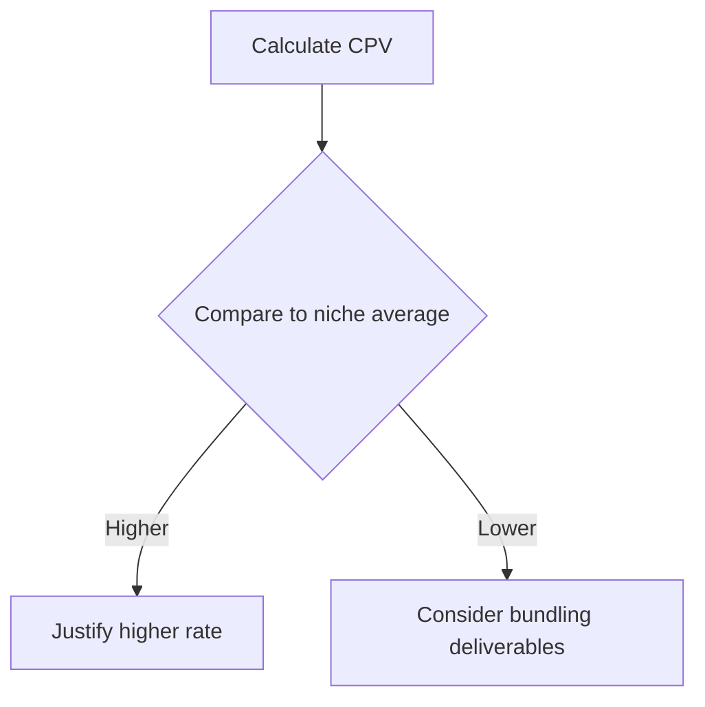
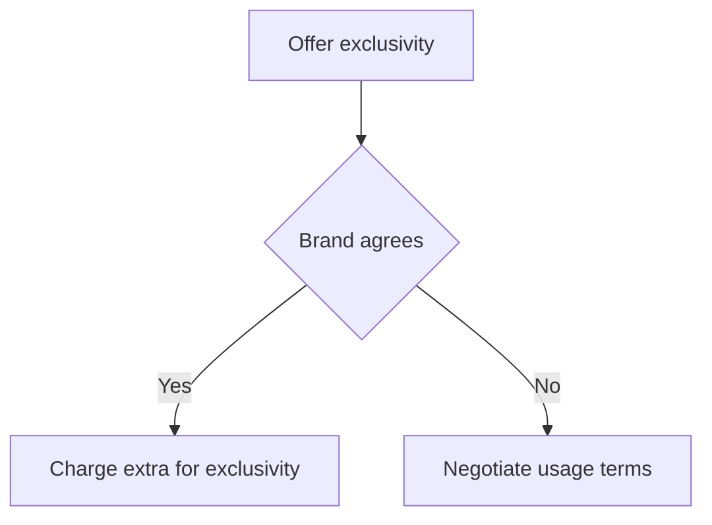
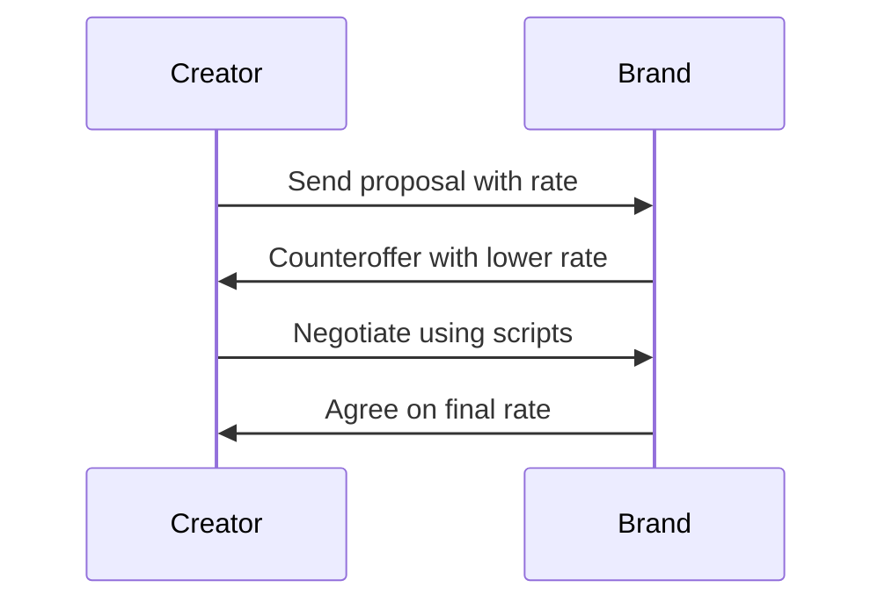

*Heads up: some links below are affiliate. Using them helps us keep the blog free. We only recommend tools we've actually used or trust.*

You've received a brand deal offer, but the rate seems too low. You know your content's value, but how do you convince the brand to pay more? You start by understanding your CPV (cost per view) and the average engagement rate for your niche. Let's say your CPV is Rs 50 and you have 100,000 views on your last video. That's Rs 5,000 in potential ad revenue, but the brand is offering only Rs 3,000. You have a solid case to negotiate a higher rate.

As a content creator in India, you need to be strategic when negotiating brand deals. You've invested time and effort into building your audience, and you deserve to be paid fairly. The key is to anchor high, justify your rate with data, and be willing to walk away if the deal isn't right. You can use scripts like this one: 'I appreciate the offer, but based on my CPV and engagement rate, I was thinking more along the lines of Rs 4,500. Would you be open to discussing this further?' For example, if you have a YouTube channel with 100,000 subscribers and an average view count of 50,000 per video, your CPV could be higher, around Rs 75. This would put your potential ad revenue at Rs 3,750 per video, giving you a stronger negotiating position. Another example could be if you have a TikTok account with 500,000 followers and an average view count of 200,000 per video, your CPV could be around Rs 100, putting your potential ad revenue at Rs 20,000 per video.

## Quick summary
| Topic | Description |
| --- | --- |
| CPV calculation | Cost per view based on ad revenue |
| Bundling deliverables | Offering multiple services for a higher rate |
| Exclusivity add-on | Charging extra for exclusive brand promotion |
| Usage add-on | Charging extra for extended content usage |
| Walk-away line | Being willing to end negotiations if the deal isn't right |

## Understanding your worth
To negotiate a higher brand deal rate, you need to understand your worth as a content creator. This includes calculating your CPV, engagement rate, and the average rate for your niche. You can use tools like Google Analytics to track your views and engagement. Let's say you have 100,000 views and 2,000 likes on your last video. Your engagement rate is 2%, which is higher than the average for your niche. You can use this data to justify a higher rate. Additionally, consider your audience demographics, such as age, location, and interests, as these can impact your negotiation. For instance, if your audience is predominantly young adults in urban areas, you may be able to command a higher rate due to the desirable demographic. On the other hand, if your audience is predominantly older adults in rural areas, you may need to adjust your rate accordingly. Here's a comparison table to help you understand the impact of audience demographics on your rate:

| Demographic | Average Rate |
| --- | --- |
| Young adults in urban areas | Rs 5,000 |
| Older adults in rural areas | Rs 3,000 |
| Middle-aged adults in suburban areas | Rs 4,000 |

Here's a step-by-step procedure to calculate your worth:
1. Determine your average views per video
2. Calculate your engagement rate (likes, comments, shares)
3. Research the average rate for your niche
4. Use tools like Google Analytics to track your audience demographics
5. Consider your content's production quality and uniqueness
6. Adjust your rate based on your audience demographics and content quality
7. Use data from previous brand deals to inform your negotiation
8. Be prepared to provide examples of your content's performance and engagement

## Bundling deliverables
Bundling deliverables is a great way to increase your brand deal rate. Instead of offering just one service, you can offer a package that includes multiple services. For example, you could offer a package that includes sponsored content, Instagram stories, and a dedicated blog post. This package would be more valuable to the brand, and you could charge a higher rate. You can use a script like this one: 'I'd like to offer a package that includes sponsored content, Instagram stories, and a dedicated blog post. This would be a comprehensive promotion for your brand, and I think it would be worth Rs 6,000.' Another example could be offering a package that includes a video review, a social media post, and a podcast episode, which could be worth Rs 8,000. Here's a comparison table to help you understand the different packages and their corresponding rates:

| Package | Services | Rate |
| --- | --- | --- |
| Basic | Sponsored content | Rs 3,000 |
| Premium | Sponsored content, Instagram stories | Rs 5,000 |
| Deluxe | Sponsored content, Instagram stories, dedicated blog post | Rs 8,000 |
| Ultimate | Sponsored content, Instagram stories, dedicated blog post, video review | Rs 10,000 |

## Pricing exclusivity and usage
Exclusivity and usage are valuable assets for brands, and you should charge extra for them. Exclusivity means that you won't promote any other brand in the same niche during the contract period. Usage refers to the brand's right to use your content for a certain period. You can use a script like this one: 'I'd like to offer exclusivity for the contract period, which would mean I wouldn't promote any other brand in the same niche. This would be worth an extra Rs 1,000. Additionally, if you'd like to use my content for an extended period, I'd charge an extra Rs 500.' Consider the following edge case: what if the brand wants to use your content for a longer period, such as 6 months or a year? You could charge an additional Rs 2,000 for a 6-month extension or Rs 5,000 for a year-long extension. Here's a step-by-step procedure to determine your exclusivity and usage rates:
1. Determine the length of the contract period
2. Research the average exclusivity rate for your niche
3. Consider the brand's request for extended usage
4. Calculate the additional rate for exclusivity and usage
5. Be prepared to negotiate the rates based on the brand's needs and your content's value

## Walk-away lines
Having a walk-away line is crucial in brand deal negotiations. If the deal isn't right, you need to be willing to end the negotiations. This shows that you're confident in your worth and not desperate for the deal. You can use a script like this one: 'I appreciate the offer, but I don't think it's the right fit for me. I'm looking for a rate of at least Rs 4,500, and I'm willing to walk away if we can't agree on that.' Another example could be: 'I understand that you're looking for a lower rate, but I've done my research and I know my content's value. If we can't agree on a rate of at least Rs 5,000, I'm willing to explore other opportunities.' Here's a comparison table to help you understand the different walk-away lines and their corresponding rates:

| Walk-away line | Rate |
| --- | --- |
| Basic | Rs 3,000 |
| Premium | Rs 4,500 |
| Deluxe | Rs 6,000 |

## Negotiation scripts
Here are some negotiation scripts you can use:
1. Anchoring high: 'I was thinking more along the lines of Rs 4,500 based on my CPV and engagement rate.'
2. Justifying your rate: 'My CPV is Rs 50, and I have 100,000 views on my last video. That's Rs 5,000 in potential ad revenue.'
3. Bundling deliverables: 'I'd like to offer a package that includes sponsored content, Instagram stories, and a dedicated blog post.'
4. Pricing exclusivity and usage: 'I'd like to offer exclusivity for the contract period, which would mean I wouldn't promote any other brand in the same niche.'
5. Walk-away line: 'I appreciate the offer, but I don't think it's the right fit for me. I'm looking for a rate of at least Rs 4,500.'

## How CreatorKhata helps
The Rate Card Calculator feature in CreatorKhata gives you a data-anchored opening number plus add-on pricing for exclusivity and usage, so every extra ask becomes extra revenue.

## Tools that help with this

- **[CreatorKhata](https://creatorkhata.com/?utm_source=blog&utm_medium=affiliate&utm_campaign=negotiate-brand-deal-rate-india)** — All-in-one business app for Indian creators — invoices, brand-deal contracts, payment tracking, GST & TDS-ready
- **[Creator gear on Amazon India](https://www.amazon.in/s?k=youtuber+kit&tag=creatorkhata2-21&utm_campaign=negotiate-brand-deal-rate-india)** — Cameras, mics, lighting, and accessories for content creators
- **[Kit (formerly ConvertKit)](https://partners.kit.com/lmou6iciacgc)** — Email/newsletter platform built for creators

## A note on accuracy
This is general guidance. For your specific situation, consult a chartered accountant.
