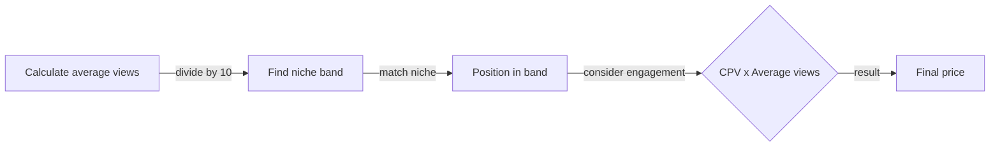

*Heads up: some links below are affiliate. Using them helps us keep the blog free. We only recommend tools we've actually used or trust.*

You've just hit 10,000 followers on Instagram and you're getting your first brand deal inquiry. The brand is offering you Rs 5,000 for a sponsored post, but you're not sure if it's a fair price. You've heard of the CPV (cost per view) method, but you're not sure how to apply it to your situation. 

You start by researching industry CPV ranges for your niche. You find that for tech creators, the CPV range is Rs 2-5, while for finance creators, it's Rs 5-10. As a lifestyle creator, your CPV range is Rs 1-3. You start to wonder how you can anchor your price to the higher end of this range.

## Quick summary
| Niche | CPV Range |
| --- | --- |
| Tech | Rs 2-5 |
| Finance | Rs 5-10 |
| Lifestyle | Rs 1-3 |
| Gaming | Rs 3-6 |
| Beauty | Rs 2-4 |
| Travel | Rs 1-2 |

For example, let's consider a gaming creator with an average of 50,000 views per post. Their CPV range would be Rs 3-6, and they could use this range to negotiate with brands. On the other hand, a travel creator with an average of 5,000 views per post would have a CPV range of Rs 1-2, and would need to adjust their pricing strategy accordingly.

Another example is a beauty creator with an average of 20,000 views per post. Their CPV range would be Rs 2-4, and they could use this range to negotiate with brands. In this case, they could also consider their audience demographics, such as age and location, to adjust their pricing strategy.

## Understanding the CPV method
CPV (cost per view) is not a formula you compute from engagement — it's the **unit price you charge per view of your content**. The industry CPV ranges by niche above tell you what the Indian market currently pays. Your job is to pick a band that matches your niche, then multiply by your average views per post to arrive at a deal price.

The actual pricing formula is straightforward:

**Price = CPV × Average views per post**

That's it. A lifestyle creator at CPV Rs 2 with 10,000 average views asks for **Rs 20,000** per sponsored post. A finance creator at CPV Rs 8 with the same 10,000 views asks for **Rs 80,000** — same audience size, very different rate because finance content drives higher commercial intent.

Where engagement comes in: it's a *signal* that justifies anchoring at the top of your niche's band, not a number you plug into the CPV math. A 4% engagement rate is roughly double the Indian average; that's your evidence to push from Rs 2 (lifestyle floor) to Rs 3 (lifestyle ceiling), not a multiplier you bake into the formula itself.

Here's a step-by-step procedure to land on your CPV number:

1. **Calculate your average views per post**: Add up the views from your last 10 posts and divide by 10.
2. **Find your niche band**: Match your niche to the table above.
3. **Position yourself in the band**: Start at the floor. Move up the band for higher engagement (>2% on Reels, >4% on YouTube), niche-aligned audience, or India-metro audience skew.
4. **Multiply to get your price**: Apply Price = CPV × average views.

Additionally, consider these factors when picking your position inside the band:
* **Audience demographics**: India-tier-1 metro skew supports the top of the band; pan-India lifestyle skews mid-band.
* **Content type**: Long-form YouTube integrations command higher CPV than Reels of the same view count.
* **Engagement type**: Saves and shares on Instagram are stronger signals than likes; comments outrank likes too.

## Anchoring your price
To anchor your price to the higher end of the CPV range, you need to demonstrate your value to the brand. Here are 5 steps to follow:
1. **Research the brand's marketing budget**: Look up the brand's marketing budget and see how much they're willing to spend on influencer marketing.
2. **Calculate your reach and engagement**: Calculate your reach and engagement rates to demonstrate your value to the brand.
3. **Create a media kit**: Create a media kit that showcases your audience demographics, engagement rates, and past collaborations.
4. **Pitch your unique selling proposition**: Pitch your unique selling proposition (USP) to the brand, highlighting what sets you apart from other creators.
5. **Negotiate your price**: Negotiate your price based on the CPV range and the value you bring to the brand.

For example, let's say you're a lifestyle creator with an average of 10,000 views per post and an engagement rate of 3%. You could create a media kit that showcases your audience demographics, engagement rates, and past collaborations, and use this to negotiate a higher price with the brand.

Here's a comparison table of the different steps to anchor your price:
| Step | Description |
| --- | --- |
| Research marketing budget | Look up the brand's marketing budget |
| Calculate reach and engagement | Calculate your reach and engagement rates |
| Create media kit | Create a media kit that showcases your audience demographics, engagement rates, and past collaborations |
| Pitch USP | Pitch your unique selling proposition to the brand |
| Negotiate price | Negotiate your price based on the CPV range and the value you bring to the brand |

Another example is a gaming creator with an average of 50,000 views per post and an engagement rate of 4%. They could create a media kit that showcases their audience demographics, engagement rates, and past collaborations, and use this to negotiate a higher price with the brand.

## Industry CPV ranges
Here are some industry CPV ranges for different niches in India:
* Tech: Rs 2-5
* Finance: Rs 5-10
* Lifestyle: Rs 1-3
* Gaming: Rs 3-6
* Beauty: Rs 2-4
* Travel: Rs 1-2

For instance, let's consider a beauty creator with an average of 15,000 views per post. Their CPV range would be Rs 2-4, and they could use this range to negotiate with brands. On the other hand, a finance creator with an average of 50,000 views per post would have a CPV range of Rs 5-10, and could command a higher price.

Here's a step-by-step procedure to determine your industry CPV range:
1. **Research your niche**: Research your niche and find out the average CPV range for creators in your niche.
2. **Calculate your average views per post**: Calculate your average views per post and adjust your CPV range accordingly.
3. **Adjust for engagement rate**: Adjust your CPV range based on your engagement rate, using the CPV formula as a guide.
4. **Consider your audience demographics**: Consider your audience demographics and adjust your CPV range accordingly.

Additionally, you can also consider the following factors when determining your industry CPV range:
* **Content quality**: Consider the quality of your content, such as the production value and engagement.
* **Audience engagement**: Consider the level of engagement you get from your audience, such as likes, comments, and shares.
* **Niche competition**: Consider the level of competition in your niche, and adjust your CPV range accordingly.

## Calculating your price
Three worked examples using **Price = CPV × Average views**:

**Lifestyle creator, 10,000 average views, 3% engagement.** Niche CPV band is Rs 1-3. The 3% engagement is above the lifestyle average, so anchor at the top of the band: CPV Rs 3. Price = Rs 3 × 10,000 = **Rs 30,000** per sponsored post. Quote Rs 32,000-35,000 to leave negotiation headroom.

**Gaming creator, 50,000 average views, 4% engagement.** Niche CPV band is Rs 3-6. Above-average engagement plus a niche-aligned gaming audience supports the ceiling: CPV Rs 6. Price = Rs 6 × 50,000 = **Rs 3,00,000**. Quote Rs 3,25,000 — gaming brands have the budgets to support it.

**Finance creator, 20,000 average views, 4% engagement.** Niche CPV band is Rs 5-10. Finance is the highest-CPV niche in India because the audience is high-commercial-intent (taxpayers, investors, working professionals). Anchor mid-to-top: CPV Rs 9. Price = Rs 9 × 20,000 = **Rs 1,80,000** per integration.

Here's how the CPV method compares to other pricing approaches creators use:

| Pricing approach | When it makes sense | Why most creators outgrow it |
| --- | --- | --- |
| Flat-rate ("I charge Rs 25k per post") | First 1-2 deals only | Doesn't scale as your views grow; you're leaving money on the table within months |
| CPV method | Anchored to your audience size + niche; most accurate | Requires you to know your average views — easy with a media kit |
| Engagement-based (Rs per like/comment) | Rare in India; mostly used by micro-influencer agencies | Encourages engagement gaming; brands ignore it for >50k creators |
| Outcome-based (Rs per signup/sale) | Affiliate deals only | Risky for the creator on cold brand audiences; not for sponsored content |

## Tips for higher prices
To anchor higher prices, you need to demonstrate your value to the brand. Here are some tips to follow:
1. **High-quality content**: Create high-quality content that resonates with your audience.
2. **Engagement rates**: Increase your engagement rates by responding to comments and creating interactive content.
3. **Niche expertise**: Establish yourself as an expert in your niche by creating content that showcases your knowledge.
4. **Audience demographics**: Showcase your audience demographics to demonstrate your value to the brand.
5. **Past collaborations**: Highlight your past collaborations with other brands to demonstrate your experience.

For instance, let's say you're a lifestyle creator who has collaborated with several brands in the past. You can highlight these collaborations in your media kit and use them to negotiate a higher price with the brand.

Here's a step-by-step procedure to increase your engagement rates:
1. **Respond to comments**: Respond to comments on your posts to increase engagement.
2. **Create interactive content**: Create interactive content, such as polls or quizzes, to increase engagement.
3. **Use hashtags**: Use relevant hashtags to increase the visibility of your content.
4. **Collaborate with other creators**: Collaborate with other creators in your niche to increase engagement.
5. **Run contests**: Run contests or giveaways to increase engagement.

## How CreatorKhata helps
The Rate Card Calculator in CreatorKhata converts your average views into per-platform pricing using these India-specific CPV bands by niche. Enter your niche and your last-10-post view average, and you get a clean rate card across Instagram Reel, Story, Post, Carousel, and YouTube formats — ready to drop into your media kit or paste into a brand-outreach email. Your first quote is anchored to market data, not to gut feel, and you can A/B different positions inside the band as your engagement signals improve. Pairs with [a contract template that locks the agreed price](/blog/invoice-format-content-creators) before delivery starts. [Try CreatorKhata free](https://creatorkhata.com).

## Tools that help with this

- **[CreatorKhata](https://creatorkhata.com/?utm_source=blog&utm_medium=affiliate&utm_campaign=price-first-brand-deal-cpv-method)** — Build a media kit + rate card based on your CPV, send to brands directly, track every deal from pitch to payment
- **[vidIQ](https://vidiq.com/creatorkhata?utm_campaign=price-first-brand-deal-cpv-method)** — Track which content types deliver the highest views so you can quote CPV with confidence
- **[Creator gear on Amazon India](https://www.amazon.in/s?k=youtuber+kit&tag=creatorkhata2-21&utm_campaign=price-first-brand-deal-cpv-method)** — Cameras, mics, lighting, and accessories for content creators

## A note on accuracy
CPV ranges are market estimates that drift quarter-to-quarter. Cross-check against current rates with a peer in your niche or your manager before quoting on a high-value deal.
