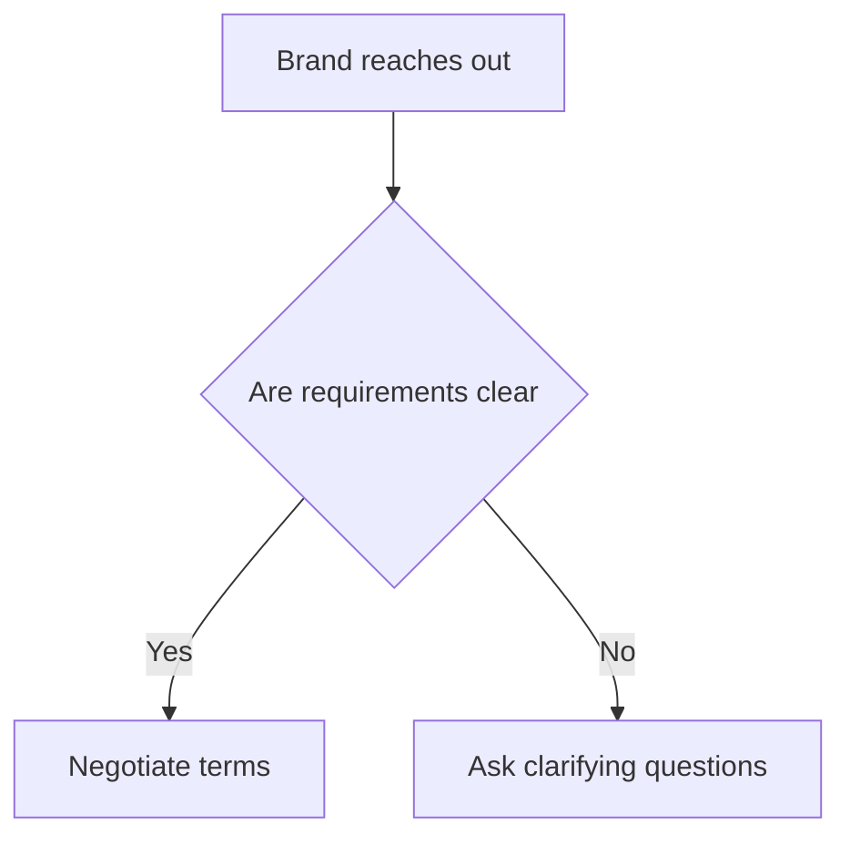
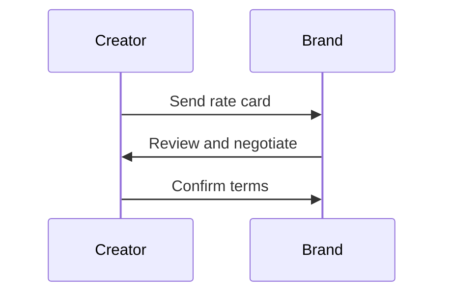
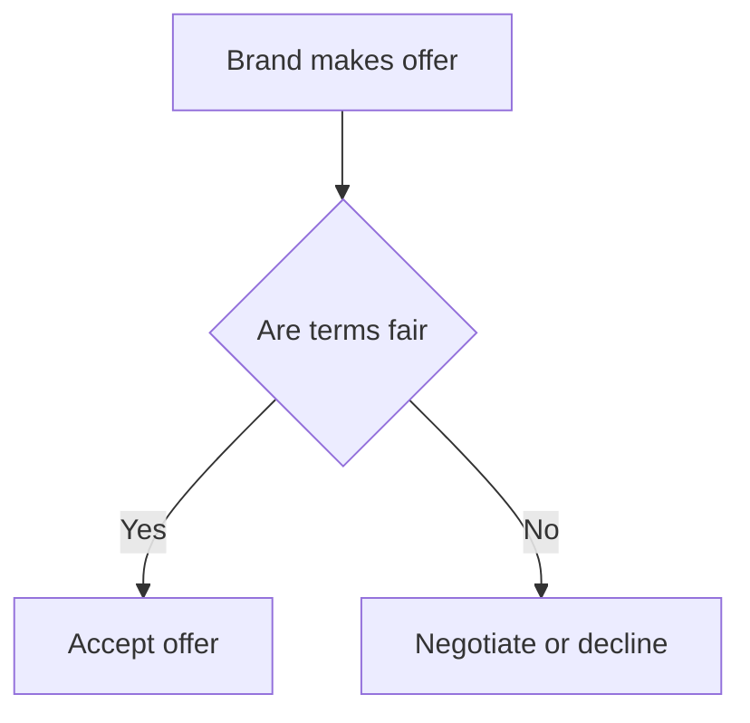

*Heads up: some links below are affiliate. Using them helps us keep the blog free. We only recommend tools we've actually used or trust.*

You've just received a brand collaboration email for your YouTube channel or Instagram profile, offering you a chance to work with a top brand in your niche. The email is brief, mentioning their interest in collaborating with you, but lacking in details. You're excited about the opportunity, but you don't want to undersell yourself. How do you respond to the brand collaboration email without giving away too much information or committing to a project that might not be profitable for you?

You start by thinking about your last brand collaboration, where you were paid Rs 50,000 for a sponsored post. You spent around 10 hours creating the content, which translates to an hourly rate of Rs 5,000. However, you feel that your content is worth more, considering the engagement and reach you've built over the years. You want to make sure that your next collaboration is more lucrative, but you're not sure how to negotiate the terms.

For example, let's say you have a different collaboration opportunity where you're asked to create a series of 5 sponsored posts for a brand. They're offering you Rs 20,000 per post, which seems like a good deal at first. However, after considering the time and effort required to create each post, you realize that your hourly rate would be lower than your usual rate. In this case, you might want to negotiate the terms to ensure that you're being fairly compensated for your work.

Another example to consider is if you're collaborating with a brand that has a large following, but your content is more niche-specific. In this case, you might want to consider the reach and engagement of your audience when determining your rate. For instance, if you have a highly engaged audience of 10,000 followers, you might be able to charge more for your services than if you had a larger, but less engaged audience. On the other hand, if you have a larger audience with lower engagement, you might need to adjust your pricing strategy to remain competitive.

## Quick summary
| Aspect | Considerations |
| --- | --- |
| Budget | Clarify the total budget for the collaboration |
| Deliverables | Define the scope of work, including content types and quantities |
| Usage | Determine how the brand plans to use your content |
| Timeline | Establish the deadlines for content creation and publication |
| Red flags | Watch out for unclear expectations, unrealistic demands, or lack of transparency |

To further illustrate the importance of understanding these aspects, let's consider a second worked example. Suppose you're approached by a brand that wants you to create a series of sponsored videos for their new product launch. They're offering you Rs 100,000 for the entire project, but they're not clear about the scope of work or the usage rights for the content. In this case, you would need to ask clarifying questions to ensure that you understand the brand's requirements and expectations.

Another scenario to consider is if you're collaborating with a brand that has a complex product or service. In this case, you might need to spend more time researching and understanding the product or service to create high-quality content. This could impact your pricing strategy, as you may need to charge more for your services to account for the additional time and effort required.

## Understanding the brand's requirements
Before you respond to the brand collaboration email, you need to understand their requirements and expectations. You should ask questions like:
1. What is the objective of the collaboration?
2. What type of content are they looking for (sponsored posts, product reviews, tutorials, etc.)?
3. How many pieces of content do they need?
4. What is the target audience for the content?
5. Are there any specific guidelines or branding requirements you need to follow?
6. What is the timeline for the collaboration, including deadlines for content creation and publication?
7. How will the brand measure the success of the collaboration, and what metrics will they use to evaluate your performance?

To further illustrate this, let's consider a step-by-step procedure for understanding the brand's requirements:
1. Review the email carefully and make a list of any questions you have.
2. Respond to the email and ask the brand to clarify any unclear points.
3. Discuss the project details with the brand, including the objective, deliverables, and timeline.
4. Ask about any specific guidelines or branding requirements you need to follow.
5. Confirm your understanding of the brand's requirements and expectations.
6. Request a call or meeting to discuss the project in more detail, if necessary.
7. Take notes during the call or meeting to ensure you understand the brand's requirements and expectations.

Another important aspect to consider is the brand's budget and how it will impact your pricing strategy. For example, if the brand has a limited budget, you may need to adjust your pricing to remain competitive. On the other hand, if the brand has a large budget, you may be able to charge more for your services.

## Quoting your services
Once you have a clear understanding of the brand's requirements, you can start thinking about your quote. You should consider factors like:
* The time and effort required to create the content
* The reach and engagement of your audience
* The level of exclusivity required by the brand
* The usage rights for the content
* Any additional services you can offer, such as content promotion or influencer takeovers

You can use a rate card to simplify the quoting process and ensure that you're charging consistently for your services. A rate card should include:
* Your hourly or daily rate
* Your rates for different types of content (e.g., sponsored posts, product reviews, etc.)
* Any discounts or packages you offer for bulk collaborations

For instance, let's say you have a rate card that looks like this:
| Service | Rate |
| --- | --- |
| Sponsored post | Rs 30,000 |
| Product review | Rs 20,000 |
| Influencer takeover | Rs 50,000 |

You can use this rate card as a starting point for your quote, and then adjust it based on the specific requirements of the brand and the value you can bring to the collaboration.

To further illustrate this, let's consider a comparison table of different pricing models:
| Pricing Model | Description | Advantages | Disadvantages |
| --- | --- | --- | --- |
| Hourly rate | Charge by the hour | Easy to track time, flexible | Can be unpredictable for brands |
| Project-based | Charge a flat fee for the project | Simple to understand, predictable for brands | Can be difficult to estimate time required |
| Retainer-based | Charge a recurring fee for ongoing services | Provides consistent income, incentivizes long-term partnerships | Can be difficult to scale |

Another pricing model to consider is a value-based pricing model, where you charge based on the value you bring to the brand. This could include metrics such as engagement, reach, or conversions. For example, you could charge Rs 10,000 for every 1,000 engagements on a sponsored post.

## Sending the rate card
You should send your rate card to the brand after you've discussed the project details and they've expressed interest in moving forward. This will give you an opportunity to negotiate the terms and ensure that you're both on the same page.

Here's an example of a step-by-step procedure for sending the rate card:
1. Review the project details and confirm your understanding of the brand's requirements.
2. Prepare your rate card and adjust it based on the specific requirements of the brand.
3. Send the rate card to the brand and explain your pricing and the value you can bring to the collaboration.
4. Be open to negotiation and willing to adjust your rate card based on the brand's feedback.
5. Confirm the terms of the collaboration and ensure that you're both on the same page.
6. Request a contract or agreement that outlines the terms of the collaboration, including payment terms and usage rights.
7. Review the contract or agreement carefully before signing to ensure you understand the terms and conditions.

Another important aspect to consider when sending the rate card is the brand's expectations and requirements. You should ensure that your rate card is tailored to the brand's needs and that you're providing value to the collaboration.

## Red flags to watch out for
There are several red flags you should watch out for when responding to a brand collaboration email. These include:
1. Unclear expectations: If the brand is vague about their requirements or expectations, it may be difficult to deliver what they're looking for.
2. Unrealistic demands: If the brand is asking for too much content or demanding unrealistic deadlines, it may be a sign that they're not willing to pay fairly for your services.
3. Lack of transparency: If the brand is not transparent about their budget or the usage rights for the content, it may be a sign that they're trying to take advantage of you.

For example, let's say you receive a brand collaboration email that asks you to create 10 sponsored posts in a week, with a budget of Rs 10,000. This may be a red flag, as it's unrealistic to expect you to create high-quality content at such a low rate.

To further illustrate this, let's consider a deeper edge case or exception. What if the brand is asking you to create content that promotes a product or service that you don't believe in or that goes against your values? In this case, you may want to decline the collaboration or negotiate the terms to ensure that you're comfortable with the content you're creating.

Another scenario to consider is if the brand is asking for exclusive rights to your content. In this case, you may want to negotiate the terms to ensure that you're being fairly compensated for the exclusive rights.

## How CreatorKhata helps
Outreach — keeps a reply template and your rate card one click away, so a brand collab email becomes a quote in minutes instead of an anxious afternoon.

## Tools that help with this

- **[CreatorKhata](https://creatorkhata.com/?utm_source=blog&utm_medium=affiliate&utm_campaign=respond-brand-collaboration-email-creator)** — All-in-one business app for Indian creators — invoices, brand-deal contracts, payment tracking, GST & TDS-ready
- **[Kit (formerly ConvertKit)](https://partners.kit.com/lmou6iciacgc)** — Email/newsletter platform built for creators
- **[Creator gear on Amazon India](https://www.amazon.in/s?k=youtuber+kit&tag=creatorkhata2-21&utm_campaign=respond-brand-collaboration-email-creator)** — Cameras, mics, lighting, and accessories for content creators

## A note on accuracy
This is general guidance. For your specific situation, consult a chartered accountant.
