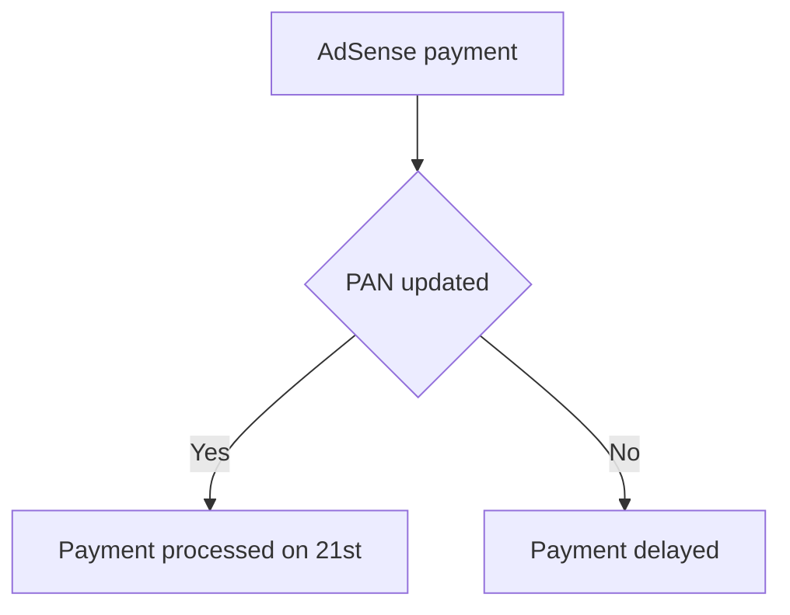
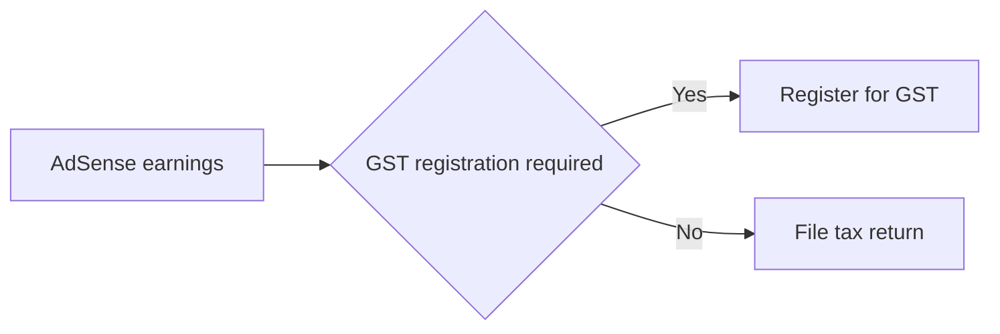
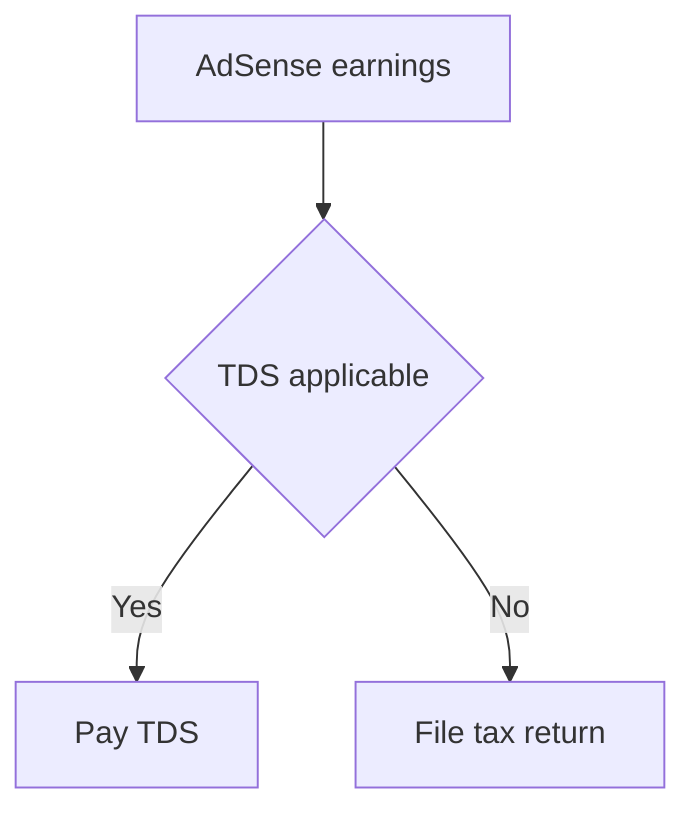

*Heads up: some links below are affiliate. Using them helps us keep the blog free. We only recommend tools we've actually used or trust.*

You're creating content on YouTube, and your channel is finally gaining traction. As an Indian creator, you're eager to know when you'll receive your AdSense payments. Let's assume your channel has just crossed the $100 threshold, and you're expecting your first payment. You've heard that AdSense pays Indian creators on the 21st of each month, but you're not sure about the process.

As you wait for your payment, you start thinking about the conversion rate from USD to INR. You've earned $150 from AdSense, but you're not sure how much you'll receive in your Indian bank account. The current exchange rate is 1 USD = 82 INR, so you're expecting around ₹12,300. However, you're aware that the actual amount may vary depending on the conversion rate at the time of payment.

## Quick summary
| Category | Description |
| --- | --- |
| Payment Threshold | $100 minimum earnings required for payment |
| Payment Timing | 21st of each month |
| PAN Requirement | PAN required for Indian payees |
| Currency Conversion | AdSense → Indian bank conversion using current exchange rate |

## Understanding AdSense Payment Thresholds
As an Indian creator, you need to earn a minimum of $100 from AdSense to receive a payment. This threshold applies to all creators, regardless of their location. If you don't reach the $100 threshold in a given month, your earnings will be carried over to the next month. For example, if you earn $50 in January and $60 in February, you'll receive a payment of $110 on the 21st of March.

Let's consider another example: suppose you earn $80 in March and $120 in April. In this case, you'll receive a payment of $200 on the 21st of May. It's essential to keep track of your earnings to ensure you meet the payment threshold.

Here's a step-by-step procedure to track your AdSense earnings:
1. Log in to your AdSense account
2. Click on the "Payments" tab
3. Check your current earnings and the payment threshold
4. Review your earnings history to ensure you're on track to meet the payment threshold
5. Adjust your content strategy if needed to meet the payment threshold

Let's consider a scenario where you earn $90 in one month. You'll need to wait until the next month to receive a payment, as you haven't met the $100 threshold. In this case, you can use the time to optimize your content and increase your earnings.

Another example is if you earn $150 in one month, but $50 of it is from a sponsored video. In this case, you'll need to consider the tax implications of the sponsored video earnings, as they may be subject to different tax rules.

## Payment Timing and PAN Requirement
AdSense pays Indian creators on the 21st of each month. To receive payments, you'll need to provide your PAN details to Google. This is a mandatory requirement for all Indian payees. Make sure your PAN is updated in your AdSense account to avoid any payment delays. You can update your PAN details by following these steps:
1. Log in to your AdSense account
2. Click on "Payments" and then "Payment settings"
3. Click on "Edit" next to "Tax information"
4. Enter your PAN details and click "Save"

In addition to updating your PAN details, it's essential to ensure your bank account information is accurate. You can update your bank account details by following these steps:
1. Log in to your AdSense account
2. Click on "Payments" and then "Payment settings"
3. Click on "Edit" next to "Bank account information"
4. Enter your bank account details and click "Save"

If you have multiple bank accounts, you can add them to your AdSense account and choose which one to use for payments. This can be helpful if you have a separate bank account for your business or if you want to receive payments in a different currency.

Here's a comparison table to illustrate the effect of having multiple bank accounts:
| Bank Account | Payment Currency | Payment Amount |
| --- | --- | --- |
| Bank Account 1 | INR | ₹10,000 |
| Bank Account 2 | USD | $150 |
| Bank Account 3 | EUR | €130 |

## Currency Conversion and Payment
When AdSense pays you, the amount is converted from USD to INR using the current exchange rate. The conversion rate may fluctuate, affecting the actual amount you receive in your Indian bank account. For example, if you've earned $200 and the exchange rate is 1 USD = 80 INR, you'll receive ₹16,000. However, if the exchange rate changes to 1 USD = 85 INR, you'll receive ₹17,000 for the same $200 earnings.

Let's consider another example: suppose you've earned $300 and the exchange rate is 1 USD = 78 INR. In this case, you'll receive ₹23,400. However, if the exchange rate changes to 1 USD = 82 INR, you'll receive ₹24,600 for the same $300 earnings.

Here's a comparison table to illustrate the effect of exchange rate fluctuations:
| Earnings (USD) | Exchange Rate (1 USD = x INR) | Payment Amount (INR) |
| --- | --- | --- |
| $200 | 80 INR | ₹16,000 |
| $200 | 85 INR | ₹17,000 |
| $300 | 78 INR | ₹23,400 |
| $300 | 82 INR | ₹24,600 |

To minimize the impact of exchange rate fluctuations, you can consider the following strategies:
1. Diversify your income streams to reduce dependence on AdSense earnings
2. Use a currency conversion service to lock in a favorable exchange rate
3. Keep a buffer of funds to account for potential exchange rate fluctuations

## Managing Your AdSense Earnings
As an Indian creator, it's essential to manage your AdSense earnings effectively. You can use the AdSense dashboard to track your earnings, payments, and tax information. Make sure to regularly review your account to ensure everything is up-to-date and accurate. You can also use the [invoice format for content creators](/blog/invoice-format-content-creators) to generate invoices for your brand deals and sponsorships.

To manage your AdSense earnings, follow these steps:
1. Log in to your AdSense account regularly
2. Review your earnings and payment history
3. Update your tax information and PAN details as needed
4. Use the AdSense dashboard to track your earnings and payments
5. Set up payment reminders to ensure you receive payments on time
6. Consider using a accounting software to track your expenses and income

Here's a step-by-step procedure to set up payment reminders:
1. Log in to your AdSense account
2. Click on "Payments" and then "Payment settings"
3. Click on "Edit" next to "Payment reminders"
4. Enter your reminder preferences and click "Save"

## Tax Implications for Indian Creators
As an Indian creator, you're required to pay taxes on your AdSense earnings. You can use the [TDS guide for creators](/blog/tds-for-youtubers-india) to understand the tax implications of your AdSense earnings. You may also need to register for GST if your annual turnover exceeds the threshold. You can use the [GST guide for Indian creators](/blog/gst-for-indian-creators) to understand the GST registration process and requirements.

Here's a step-by-step procedure to understand your tax implications:
1. Calculate your annual turnover from AdSense earnings
2. Determine if you need to register for GST
3. Review your tax information and PAN details
4. Consult a chartered accountant to ensure you're meeting your tax obligations
5. File your tax return on time to avoid penalties
6. Consider using tax planning strategies to minimize your tax liability

## How CreatorKhata helps
The Payment Tracker feature in CreatorKhata helps you auto-log each AdSense payout with the USD-INR conversion rate captured, so your foreign-currency income line on the ITR matches your bank credits exactly.

## Tools that help with this

- **[CreatorKhata](https://creatorkhata.com/?utm_source=blog&utm_medium=affiliate&utm_campaign=youtube-adsense-payment-thresholds-india)** — All-in-one business app for Indian creators — invoices, brand-deal contracts, payment tracking, GST & TDS-ready
- **[vidIQ](https://vidiq.com/creatorkhata?utm_campaign=youtube-adsense-payment-thresholds-india)** — YouTube analytics + content ideas + competitor tracking
- **[Creator gear on Amazon India](https://www.amazon.in/s?k=youtuber+kit&tag=creatorkhata2-21&utm_campaign=youtube-adsense-payment-thresholds-india)** — Cameras, mics, lighting, and accessories for content creators

## A note on accuracy
This is general guidance. For your specific situation, consult a chartered accountant.
