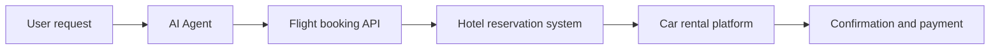
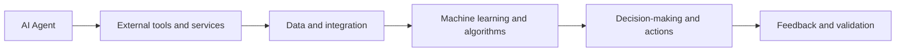
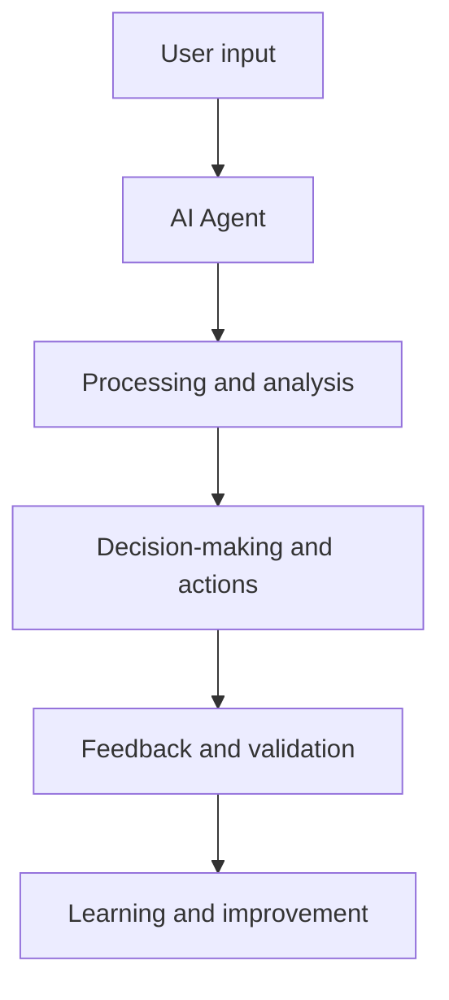

You're planning a trip and need help booking flights, hotels, and rental cars. You can use a travel website or a virtual assistant to make the process easier. But have you ever wondered what's behind these virtual helpers? Are they just simple chatbots or more advanced AI agents? Understanding the difference between AI agents and chatbots can help you appreciate the technology that powers these virtual assistants.

Imagine you ask a virtual travel assistant to book a trip from New York to Los Angeles. A chatbot might respond with a list of available flights, while an AI agent would not only provide the list but also offer to book the flight, arrange for a hotel, and rent a car for you. The AI agent would use various tools and services to accomplish these tasks, making it a more powerful and useful tool.

## Quick summary
| Term | Description | Example |
| --- | --- | --- |
| Chatbot | A computer program that answers questions and provides information | Answering FAQs on a website |
| AI Agent | A computer program that plans, uses tools, and takes actions to achieve a goal | Booking a trip, including flights, hotels, and rental cars |
| Goal-oriented | Focused on achieving a specific objective | Booking a trip within a budget |
| Multi-step actions | Taking several steps to achieve a goal | Booking a flight, then a hotel, and finally a rental car |
| Tool usage | Using various services and applications to accomplish tasks | Using a flight booking API, a hotel reservation system, and a car rental platform |

To further illustrate the difference, consider a second example. Suppose you want to plan a meeting with colleagues from different locations. A chatbot might provide you with a list of available meeting times and dates, while an AI agent would take it a step further by suggesting the best time and date based on everyone's schedule, booking the meeting room, and sending out invitations. The AI agent would use calendar integration, meeting scheduling algorithms, and email services to accomplish these tasks, making it a more comprehensive and efficient tool.

## What are Chatbots?
Chatbots are computer programs designed to answer questions, provide information, and assist with simple tasks. They use natural language processing (NLP) to understand user input and respond accordingly. Chatbots can be useful for tasks such as answering frequently asked questions, providing customer support, and helping users navigate a website. However, they are limited in their ability to take actions or use external tools and services.

One common misconception about chatbots is that they are only used for customer support. While they are indeed useful for this purpose, they can also be used in other areas, such as:

1. **Content generation**: Chatbots can be used to generate content, such as news articles or social media posts, based on user input and preferences.
2. **Language translation**: Chatbots can be used to translate text or speech from one language to another, facilitating communication across language barriers.
3. **Data analysis**: Chatbots can be used to analyze data, such as user behavior or market trends, and provide insights and recommendations.

However, chatbots have limitations, including their inability to understand nuances of human language and their reliance on pre-defined rules and knowledge bases. For instance, a chatbot might struggle to understand sarcasm or idioms, which can lead to misinterpretation or incorrect responses.

## What are AI Agents?
AI agents, on the other hand, are more advanced computer programs that can plan, use tools, and take multi-step actions to achieve a goal. They use a combination of NLP, machine learning, and software integration to interact with various services and applications. AI agents can be used for tasks such as booking travel, managing schedules, and automating workflows. They can also learn from user interactions and adapt to changing circumstances.

A deeper edge case to consider is the use of AI agents in complex, dynamic environments. For example, an AI agent might be used to manage a supply chain, adapting to changes in demand, inventory, and shipping schedules. In this scenario, the AI agent would need to integrate with multiple systems, such as enterprise resource planning (ERP) software, transportation management systems, and weather forecasting services, to make informed decisions and optimize the supply chain.

Here is a step-by-step procedure for implementing an AI agent in a complex environment:

1. **Define the goal**: Clearly define the objective of the AI agent, such as optimizing the supply chain or automating a workflow.
2. **Identify the tools and services**: Determine the tools and services required to achieve the goal, such as ERP software, transportation management systems, and weather forecasting services.
3. **Integrate the tools and services**: Integrate the tools and services using APIs, software development kits (SDKs), or other integration methods.
4. **Train the AI agent**: Train the AI agent using machine learning algorithms and data from the integrated tools and services.
5. **Deploy and monitor**: Deploy the AI agent and monitor its performance, making adjustments as needed to optimize its effectiveness.

## Comparison of AI Agents and Chatbots
Here's a comparison table highlighting the key differences between AI agents and chatbots:
| Feature | Chatbots | AI Agents |
| --- | --- | --- |
| Primary function | Answering questions and providing information | Planning, using tools, and taking actions to achieve a goal |
| Level of complexity | Simple to moderate | Moderate to complex |
| Ability to use external tools | Limited or none | Yes, using APIs and software integration |
| Goal-oriented | No | Yes |
| Multi-step actions | No | Yes |

To further illustrate the differences, consider the following analogy. Chatbots are like virtual assistants that can perform simple tasks, such as setting reminders or sending messages. AI agents, on the other hand, are like personal assistants that can manage complex tasks, such as planning a trip or managing a schedule. While chatbots can provide useful information and assistance, AI agents can take actions and make decisions on your behalf, making them more powerful and useful tools.

## Example: Booking a Trip
Let's go back to the example of booking a trip from New York to Los Angeles. A chatbot might respond with a list of available flights, while an AI agent would offer to book the flight, arrange for a hotel, and rent a car for you. The AI agent would use various tools and services, such as flight booking APIs, hotel reservation systems, and car rental platforms, to accomplish these tasks.

To further illustrate the example, consider the following Markdown comparison table:
| Tool | Chatbot | AI Agent |
| --- | --- | --- |
| Flight booking API | No | Yes |
| Hotel reservation system | No | Yes |
| Car rental platform | No | Yes |
| Payment processing | No | Yes |

## Limitations of AI Agents
While AI agents are more powerful and useful than chatbots, they also have limitations. One of the main limitations is their reliance on external tools and services. If these tools and services are not available or are not integrated correctly, the AI agent may not be able to complete its tasks. Additionally, AI agents may not always understand the user's intent or preferences, which can lead to errors or misunderstandings.

A deeper edge case to consider is the use of AI agents in environments with limited data or uncertain conditions. For example, an AI agent might be used to predict stock prices or forecast weather patterns. In these scenarios, the AI agent would need to use machine learning algorithms and statistical models to make informed decisions, but it may still be limited by the quality and availability of the data.

Here is a step-by-step procedure for mitigating the limitations of AI agents:

1. **Monitor and maintain**: Continuously monitor and maintain the AI agent's integration with external tools and services.
2. **Train and update**: Regularly train and update the AI agent using new data and machine learning algorithms.
3. **Test and validate**: Thoroughly test and validate the AI agent's performance in different scenarios and environments.
4. **Provide feedback mechanisms**: Provide feedback mechanisms for users to report errors or misunderstandings, allowing the AI agent to learn and improve.
5. **Develop contingency plans**: Develop contingency plans for scenarios where the AI agent may fail or encounter limitations, such as having a human backup or alternative solutions.

## Key Takeaways
* AI agents are more advanced than chatbots, with the ability to plan, use tools, and take multi-step actions to achieve a goal.
* Chatbots are limited to answering questions and providing information, while AI agents can use external tools and services to accomplish tasks.
* AI agents can learn from user interactions and adapt to changing circumstances.
* The primary function of AI agents is to achieve a goal, while chatbots focus on providing information.
* AI agents have limitations, including reliance on external tools and services, and potential errors or misunderstandings due to lack of understanding of user intent or preferences.
