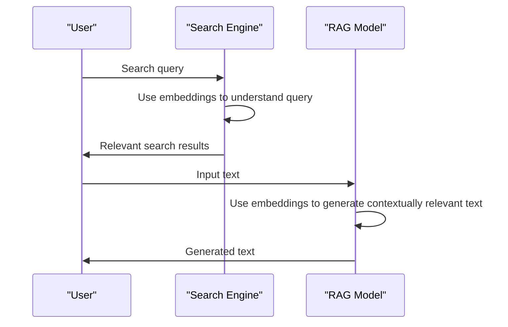
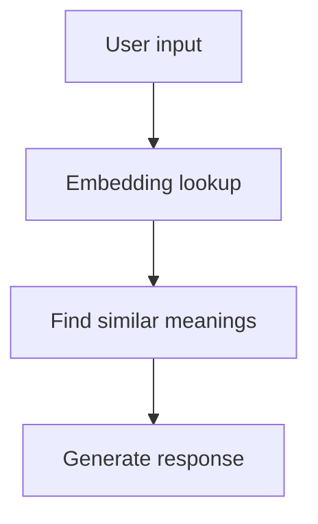

You're searching for a new restaurant to try, and you type 'Italian food near me' into your favorite search engine. How does the engine know to show you results about pasta, pizza, and other Italian dishes? It's not just because the words match; it's because the search engine understands the meaning behind those words. This understanding is made possible by something called embeddings.

Imagine you're organizing a huge library with an infinite number of books, each representing a word or concept. Embeddings are like a special way of arranging these books on shelves so that similar books are close together. But instead of using shelves, embeddings use lists of numbers to capture the meaning of words. These lists, often hundreds of numbers long, are called vectors. When you see a word like 'dog', its embedding might be a list like [0.1, 0.2, 0.05, ...]. This list doesn't make sense to humans, but to a computer, it represents the concept of a dog.

## Quick summary
| Term | Explanation |
| --- | --- |
| Embedding | A list of numbers representing the meaning of a word or concept |
| Vector | Another term for an embedding, often used in mathematical contexts |
| Similarity | Words with similar meanings have embeddings that are close together |
| Search Engine | Uses embeddings to understand the meaning behind search queries |
| RAG | Retrieval-Augmented Generation, a technology that benefits from embeddings |

To further illustrate the concept of embeddings, consider a second analogy. Think of a large, complex web where each word is a node, and the connections between nodes represent the relationships between words. Embeddings would be like a way to map this web into a more manageable, lower-dimensional space, where similar nodes (words) are closer together. This mapping allows computers to efficiently navigate the web of words and make informed decisions based on their meanings.

For instance, consider the words 'car', 'automobile', and 'vehicle'. These words are related and would have similar embeddings, allowing a computer to understand their connections. On the other hand, words like 'dog' and 'house' would have very different embeddings, reflecting their distinct meanings.

## What are Embeddings?
Embeddings are a way for computers to understand the meaning of words. They do this by assigning a list of numbers (a vector) to each word. The magic of embeddings is that words with similar meanings have vectors that are close together. For example, the vectors for 'dog', 'cat', and 'animal' would all be near each other because they're related concepts. This is useful because it lets computers make decisions based on the meaning of words, not just their exact spelling.

A deeper edge case to consider is how embeddings handle nuances in language, such as synonyms, antonyms, and homophones. Synonyms, which are words with similar meanings, should ideally have similar embeddings. Antonyms, on the other hand, should have embeddings that are farther apart, reflecting their opposing meanings. Homophones, which are words that sound the same but have different meanings, pose a challenge for embeddings, as their meanings need to be distinguished despite their similar pronunciation.

To address these challenges, embeddings can be fine-tuned using various techniques, such as:

1. **Contextualization**: This involves adjusting the embeddings based on the context in which a word is used. For example, the word 'bank' could refer to a financial institution or the side of a river, depending on the context.
2. **Subword modeling**: This technique represents words as a combination of subwords (smaller units of words) to better capture nuances in language.
3. **Multitask learning**: This involves training embeddings on multiple tasks simultaneously, such as language translation and text classification, to improve their overall quality and robustness.

Here's a comparison table to illustrate the differences between these techniques:

| Technique | Description | Advantages |
| --- | --- | --- |
| Contextualization | Adjusts embeddings based on context | Improves handling of homophones and polysemous words |
| Subword modeling | Represents words as a combination of subwords | Captures nuances in language, such as prefixes and suffixes |
| Multitask learning | Trains embeddings on multiple tasks simultaneously | Improves overall quality and robustness of embeddings |

## How Embeddings Work
To understand how embeddings work, let's consider an analogy. Imagine a map where each city represents a word. Cities that are close together on the map are similar, just like words with similar meanings have embeddings that are close together. If you wanted to find all the cities near 'Paris', you could look at the map and see that 'Lyon' and 'Bordeaux' are close by. Similarly, if you wanted to find words related to 'dog', you could look at their embeddings and see that 'cat' and 'pet' are nearby.

A step-by-step procedure for creating embeddings involves:

1. **Data collection**: Gathering a large dataset of text to learn from.
2. **Preprocessing**: Cleaning and normalizing the text data, such as removing punctuation and converting all text to lowercase.
3. **Tokenization**: Splitting the text into individual words or tokens.
4. **Embedding training**: Using a machine learning algorithm to learn the embeddings from the tokenized text data.
5. **Evaluation**: Testing the quality of the learned embeddings using various metrics, such as word similarity tasks or text classification tasks.

Additionally, consider the following example to illustrate the concept of embeddings. Suppose we have a dataset of text about different types of food, including 'pizza', 'sushi', and 'tacos'. We can use embeddings to capture the meanings of these words and their relationships to each other. For instance, the embeddings for 'pizza' and 'sushi' might be close together, reflecting their shared meaning as types of food.

## Why Similar Meanings Sit Close Together
The reason similar meanings sit close together in embeddings is due to how they're created. Embeddings are typically learned from large datasets of text using machine learning algorithms. These algorithms look for patterns in the way words are used and adjust the embeddings accordingly. For example, if the algorithm sees the word 'dog' often used in the same context as 'pet' and 'animal', it will adjust their embeddings to be closer together.

A common misconception about embeddings is that they are simply a matter of counting word frequencies. While word frequencies do play a role in learning embeddings, the process is more complex and involves capturing the nuances of language, such as word order, context, and semantics.

To illustrate this, consider the following comparison table:

| Method | Description | Limitations |
| --- | --- | --- |
| Word frequency counting | Counts the frequency of each word in a dataset | Fails to capture nuances in language, such as word order and context |
| Embeddings | Learns vectors that capture the meaning of words | Requires large datasets and computational resources to train |

Furthermore, consider the following step-by-step procedure to fine-tune embeddings for a specific task:

1. **Task definition**: Define the task for which you want to fine-tune the embeddings, such as text classification or language translation.
2. **Data preparation**: Prepare the dataset for the task, including preprocessing and tokenization.
3. **Model selection**: Select a suitable machine learning model for the task, such as a neural network or a gradient boosting model.
4. **Fine-tuning**: Fine-tune the embeddings using the selected model and dataset.
5. **Evaluation**: Evaluate the performance of the fine-tuned embeddings using various metrics, such as accuracy or F1-score.

## Embeddings in Search and RAG
Embeddings are crucial for technologies like search engines and Retrieval-Augmented Generation (RAG). In search, embeddings help the engine understand the meaning behind your query, so it can show you relevant results even if they don't contain the exact words you typed. For RAG, embeddings enable the generation of text that's contextually relevant because the system can understand the meaning of the input it's given.

A second example of using embeddings in search is to improve the handling of long-tail queries. Long-tail queries are search queries that are more specific and less common, such as 'Italian restaurants in New York City'. Embeddings can help search engines understand the meaning behind these queries and return relevant results, even if the exact words are not present in the search index.

Additionally, consider the following comparison table to illustrate the benefits of using embeddings in search:

| Method | Description | Benefits |
| --- | --- | --- |
| Keyword matching | Matches search query to exact keywords in index | Fails to capture nuances in language and context |
| Embeddings | Uses vectors to capture meaning of search query | Improves handling of long-tail queries and returns relevant results |

## A Simple Example
Let's say you're building a chatbot that needs to respond to user queries. You could use embeddings to understand the meaning of the user's input and generate a relevant response. For example, if the user types 'I'm feeling sad', the embeddings for 'sad' would be close to those for 'depressed' and 'unhappy', allowing your chatbot to respond with a message like 'Sorry to hear that. Would you like to talk about what's on your mind?'.

To further illustrate this example, consider the following step-by-step procedure for building a chatbot using embeddings:

1. **Data collection**: Gather a dataset of user queries and corresponding responses.
2. **Embedding training**: Train embeddings on the collected dataset to learn the meanings of words and phrases.
3. **Chatbot development**: Develop a chatbot that uses the trained embeddings to understand user input and generate relevant responses.
4. **Testing and evaluation**: Test and evaluate the chatbot's performance using various metrics, such as response accuracy and user satisfaction.

Moreover, consider the following analogy to illustrate the concept of embeddings in chatbots. Think of a chatbot as a librarian who needs to find relevant books (responses) based on a user's query (input). The librarian uses embeddings to understand the meaning of the query and find books that are close together in meaning, just like a search engine uses embeddings to find relevant results.

## Key Takeaways
* Embeddings are lists of numbers that capture the meaning of words, allowing computers to understand their context and relationships.
* Similar meanings sit close together in embeddings, enabling technologies like search engines and RAG models to make decisions based on word meanings.
* Embeddings are learned from large datasets of text using machine learning algorithms.
* They're crucial for understanding natural language and generating contextually relevant text.
* Embeddings power many modern AI applications, from search and chatbots to text generation and more.
