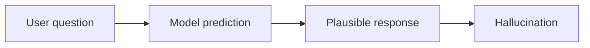
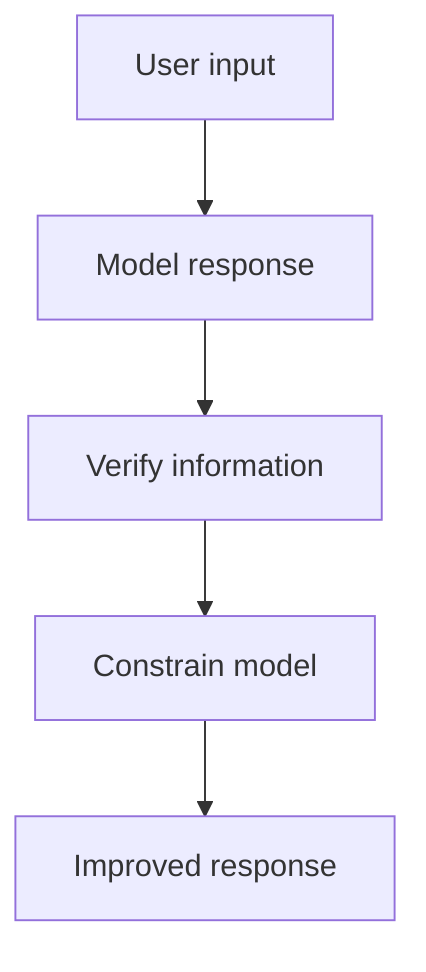
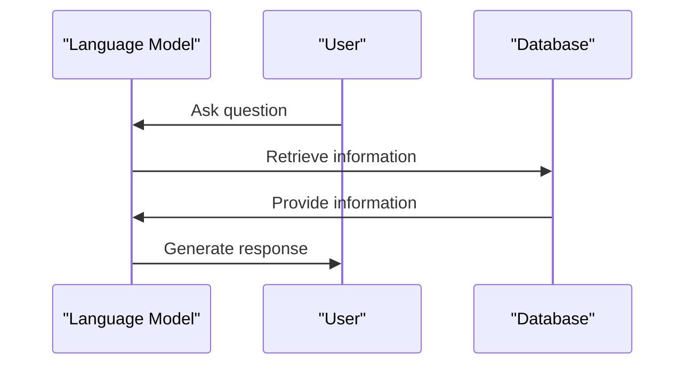

You've probably interacted with a language model, like a chatbot or a virtual assistant, and been impressed by its ability to generate human-like text. But have you ever noticed that sometimes these models seem to make things up? This phenomenon is known as **AI hallucinations**, which occur when a model confidently produces false information. 

As you explore the capabilities and limitations of language models, you might wonder why they produce such falsehoods. The reason lies in how these models are trained: they predict what text is likely to come next, not what is true. This means that if a model is given a prompt that it doesn't have enough information to answer accurately, it will still try to generate a response that seems plausible, even if it's entirely made up.

## Quick summary
| Term | Description |
| --- | --- |
| AI Hallucinations | Confidently produced false information by a model |
| LLMs | Large Language Models, trained on vast amounts of text data |
| RAG | Retrieval-Augmented Generation, a technique to reduce hallucinations |
| Truthfulness | The ability of a model to produce accurate and reliable information |
| Plausible Text | Text that seems likely or believable, but may not be true |

To further illustrate this concept, consider the following analogy: imagine you're having a conversation with a friend who is trying to guess what you'll say next. Your friend might make educated guesses based on the context of the conversation, but they might also make mistakes. Similarly, language models are trying to predict what text is likely to come next, but they can also make mistakes, leading to hallucinations.

## What are AI Hallucinations?
AI hallucinations are a result of how language models are trained. These models are designed to predict the next word in a sequence of text, based on the context and the patterns they've learned from their training data. When a model is faced with a question or prompt that it doesn't have enough information to answer accurately, it will still try to generate a response that seems plausible. This can lead to the model producing false information, which it presents with confidence.

For example, suppose you ask a language model to describe a new restaurant in town. If the model doesn't have any information about the restaurant, it might generate a response that seems plausible, such as 'The restaurant is located in the heart of the city and serves a variety of cuisines.' However, this response might be entirely made up, and the model might not have any actual information about the restaurant.

To mitigate this issue, it's essential to understand the limitations of language models and to verify the information they generate. Here are some steps you can take:
1. **Evaluate the model's training data**: Understand what data the model was trained on and what its limitations are.
2. **Ask for sources**: Request that the model provide sources for the information it generates.
3. **Verify information**: Fact-check the information generated by the model to ensure its accuracy.
4. **Constrain the model**: Provide the model with more context or specify the scope of the task to help it generate more accurate responses.
5. **Use multiple models**: Compare the responses generated by multiple models to identify potential hallucinations.

## Common Trigger Situations
There are several situations that can trigger AI hallucinations. One common scenario is when a model is asked a question that is outside its training data. For example, if a model is trained on a dataset that only includes information up to 2022, it may hallucinate when asked about events that occurred in 2023. Another trigger situation is when a model is given a prompt that is ambiguous or unclear. In such cases, the model may generate a response that seems plausible but is actually false.

Here's a comparison table highlighting some common trigger situations:
| Situation | Description | Example |
| --- | --- | --- |
| Out-of-distribution data | The model is asked a question that is outside its training data | Asking a model about events in 2023 when it was trained on data up to 2022 |
| Ambiguous prompts | The model is given a prompt that is unclear or ambiguous | Asking a model to describe a 'new' restaurant without providing more context |
| Limited context | The model is not provided with enough context to generate an accurate response | Asking a model to summarize a long article without providing the article's content |

To avoid these situations, it's crucial to provide language models with clear and specific prompts, and to verify the information they generate. Additionally, using techniques such as RAG and multimodal learning can help reduce hallucinations.

## Reducing AI Hallucinations
While AI hallucinations are a natural consequence of how language models work, there are several practical ways to reduce them. Here are five techniques:
1. **Use Retrieval-Augmented Generation (RAG)**: This technique involves using a retrieval system to fetch relevant information from a database or knowledge graph, which is then used to generate a response. By incorporating external knowledge, RAG can help reduce hallucinations.
2. **Ask for Sources**: When interacting with a language model, ask it to provide sources for the information it generates. This can help you verify the accuracy of the response and detect potential hallucinations.
3. **Lower the Stakes**: When using a language model for a task, try to lower the stakes by making the task less critical. For example, instead of using a model to generate a formal report, use it to generate a draft that can be reviewed and corrected by a human.
4. **Verify Information**: Always verify the information generated by a language model, especially if it seems too good (or bad) to be true. Use fact-checking websites or consult with experts to confirm the accuracy of the response.
5. **Constrain the Model**: Constrain the model by providing it with more context or specifying the scope of the task. This can help the model generate more accurate responses and reduce hallucinations.

For instance, suppose you're using a language model to generate a summary of a research paper. To reduce hallucinations, you can provide the model with the paper's abstract, introduction, and conclusion, and ask it to generate a summary based on that information. This can help the model generate a more accurate response and reduce the likelihood of hallucinations.

## The Impact of AI Hallucinations
AI hallucinations can have significant consequences, especially in applications where accuracy and truthfulness are critical. For example, in healthcare, a model that hallucinates about a patient's medical history or diagnosis can lead to incorrect treatment and harm to the patient. In finance, a model that hallucinates about market trends or stock prices can lead to incorrect investment decisions and financial losses.

To mitigate the impact of AI hallucinations, it's essential to develop more accurate and truthful language models. Here are some potential steps:
1. **Improve training data**: Ensure that the training data is accurate, diverse, and representative of the task at hand.
2. **Use multimodal learning**: Train models on multiple sources of data, such as text, images, and audio, to develop a more nuanced understanding of the world.
3. **Incorporate human feedback**: Use human feedback to correct and improve the responses generated by language models.
4. **Develop more transparent models**: Develop models that provide transparent and explainable responses, making it easier to identify potential hallucinations.
5. **Continuously evaluate and update models**: Continuously evaluate and update language models to ensure they remain accurate and truthful over time.

## Future Directions
To mitigate the effects of AI hallucinations, researchers are exploring new techniques and architectures for language models. One promising approach is to use **multimodal learning**, where models are trained on multiple sources of data, such as text, images, and audio. This can help models develop a more nuanced understanding of the world and reduce hallucinations.

For example, a language model trained on both text and images can generate more accurate descriptions of visual scenes, reducing the likelihood of hallucinations. Additionally, using techniques such as attention mechanisms and graph-based models can help improve the accuracy and transparency of language models.

## Key Takeaways
* AI hallucinations occur when language models produce confident falsehoods.
* LLMs predict plausible text, not truth, which can lead to hallucinations.
* Techniques like RAG, asking for sources, lowering stakes, verifying information, and constraining the model can reduce hallucinations.
* AI hallucinations can have significant consequences in critical applications.
* Future research directions include multimodal learning and developing more accurate and truthful language models.
