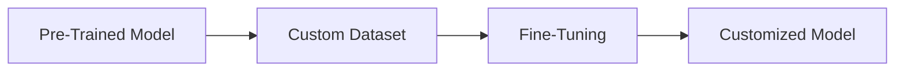
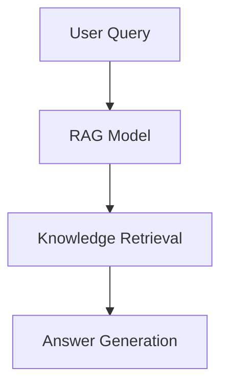

You're exploring the world of artificial intelligence and wondering how to get the most out of your AI models. One crucial decision is whether to fine-tune your model or use Retrieval-Augmented Generation (RAG). But what do these terms mean, and how do you choose between them?

Imagine you have a pre-trained AI model that's great at understanding language, but you want it to perform a specific task, like answering questions about your company's products. You have two main options: fine-tune the model, which means adjusting its internal workings to fit your needs, or use RAG, which involves feeding the model additional information at runtime. The right choice depends on your specific use case, the cost, the freshness of your data, and the effort you're willing to put in.

## Quick summary
| Term | Definition | Use Case |
| --- | --- | --- |
| Fine-Tuning | Adjusting a model's weights | Custom tasks with large datasets |
| RAG | Feeding a model knowledge at runtime | Tasks with constantly changing information |
| Prompting | Providing input to guide a model | Simple tasks with minimal data |
| Pre-Trained Model | A model trained on a large, general dataset | General language understanding tasks |

## Understanding Fine-Tuning
Fine-tuning involves changing the model's weights to fit your specific task. This process requires a significant amount of data and computational resources. Fine-tuning is useful when you have a large dataset and want to customize the model for a specific task. However, it can be time-consuming and expensive. Here's an example of when fine-tuning might be the right choice:

For instance, if you're building a chatbot for a specific industry, you might fine-tune a pre-trained model on a large dataset of industry-related text. Another example could be fine-tuning a language translation model for a specific language pair, such as English to Spanish. In this case, you would need a large dataset of translated text to fine-tune the model.

To fine-tune a model, you can follow these steps:
1. **Prepare your dataset**: Collect and preprocess a large dataset relevant to your specific task.
2. **Choose a pre-trained model**: Select a pre-trained model that is suitable for your task and has a similar architecture to the model you want to fine-tune.
3. **Fine-tune the model**: Use your dataset to fine-tune the pre-trained model, adjusting its weights to fit your specific task.
4. **Evaluate the model**: Test the fine-tuned model on a validation set to ensure it performs well on your specific task.
5. **Deploy the model**: Deploy the fine-tuned model in your application, using it to make predictions or generate text.

One common edge case to consider is when you have a large dataset, but it's noisy or biased. In this case, fine-tuning might not be the best option, as the model may learn to fit the noise or bias in the data. To address this, you could try data preprocessing techniques, such as data cleaning or data augmentation, to improve the quality of your dataset before fine-tuning the model.

Another consideration is the risk of overfitting, which occurs when the model becomes too specialized to the training data and fails to generalize well to new, unseen data. To mitigate this risk, you can try techniques such as regularization, early stopping, or ensemble methods, which can help prevent the model from becoming too complex and overfitting to the training data.

## Understanding RAG
RAG, on the other hand, involves feeding the model additional information at runtime. This approach is useful when you have constantly changing information or a small dataset. RAG is often more efficient and cost-effective than fine-tuning. Here's an example of how RAG works:

For example, if you're building a question-answering system that needs to stay up-to-date with the latest news, RAG might be a better choice. Another example could be using RAG to generate text based on a specific topic, such as a company's products or services. In this case, you would feed the model a knowledge base of information about the topic, and it would generate text based on that knowledge.

To use RAG, you can follow these steps:
1. **Prepare your knowledge base**: Collect and preprocess a knowledge base of information relevant to your specific task.
2. **Choose a RAG model**: Select a RAG model that is suitable for your task and has a similar architecture to the model you want to use.
3. **Feed the model knowledge**: Feed the RAG model your knowledge base at runtime, allowing it to generate answers or text based on that knowledge.
4. **Evaluate the model**: Test the RAG model on a validation set to ensure it performs well on your specific task.
5. **Deploy the model**: Deploy the RAG model in your application, using it to make predictions or generate text.

One common misconception about RAG is that it requires a large amount of data to be effective. However, this is not necessarily true. RAG can be effective with small datasets, as long as the knowledge base is relevant and up-to-date. Another caveat is that RAG can be sensitive to the quality of the knowledge base, so it's essential to ensure that the knowledge base is accurate and comprehensive.

For instance, if you're using RAG to generate text based on a specific topic, you'll need to ensure that the knowledge base is complete and accurate. You can do this by regularly updating the knowledge base with new information and verifying the accuracy of the existing information.

## Decision Table
Here's a decision table to help you choose between fine-tuning and RAG:
1. **Use Case**: What task do you want the model to perform?
   * Custom task with large dataset: Fine-Tuning
   * Task with constantly changing information: RAG
   * Simple task with minimal data: Prompting
2. **Cost**: What are your budget constraints?
   * High budget: Fine-Tuning
   * Low budget: RAG or Prompting
3. **Freshness of Data**: How often does your data change?
   * Frequently changing data: RAG
   * Static data: Fine-Tuning
4. **Effort**: How much time and resources are you willing to invest?
   * High effort: Fine-Tuning
   * Low effort: RAG or Prompting

The following comparison table summarizes the key differences between fine-tuning and RAG:
| Approach | Data Requirements | Computational Resources | Customization | Cost |
| --- | --- | --- | --- | --- |
| Fine-Tuning | Large dataset | High | High | High |
| RAG | Small dataset | Low | Medium | Low |

## Choosing the Right Approach
When deciding between fine-tuning and RAG, consider the following factors:
* **Data availability**: If you have a large dataset, fine-tuning might be the better choice. If you have limited data, RAG or prompting might be more suitable.
* **Customization**: If you need to customize the model for a specific task, fine-tuning is likely the better option. If you need to adapt to changing information, RAG is a better choice.
* **Cost and effort**: If you have a limited budget or want to minimize effort, RAG or prompting might be the way to go.

One edge case to consider is when you have a small dataset, but you still want to customize the model for a specific task. In this case, you might consider using a combination of fine-tuning and RAG. For example, you could fine-tune a pre-trained model on a small dataset, and then use RAG to feed the model additional information at runtime. This approach can help you balance the trade-off between customization and data requirements.

Another consideration is the freshness of your data. If your data is constantly changing, RAG might be a better choice. However, if your data is static, fine-tuning might be more suitable. You should also consider the cost and effort required to update your model. If you have a limited budget or want to minimize effort, RAG or prompting might be more suitable.

To illustrate this, let's consider an example. Suppose you're building a chatbot that needs to answer questions about a company's products. If the company's product line is constantly changing, RAG might be a better choice. However, if the product line is relatively static, fine-tuning might be more suitable. In this case, you could fine-tune a pre-trained model on a dataset of product information, and then use the model to answer questions about the products.

## Key Takeaways
* Fine-tuning involves adjusting a model's weights for custom tasks with large datasets.
* RAG feeds a model knowledge at runtime for tasks with constantly changing information.
* Prompting provides input to guide a model for simple tasks with minimal data.
* Choose the approach based on your use case, cost, freshness of data, and effort.
* Most people need RAG or prompting, not fine-tuning, for their AI tasks.
