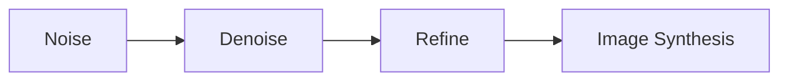
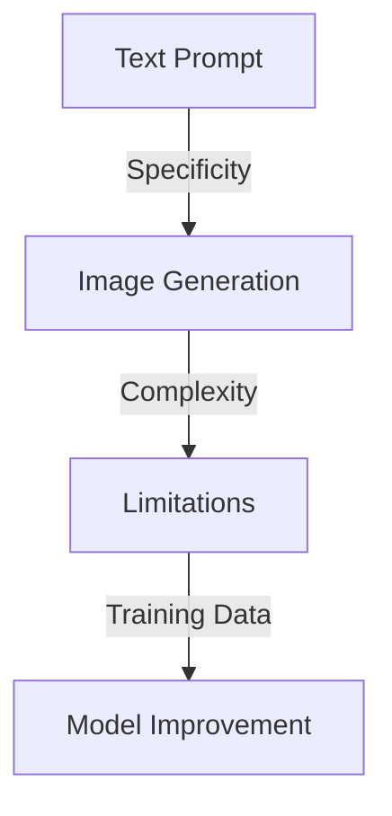
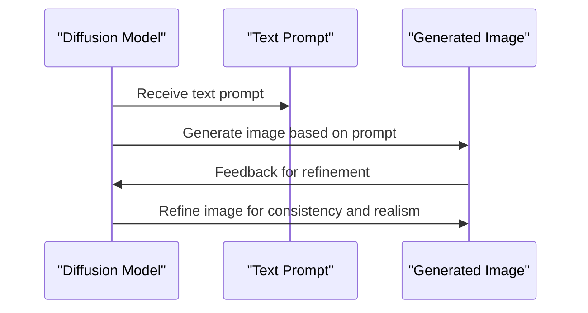

You've probably seen the impressive results of AI-generated images that seem almost indistinguishable from real photographs. But have you ever wondered how these models actually work? Imagine you're given a blank canvas and a prompt, like 'a sunny day at the beach.' You'd start with a rough outline, gradually adding more details until you have a complete picture. AI image generation works in a similar way, but instead of a canvas, it starts with noise.

You're about to explore how AI models, specifically diffusion models, can take a text prompt and turn it into a realistic image. This process involves repeatedly refining the image, guided by the text, until it produces a result that matches what you described. The key to understanding how AI image generation works lies in comprehending the concept of diffusion and how these models are trained to denoise images towards a specific goal.

## Quick summary
| Term | Description |
| --- | --- |
| Diffusion Model | A type of AI model that generates images by iteratively refining noise |
| Text Prompt | The input text that guides the image generation process |
| Denoising | The process of removing noise from an image to reveal a clearer picture |
| Training Data | The large dataset of images and text prompts used to teach the model |
| Image Synthesis | The final output of the diffusion model, a generated image based on the text prompt |

To further illustrate this concept, consider a second analogy. Think of the diffusion model as a sculptor, starting with a block of marble (the noise) and gradually chiseling away to reveal a statue (the final image). The text prompt serves as the blueprint or design that guides the sculptor's work, ensuring the final product matches the intended outcome. Just as the sculptor must carefully refine the marble, the diffusion model iteratively refines the noise to produce a realistic image.

## Introduction to Diffusion Models
Diffusion models are a class of AI models designed for image synthesis. They work by starting with a random noise signal and then iteratively refining it until it becomes a realistic image that matches a given text prompt. This process can be thought of as a series of steps where the model learns to denoise the image, gradually making it clearer and more detailed. The model is trained on a vast dataset of images, each paired with a text description. This training teaches the model what features are important for generating images that match given prompts.

A deeper edge case to consider in the introduction of diffusion models is the concept of mode collapse. Mode collapse occurs when the model generates limited variations of the same output, failing to capture the full range of possibilities implied by the text prompt. This can happen if the training data lacks diversity or if the model is not complex enough to handle the nuances of the prompt. Understanding and addressing mode collapse is crucial for improving the versatility and realism of diffusion models.

## Training Diffusion Models
Training a diffusion model involves showing it a large number of images along with their corresponding text descriptions. The model learns to associate certain features in the text prompts with specific elements in the images. For example, if the prompt is 'a cat on a couch,' the model will learn to recognize what a cat and a couch look like and how they can be arranged in an image. This training process is crucial because it teaches the model how to transform noise into a coherent image that matches the prompt.

Here is a step-by-step procedure for training a diffusion model:
1. **Data Collection**: Gather a large dataset of images and their corresponding text descriptions.
2. **Model Initialization**: Initialize the diffusion model with random weights.
3. **Training Loop**: Iterate through the dataset, using each image and text prompt to update the model's weights.
4. **Evaluation**: Periodically evaluate the model's performance on a validation set to monitor its progress and adjust the training parameters as needed.
5. **Refinement**: Continue training until the model achieves the desired level of performance, at which point it can be used for image generation.

A comparison of different training strategies for diffusion models can be seen in the following table:
| Training Strategy | Description | Advantages |
| --- | --- | --- |
| Supervised Learning | The model is trained on labeled data | Fast convergence, high accuracy |
| Unsupervised Learning | The model is trained on unlabeled data | Ability to learn from large datasets without labels |
| Semi-Supervised Learning | The model is trained on a combination of labeled and unlabeled data | Balances the benefits of supervised and unsupervised learning |

## The Role of Text Prompts
Text prompts play a vital role in guiding the image generation process. They provide the model with the necessary information to decide what the final image should look like. A well-crafted prompt can result in a more accurate and detailed image. For instance, a prompt like 'a futuristic cityscape at sunset with flying cars' gives the model a clear idea of what elements to include and how to arrange them. The specificity of the prompt directly influences the quality and relevance of the generated image.

To further emphasize the importance of text prompts, consider a second worked example. Imagine you want to generate an image of a historical figure, say Albert Einstein, in a modern setting. A prompt like 'Albert Einstein sitting in a coffee shop, wearing modern clothes and holding a smartphone' would guide the model to include specific details such as Einstein's distinctive hair and mustache, the style of modern clothes, and the presence of a smartphone. The model would then generate an image that combines these elements in a coherent and realistic way.

## Limitations of Diffusion Models
While diffusion models have made significant strides in AI image generation, they are not without limitations. One of the challenges these models face is generating images of hands or text. The complexity and variability of human hands, along with the detail required for readable text, can be difficult for the model to accurately reproduce. Additionally, maintaining consistency across the image, especially in complex scenes, can be a challenge. These limitations highlight areas where diffusion models can be improved, such as through more detailed training data or refinements in the denoising process.

A common misconception about diffusion models is that they can only generate images based on the exact text prompts they were trained on. However, with the right training data and fine-tuning, diffusion models can be adapted to generate images based on a wide range of prompts, including those that are similar but not identical to the training data. This versatility is one of the key strengths of diffusion models and makes them highly useful for a variety of applications.

## Consistency and Realism
Achieving consistency and realism in generated images is a key goal of diffusion models. The model's ability to consistently produce high-quality images that match the text prompt is a measure of its success. Realism is not just about the detail in the image but also about how well the different elements of the scene interact and make sense together. For example, in an image of a room, the furniture should be appropriately sized and placed, and the lighting should be consistent with the time of day mentioned in the prompt.

To achieve high levels of consistency and realism, the model must be able to capture the nuances of the text prompt and translate them into visual elements. This involves not just recognizing objects and their arrangements but also understanding the context and relationships between different parts of the scene. For instance, in generating an image of a beach scene, the model must understand the relationship between the sun, the sea, and the sand, and how these elements interact to create a cohesive and realistic image.

## Key Takeaways
* Diffusion models generate images by iteratively denoising a noise signal guided by a text prompt.
* The specificity and quality of the text prompt directly influence the generated image.
* Training data plays a crucial role in teaching the model to associate text features with image elements.
* Limitations include difficulty with generating images of hands, text, and maintaining consistency across complex scenes.
* Achieving realism and consistency in generated images is a key challenge and goal for diffusion models.
