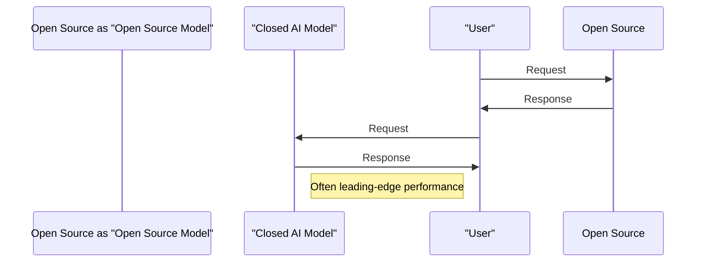
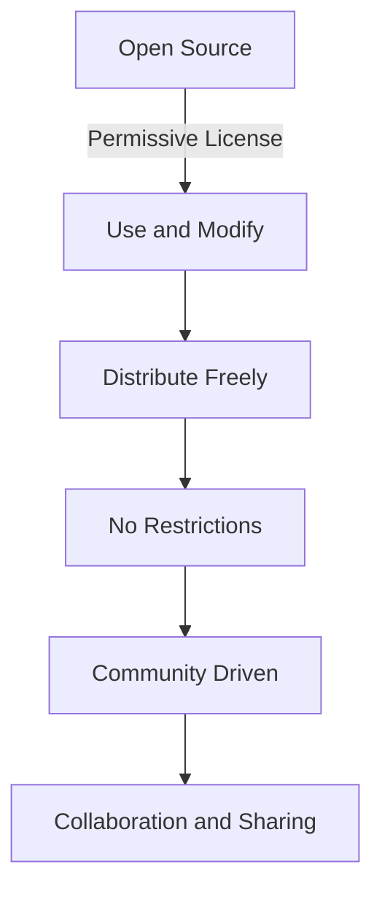

You're considering using AI models for your next project, but you're not sure whether to choose open source or closed AI models. This decision can be crucial, as it affects not only the cost but also the control you have over your project. As you weigh your options, you'll want to consider the trade-offs between open source and closed AI models.

As you delve into the world of AI, you'll come across terms like 'open weights' and 'truly open' models. **Open weights** refer to AI models where the weights or parameters are openly available, but the underlying code or architecture might not be. On the other hand, **truly open** models are completely open source, allowing you to modify and distribute them freely. Understanding these differences is key to making an informed decision.

## Quick summary
| Category | Open Source AI Models | Closed AI Models |
| --- | --- | --- |
| Control | High | Low |
| Cost | Low | High |
| Privacy | High | Low |
| Capability | Variable | Often leading-edge |
| Support | Community-driven | Official support |
| Licensing | Permissive | Restrictive |

## Control and Customization
One of the primary advantages of open source AI models is the level of control they offer. With **open source models**, you have the freedom to modify the code, add new features, and customize them to suit your specific needs. This is particularly important for projects that require a high degree of customization or have unique requirements. In contrast, **closed AI models** are often rigid and inflexible, limiting your ability to make changes or adapt them to your needs.

For example, consider a scenario where you're building a chatbot for a customer service platform. With an open source model, you can modify the code to integrate it with your existing CRM system, allowing for seamless customer data integration. On the other hand, a closed AI model might not offer this level of customization, forcing you to work within the limitations of the model.

Here's a step-by-step procedure to customize an open source AI model:

1. **Fork the repository**: Create a copy of the open source model's repository to begin making modifications.
2. **Review the code**: Study the codebase to understand how the model works and identify areas for customization.
3. **Modify the code**: Make changes to the code to add new features or modify existing ones.
4. **Test and validate**: Test the modified model to ensure it works as expected and validate its performance.
5. **Deploy the model**: Deploy the customized model in your production environment.

To further illustrate the customization process, consider the following analogy: customizing an open source AI model is similar to renovating a house. You have the freedom to design and build the house according to your specific needs and preferences, whereas a closed AI model is like buying a pre-built house where you're limited to the existing design and layout.

Another important aspect to consider is the potential for **edge cases**. When customizing an open source AI model, you may encounter edge cases that are not accounted for in the original code. For instance, you might need to handle unusual input data or adapt the model to work with a specific hardware configuration. In such cases, the open source community can be a valuable resource, providing guidance and support to help you overcome these challenges.

## Cost Considerations
The cost of AI models is another critical factor to consider. **Open source models** are often free or low-cost, making them an attractive option for projects with limited budgets. However, **closed AI models** can be expensive, with costs ranging from thousands to millions of dollars, depending on the complexity and capabilities of the model.

To illustrate the cost difference, consider the following comparison table:

| Model Type | Cost |
| --- | --- |
| Open Source | Free/Low-cost |
| Closed AI | Thousands to Millions of Dollars |

In addition to the initial cost, you should also consider the total cost of ownership, including maintenance, updates, and support. Open source models often have a lower total cost of ownership, as the community-driven support and permissive licensing reduce the need for expensive official support channels.

A deeper edge case to consider is the **cost of expertise**. While open source models can be cost-effective, they often require a high level of expertise to customize and maintain. If you don't have the necessary expertise in-house, you may need to hire external consultants or invest in training your team, which can add to the overall cost.

To mitigate this risk, you can consider the following step-by-step procedure:

1. **Assess your team's expertise**: Evaluate your team's skills and experience with AI models and open source software.
2. **Identify knowledge gaps**: Determine the areas where your team needs additional training or support.
3. **Develop a training plan**: Create a plan to address the knowledge gaps and provide the necessary training and resources.
4. **Budget for external expertise**: Allocate a budget for external consultants or experts who can provide guidance and support when needed.
5. **Monitor and adjust**: Continuously monitor your team's progress and adjust the training plan as needed.

## Privacy and Security
When it comes to privacy and security, **open source models** generally have an advantage. Since the code is openly available, you can review and audit it to ensure that it meets your security standards. In contrast, **closed AI models** can be a black box, making it difficult to understand how they process and store your data.

A common misconception is that open source models are inherently less secure due to their open nature. However, this is not necessarily true. With open source models, you have the ability to review and audit the code, which can actually increase security. On the other hand, closed AI models can be vulnerable to security risks due to their proprietary nature, making it difficult to identify and address potential vulnerabilities.

To further illustrate the importance of security, consider the following analogy: using a closed AI model is like putting your data in a safe, but you don't have the combination. With an open source model, you have the combination, and you can ensure that the safe is secure and meets your standards.

A deeper edge case to consider is the **security of dependencies**. When using open source models, you need to ensure that the dependencies and libraries used in the model are secure and up-to-date. This can be a challenging task, especially if you're not familiar with the dependencies or don't have the necessary expertise.

## Capability and Performance
While **open source models** have made significant strides in recent years, **closed AI models** often lead the way in terms of raw capability and performance. This is because closed models are often developed by large corporations with significant resources and expertise. However, **open source models** can still offer impressive performance, especially when combined with other open source tools and frameworks.

For instance, consider a scenario where you're building a computer vision model for object detection. A closed AI model might offer superior performance due to its proprietary architecture and large-scale training data. On the other hand, an open source model might offer comparable performance when combined with other open source tools, such as TensorFlow or PyTorch, and large-scale open datasets.

To further illustrate the performance difference, consider the following comparison table:

| Model Type | Performance |
| --- | --- |
| Open Source | Variable, but often competitive |
| Closed AI | Often leading-edge |

Another important aspect to consider is the **performance of open source models over time**. As open source models are constantly evolving, their performance can improve significantly over time. This is because the open source community is continually contributing to the model, fixing bugs, and adding new features.

## Support and Community
The level of support and community involvement is another important consideration. **Open source models** often have large and active communities, which can provide valuable support and resources. In contrast, **closed AI models** typically rely on official support channels, which can be limited and expensive.

Here's a comparison of the support options for open source and closed AI models:

| Support Option | Open Source | Closed AI |
| --- | --- | --- |
| Community Support | Large and Active | Limited |
| Official Support | Community-driven | Official Channels |
| Cost | Free/Low-cost | Expensive |

A deeper edge case to consider is the **support for niche use cases**. While open source models have large communities, they may not always provide support for niche use cases or specialized applications. In such cases, closed AI models might be a better option, as they often have dedicated support channels for specific industries or use cases.

To mitigate this risk, you can consider the following step-by-step procedure:

1. **Research the community**: Investigate the open source community and its level of activity and support.
2. **Identify niche use cases**: Determine if your use case is niche or specialized.
3. **Evaluate closed AI models**: Assess closed AI models and their support options for your specific use case.
4. **Compare costs**: Compare the costs of open source and closed AI models, including support and maintenance costs.
5. **Make an informed decision**: Choose the model that best fits your needs and budget.

## Licensing and Restrictions
Finally, it's essential to consider the licensing and restrictions associated with each type of model. **Open source models** are often released under permissive licenses, allowing you to use and modify them freely. In contrast, **closed AI models** are typically released under restrictive licenses, limiting your ability to use and distribute them.

For example, consider a scenario where you're building a commercial product that utilizes an AI model. With an open source model, you can use and modify the model freely, without worrying about licensing restrictions. On the other hand, a closed AI model might require you to obtain a license, which can be expensive and restrictive.

A deeper edge case to consider is the **licensing of dependencies**. When using open source models, you need to ensure that the dependencies and libraries used in the model are licensed correctly and do not impose any restrictions on your use case.

## Key takeaways
* Open source AI models offer high control and customization, but may lack in terms of raw capability.
* Closed AI models often lead in terms of capability and performance, but can be expensive and restrictive.
* Open source models are generally more private and secure, while closed models can be a black box.
* The cost of open source models is often lower, while closed models can be expensive.
* Open source models have community-driven support, while closed models rely on official support channels.
* Licensing and restrictions vary between open source and closed AI models, with open source models typically being more permissive.
