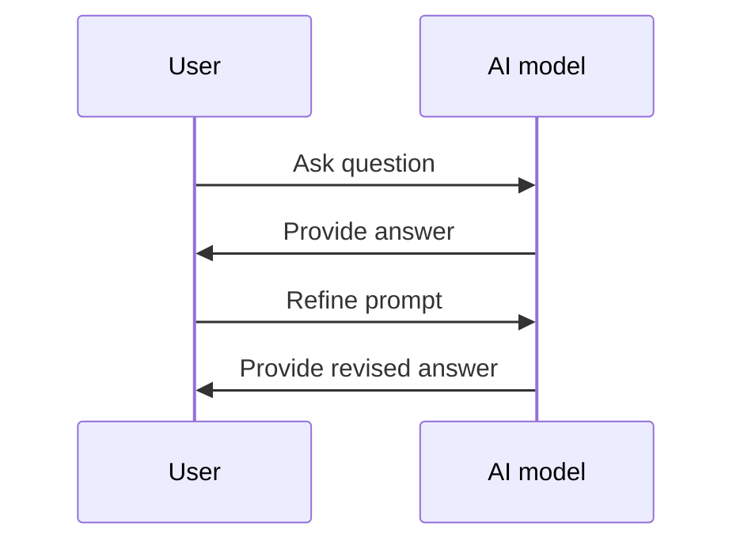

You're about to ask an AI model a question, but have you thought about how you're going to ask it? The way you phrase your question can greatly affect the quality of the answer you get. This is where prompt engineering comes in - the art of crafting effective prompts to get the best possible answers from AI models.

Imagine you're a journalist trying to get information from a source. You wouldn't just walk up to them and say 'tell me everything', would you? You'd ask specific, well-researched questions to get the information you need. It's the same with AI models. By using the right techniques, you can get more accurate and relevant answers.

## Quick summary
| Term | Description |
| --- | --- |
| Prompt Engineering | The process of crafting effective prompts to get better answers from AI models |
| Few-shot Learning | A technique where the AI model is given a few examples to learn from before answering a question |
| Zero-shot Learning | A technique where the AI model is given no examples to learn from before answering a question |
| Prompt Format | The structure and wording of a prompt |
| Context | The background information or situation that the prompt is related to |
| Iteration | The process of refining a prompt to get better answers |

## What is Prompt Engineering?
Prompt engineering is the process of designing and optimizing prompts to get the best possible answers from AI models. It involves understanding how the AI model works, what type of questions it can answer, and how to phrase the question to get the most accurate and relevant answer. A good prompt should be clear, concise, and well-defined.

To illustrate this, let's consider a scenario where you're trying to get information about a new product. A weak prompt might be 'What's the new iPhone like?' whereas a strong prompt would be 'I'm looking for a new smartphone and I've heard that the new iPhone has some exciting features. Can you tell me about the camera, battery life, and storage options?'

Here's a step-by-step procedure for designing effective prompts:
1. **Define the task**: Clearly define what you want the AI model to do.
2. **Gather context**: Gather any relevant background information or context that is related to the question.
3. **Choose the right format**: Choose the right format for the prompt, such as a question, statement, or command.
4. **Refine the prompt**: Refine the prompt based on the AI model's response, by iterating and refining the prompt to get better answers.

## Crafting Effective Prompts
To craft an effective prompt, you need to consider the context, the format, and the iteration. Let's take a look at a weak and strong prompt side by side:

Weak Prompt: 'What is the best way to learn a new language?'
Strong Prompt: 'I'm a beginner looking to learn Spanish. What are the top 3 language learning methods that have been proven to be effective for beginners, and what are the pros and cons of each method?'

As you can see, the strong prompt is more specific, well-defined, and provides more context. It also asks for a specific type of answer (top 3 methods) and provides criteria for evaluation (pros and cons).

Here's a comparison table to illustrate the differences between weak and strong prompts:
| Feature | Weak Prompt | Strong Prompt |
| --- | --- | --- |
| Specificity | Low | High |
| Context | Low | High |
| Format | Open-ended | Specific |
| Evaluation criteria | None | Pros and cons |

## Few-shot Learning
Few-shot learning is a technique where the AI model is given a few examples to learn from before answering a question. This can be useful when you want to teach the AI model about a specific topic or domain. For example, if you want to ask the AI model about the benefits of meditation, you could provide a few examples of studies that have shown the benefits of meditation, and then ask the AI model to summarize the findings.

Here's another example of few-shot learning in action. Let's say you want to ask the AI model to generate a poem about a specific topic. You could provide a few examples of poems that are similar in style and theme, and then ask the AI model to generate a new poem based on those examples.

## Zero-shot Learning
Zero-shot learning is a technique where the AI model is given no examples to learn from before answering a question. This can be useful when you want to test the AI model's ability to reason and generate answers based on its prior knowledge. For example, if you want to ask the AI model about the potential risks of climate change, you could ask a question like 'What are the potential risks of climate change, and how can we mitigate them?'

Here's a deeper edge case to consider: what if the AI model is asked a question that is outside of its domain of knowledge? In this case, the AI model may struggle to provide an accurate answer, or may provide an answer that is not relevant to the question. To mitigate this, it's essential to provide context and to use specific language when asking the question.

## 7 Techniques for Better AI Answers
Here are 7 techniques for crafting effective prompts to get better answers from AI models:

1. **Define the task**: Clearly define what you want the AI model to do. For example, 'Summarize the main points of this article' or 'Generate a list of potential solutions to this problem'.
2. **Provide context**: Provide background information or context that is relevant to the question. For example, 'I'm a beginner looking to learn Spanish' or 'The company is looking to expand into a new market'.
3. **Use specific language**: Use specific and technical language to get more accurate and relevant answers. For example, 'What are the benefits of using a relational database management system?' instead of 'What are the benefits of using a database?'
4. **Ask for examples**: Ask the AI model to provide examples or illustrations to support its answer. For example, 'What are some examples of successful marketing campaigns that have used social media?' or 'Can you provide an example of a well-structured sentence?'
5. **Constrain the format**: Constrain the format of the answer to get more specific and relevant answers. For example, 'Please provide a list of 5 potential solutions' or 'Please summarize the main points in 2 paragraphs'.
6. **Iterate and refine**: Iterate and refine the prompt to get better answers. For example, 'What are the benefits of using a cloud-based storage system?' could be refined to 'What are the benefits of using a cloud-based storage system for a small business?'
7. **Use few-shot learning**: Use few-shot learning to teach the AI model about a specific topic or domain. For example, 'Here are 3 examples of successful e-commerce websites. What are the common features of these websites, and how can we apply them to our own website?'

Here's a step-by-step procedure for using these techniques:
1. **Start with a clear goal**: Start with a clear goal in mind, such as getting a specific type of answer or solving a particular problem.
2. **Choose the right technique**: Choose the right technique based on the goal, such as using few-shot learning or constraining the format.
3. **Refine the prompt**: Refine the prompt based on the AI model's response, by iterating and refining the prompt to get better answers.
4. **Evaluate the answer**: Evaluate the answer based on the criteria, such as accuracy, relevance, and completeness.

## Key Takeaways
* Prompt engineering is the process of crafting effective prompts to get better answers from AI models
* A good prompt should be clear, concise, and well-defined
* Few-shot learning and zero-shot learning are two techniques for teaching AI models about specific topics or domains
* Providing context, using specific language, and constraining the format can help get more accurate and relevant answers
* Iterating and refining the prompt can help get better answers
* Using few-shot learning can help teach the AI model about a specific topic or domain
