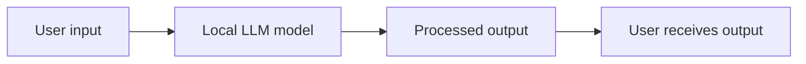
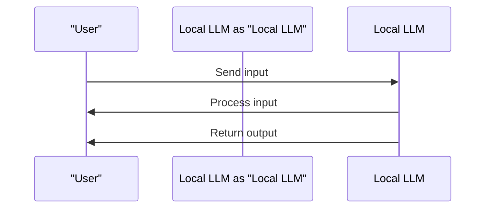
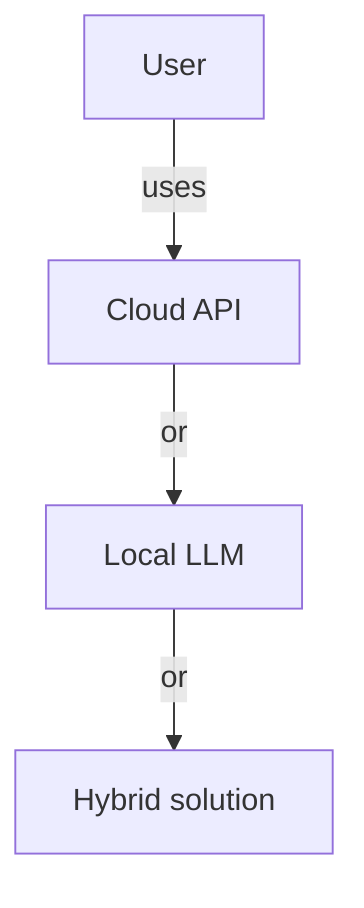

You're considering using artificial intelligence (AI) models, but you're not sure if you should run them on your own machine or use a cloud-based service. Running a model on your own machine is known as a local LLM (Large Language Model). But what does that really mean, and is it right for you? 
Imagine having an AI assistant that can help you with tasks like writing, research, or even just answering questions, all without needing to send your data to a remote server. This is what a local LLM can offer.

## Quick summary
| Term | Description |
| --- | --- |
| Local LLM | A Large Language Model run on your own machine |
| Cloud API | A cloud-based service that provides access to AI models |
| Privacy | The ability to keep your data secure and private |
| Offline access | The ability to use AI models without an internet connection |
| Hardware requirements | The computer hardware needed to run a local LLM |
| Quality trade-offs | The potential decrease in model quality due to hardware limitations |

## What are Local LLMs?
A local LLM is an AI model that is run on your own machine, rather than on a remote server. This means that you have full control over the model and your data, and you don't need to worry about sending sensitive information over the internet. 
To run a local LLM, you'll need a computer with sufficient hardware, including a strong graphics card, a multi-core processor, and plenty of memory. The exact requirements will depend on the size and complexity of the model you want to run.
For example, if you want to run a simple language model, you might be able to get away with a lower-end graphics card and a dual-core processor. However, if you want to run a more complex model, such as a transformer-based model, you'll need a more powerful graphics card and a multi-core processor.
Here's a step-by-step procedure to determine the hardware requirements for your local LLM:
1. **Determine the model size**: Decide on the size of the model you want to run, including the number of parameters and layers.
2. **Choose a framework**: Select a deep learning framework that supports local LLMs, such as TensorFlow or PyTorch.
3. **Check the hardware requirements**: Check the hardware requirements for the framework and model you've chosen, including the recommended graphics card, processor, and memory.
4. **Compare hardware options**: Compare the hardware options available to you, including desktops, laptops, and cloud-based services.
5. **Test and refine**: Test your local LLM on your chosen hardware and refine the setup as needed.

## Benefits of Local LLMs
There are several benefits to running a local LLM. One of the most significant advantages is privacy. When you use a cloud-based API, you need to send your data to the server, where it may be stored or used for other purposes. With a local LLM, your data never leaves your machine, so you can be sure that it's secure. 
Another benefit is cost. While you may need to invest in hardware to run a local LLM, you won't need to pay for ongoing API fees or worry about costs increasing as you use more resources. 
Finally, local LLMs can provide offline access, which can be useful if you need to use AI models in areas with limited or no internet connectivity.
Consider the following comparison table to see the benefits of local LLMs:
| Benefit | Local LLM | Cloud API |
| --- | --- | --- |
| Privacy | High | Low |
| Cost | One-time hardware cost | Ongoing API fees |
| Offline access | Yes | No |
For instance, if you're a researcher working with sensitive data, a local LLM can provide a secure and private environment for experimentation and testing. Alternatively, if you're an individual with a specific use case, such as writing or research, a local LLM can provide a cost-effective and private solution.

## Hardware and Quality Trade-offs
While local LLMs offer many benefits, there are also some trade-offs to consider. One of the main limitations is hardware requirements. Running a large AI model can require significant computational resources, including a strong graphics card, a multi-core processor, and plenty of memory. 
If your hardware is not sufficient, you may need to use a smaller or less complex model, which can affect the quality of the output. Here are some key considerations:
1. **Graphics card**: A strong graphics card is essential for running large AI models. Look for a card with plenty of VRAM and a high number of CUDA cores.
2. **Processor**: A multi-core processor can help speed up model training and inference. Look for a processor with at least 4-6 cores.
3. **Memory**: You'll need plenty of memory to store the model and your data. Look for a system with at least 16-32 GB of RAM.
Additionally, consider the following edge case: what if you need to run a local LLM on a device with limited hardware resources, such as a Raspberry Pi? In this case, you may need to use a smaller or less complex model, or consider using a cloud-based service.
To mitigate the quality trade-offs, you can try the following:
* **Model pruning**: Remove unnecessary parameters and layers from the model to reduce computational requirements.
* **Knowledge distillation**: Train a smaller model to mimic the behavior of a larger model.
* **Quantization**: Reduce the precision of the model's weights and activations to reduce memory usage.

## Who Should Use Local LLMs?
So, who should use local LLMs? Here are some scenarios where a local LLM might be the right choice:
1. **Researchers and developers**: If you're working on AI research or developing your own AI models, a local LLM can provide a secure and private environment for experimentation and testing.
2. **Enterprises with sensitive data**: If your organization works with sensitive data, a local LLM can help keep that data secure and private.
3. **Individuals with specific use cases**: If you have a specific use case that requires AI, such as writing or research, a local LLM can provide a cost-effective and private solution.
Consider the following analogy: running a local LLM is like having a personal assistant who can help you with tasks, but instead of being a human, it's a machine learning model that runs on your own machine.
Here's a step-by-step procedure to determine if a local LLM is right for you:
1. **Assess your data**: Determine if you're working with sensitive data that requires a high level of security and privacy.
2. **Evaluate your use case**: Decide if you have a specific use case that requires AI, such as writing or research.
3. **Consider your hardware**: Determine if you have the necessary hardware to run a local LLM, including a strong graphics card, a multi-core processor, and plenty of memory.
4. **Compare options**: Compare the benefits and trade-offs of local LLMs with cloud-based services.
5. **Test and refine**: Test a local LLM on your hardware and refine the setup as needed.

## Key Considerations for Using Local LLMs
Before deciding to use a local LLM, consider the following key points:
* **Hardware costs**: While you may save on API fees, you'll need to invest in hardware to run a local LLM.
* **Model quality**: Depending on your hardware, you may need to use a smaller or less complex model, which can affect the quality of the output.
* **Maintenance and updates**: You'll be responsible for maintaining and updating your local LLM, which can require technical expertise.
Additionally, consider the following caveat: local LLMs may not be suitable for all use cases, such as applications that require real-time processing or large-scale data processing.
To mitigate these considerations, you can try the following:
* **Start small**: Begin with a small-scale local LLM setup and gradually scale up as needed.
* **Monitor performance**: Regularly monitor the performance of your local LLM and adjust the setup as needed.
* **Seek support**: Seek support from technical experts or online communities if you encounter issues with your local LLM.

## Alternatives to Local LLMs
If you're not sure about running a local LLM, there are alternative options to consider:
1. **Cloud APIs**: Cloud-based APIs can provide easy access to AI models, but may require sending data to a remote server.
2. **Hybrid solutions**: Some solutions offer a combination of local and cloud-based AI, which can provide a balance between privacy and convenience.
Consider the following comparison table to see the alternatives to local LLMs:
| Alternative | Description | Benefits | Drawbacks |
| --- | --- | --- | --- |
| Cloud API | Cloud-based API | Easy access to AI models | May require sending data to a remote server |
| Hybrid solution | Combination of local and cloud-based AI | Balance between privacy and convenience | May require complex setup |
For instance, if you're an individual with a specific use case, such as writing or research, a cloud API may be a suitable alternative to a local LLM. Alternatively, if you're an enterprise with sensitive data, a hybrid solution may provide a balance between privacy and convenience.

## Key Takeaways
* Local LLMs offer privacy, cost, and offline benefits, but require significant hardware resources.
* The quality of the output may be affected by hardware limitations.
* Local LLMs are suitable for researchers, enterprises with sensitive data, and individuals with specific use cases.
* Consider hardware costs, model quality, and maintenance requirements before deciding to use a local LLM.
* Alternative options, such as cloud APIs and hybrid solutions, are available for those who don't need or can't run a local LLM.
