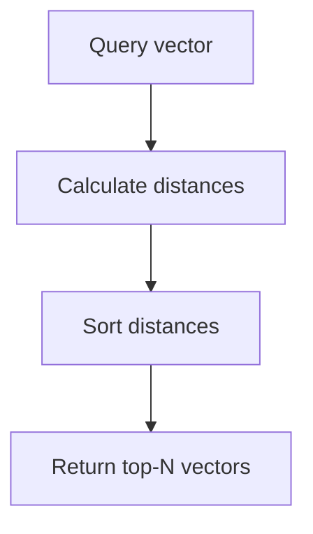
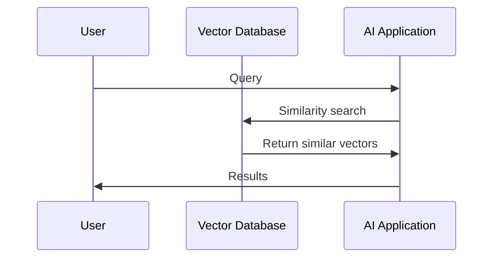

You're likely familiar with how regular databases work: they store and manage data in a structured format, making it easy to retrieve specific information using queries. However, when it comes to artificial intelligence (AI) applications, traditional databases often fall short. This is where vector databases come into play. 

Imagine you're building an AI-powered search engine that can find similar images or texts based on their meaning, not just exact keyword matches. Traditional databases aren't designed to handle such complex, similarity-based searches efficiently. That's because they store data as discrete, numerical values, whereas AI models represent data as vectors – high-dimensional numerical representations that capture nuanced relationships between data points.

## Quick summary
| Concept | Description |
| --- | --- |
| Vector Database | Stores data as high-dimensional vectors |
| Embeddings | Vector representations of data, capturing semantic meaning |
| Similarity Search | Finding data points with similar vector representations |
| Nearest-Neighbour Search | Algorithm for finding the most similar data points |
| AI Applications | Utilize vector databases for search, recommendations, and more |

One way to think about vector databases is to consider a library with an infinite number of books. Each book represents a piece of data, and the library is organized in a way that allows you to find similar books based on their content, not just their titles. This is similar to how vector databases work, where each piece of data is represented as a vector, and the database is designed to find similar vectors based on their semantic meaning.

To further illustrate this concept, consider a second analogy. Imagine you're trying to find a specific song in a vast music library. Traditional databases would require you to search by exact song title or artist, whereas a vector database would allow you to search by the song's acoustic features, such as its melody or rhythm. This enables you to find similar songs, even if they're by different artists or have different titles.

## What is a Vector Database?
A vector database is a type of database that stores data as vectors, also known as embeddings. These vectors are high-dimensional numerical representations of data, such as images, texts, or audio clips. By storing data in this format, vector databases enable efficient similarity searches, which are crucial for many AI applications. 

For example, consider a vector database that stores image embeddings. Each image is represented as a vector, which captures the image's semantic meaning, such as its objects, colors, and textures. When you query the database with a new image, it can find similar images based on their vector representations, allowing for efficient image retrieval and recommendation.

To further illustrate this concept, let's consider a step-by-step procedure for building a vector database:

1. **Data collection**: Gather a large dataset of images, texts, or audio clips.
2. **Embedding model training**: Train an embedding model to convert each piece of data into a vector representation.
3. **Vector database creation**: Create a vector database and store the vector representations of the data.
4. **Query processing**: Process queries by converting the query into a vector representation and searching the database for similar vectors.
5. **Result retrieval**: Retrieve the results from the database and return them to the user.

Additionally, consider a deeper edge case. Suppose we have a vector database that stores text embeddings, and we want to find similar texts based on their semantic meaning. However, the texts are from different languages, such as English and Spanish. In this case, we need to use a technique called cross-lingual embedding to adjust the vector representations of the texts to account for the differences between the languages.

## Why Normal Databases Can't Do Similarity Search Well
Traditional databases are designed for exact-match queries, not similarity searches. When you query a traditional database, it looks for exact matches based on the query parameters. In contrast, similarity searches require finding data points with similar vector representations. This is a much more complex task, as it involves calculating distances between high-dimensional vectors. 

One common misconception about traditional databases is that they can be modified to perform similarity searches by adding additional indexes or query optimization techniques. However, this approach is often inefficient and can lead to poor performance, especially for large datasets. Vector databases, on the other hand, are specifically designed for similarity searches and can handle large datasets with high-dimensional vectors.

To illustrate the difference between traditional databases and vector databases, consider the following comparison table:

| Database Type | Query Type | Performance |
| --- | --- | --- |
| Traditional Database | Exact-match query | High performance |
| Traditional Database | Similarity search | Low performance |
| Vector Database | Exact-match query | Medium performance |
| Vector Database | Similarity search | High performance |

Furthermore, consider a second worked example. Suppose we have a traditional database that stores user information, such as names and addresses. We want to find users who are similar to a given user based on their demographic information. While we could use a traditional database to perform this query, it would require complex query optimization techniques and would likely result in poor performance. In contrast, a vector database would allow us to store user embeddings and perform efficient similarity searches to find similar users.

## How Nearest-Neighbour Search Works
Nearest-neighbour search is a fundamental algorithm used in vector databases to find the most similar data points. The basic idea is to calculate the distance between the query vector and all the vectors in the database, and then return the top-N most similar vectors. This is typically done using metrics such as Euclidean distance, cosine similarity, or Manhattan distance.

For example, consider a vector database that stores text embeddings. When you query the database with a new text, it calculates the cosine similarity between the query vector and all the vectors in the database. The top-N most similar vectors are then returned, allowing for efficient text retrieval and recommendation.

To further illustrate this concept, let's consider a deeper edge case. Suppose we have a vector database that stores image embeddings, and we want to find similar images based on their semantic meaning. However, the images are from different domains, such as images of dogs and images of cats. In this case, we need to use a technique called domain adaptation to adjust the vector representations of the images to account for the differences between the domains.

Additionally, consider a step-by-step procedure for implementing nearest-neighbour search in a vector database:

1. **Query vector creation**: Create a vector representation of the query data.
2. **Distance calculation**: Calculate the distance between the query vector and all the vectors in the database.
3. **Distance sorting**: Sort the distances in ascending order.
4. **Top-N selection**: Select the top-N most similar vectors based on the sorted distances.
5. **Result retrieval**: Retrieve the results from the database and return them to the user.

## Typical Use Cases for Vector Databases
Vector databases have a wide range of applications, including:

1. **Search engines**: Vector databases can be used to build search engines that can find similar images, texts, or audio clips based on their meaning.
2. **Recommendation systems**: By storing user preferences and item embeddings in a vector database, recommendation systems can efficiently find similar items to recommend.
3. **Retrieval-Augmented Generation (RAG)**: Vector databases are used in RAG models to store and retrieve relevant information from a large corpus of text.
4. **Image and video analysis**: Vector databases can be used to store and search image and video embeddings, enabling applications such as image classification, object detection, and video analysis.

Another example of a use case for vector databases is in natural language processing (NLP). Vector databases can be used to store and search text embeddings, enabling applications such as text classification, sentiment analysis, and language translation.

To further illustrate this concept, let's consider a step-by-step procedure for building a recommendation system using a vector database:

1. **User data collection**: Gather user data, such as ratings or click history.
2. **Item embedding creation**: Create item embeddings by converting each item into a vector representation.
3. **User embedding creation**: Create user embeddings by converting each user's data into a vector representation.
4. **Vector database creation**: Create a vector database and store the user and item embeddings.
5. **Query processing**: Process queries by converting the query into a vector representation and searching the database for similar vectors.
6. **Result retrieval**: Retrieve the results from the database and return them to the user.

Additionally, consider a comparison table of different vector database use cases:

| Use Case | Description | Benefits |
| --- | --- | --- |
| Search engines | Find similar images, texts, or audio clips | Improved search results, increased user engagement |
| Recommendation systems | Efficiently find similar items to recommend | Increased user satisfaction, improved sales |
| RAG models | Store and retrieve relevant information from a large corpus of text | Improved model performance, increased efficiency |
| Image and video analysis | Enable applications such as image classification, object detection, and video analysis | Improved accuracy, increased efficiency |

## Key Takeaways
* Vector databases store data as high-dimensional vectors, enabling efficient similarity searches.
* Traditional databases are not designed for similarity searches and fall short in AI applications.
* Nearest-neighbour search is a fundamental algorithm used in vector databases to find similar data points.
* Vector databases have a wide range of applications, including search engines, recommendation systems, RAG, and image and video analysis.
* By using vector databases, AI applications can efficiently search and retrieve similar data, revolutionizing the way we interact with information.
