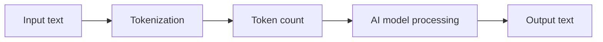
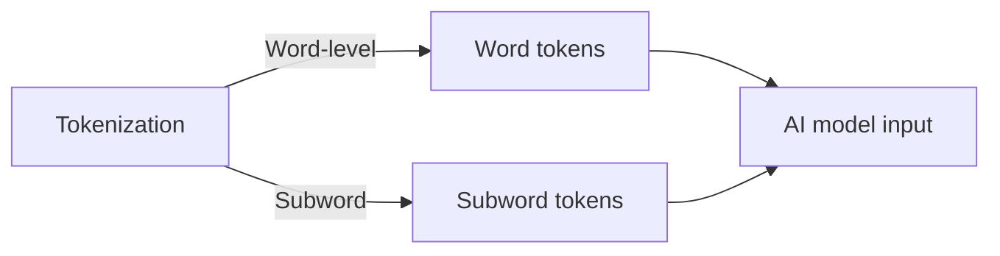

You're about to interact with an AI model, perhaps to generate text or answer a question. The model's performance and cost depend on several factors, but one crucial element is often overlooked: tokens. You might wonder, what are tokens in AI, and why do they matter? As you delve into the world of artificial intelligence, understanding tokens will help you make the most out of your AI experiences.

When you feed text into an AI model, it doesn't process the text as a whole. Instead, it breaks the text down into smaller chunks called tokens. Tokens are essentially the building blocks of text, and they can be thought of as roughly three-quarters of a word. This process of dividing text into tokens is known as tokenization. Tokenization is a fundamental step in natural language processing, as it allows AI models to analyze and understand the structure and meaning of text.

## Quick summary
| Term | Description | Importance |
| --- | --- | --- |
| Token | A chunk of text, roughly 3/4 of a word | Fundamental unit of text analysis |
| Tokenization | The process of breaking text into tokens | Enables AI models to understand text structure and meaning |
| Token limit | The maximum number of tokens an AI model can process | Affects cost, speed, and performance of AI models |
| Context limit | The maximum amount of context an AI model can consider | Impacts the accuracy and relevance of AI-generated text |
| Pricing model | The way AI services charge for their usage | Often based on the number of tokens processed |

To further illustrate the concept of tokens, consider a simple analogy. Think of tokens as individual LEGO bricks, and the text as a complex LEGO structure. Just as LEGO bricks are the building blocks of a LEGO structure, tokens are the building blocks of text. The process of tokenization is like disassembling the LEGO structure into individual bricks, allowing the AI model to analyze and understand the structure and meaning of the text.

Another way to think about tokens is to consider a sentence as a recipe. Each word or subword in the sentence is like an ingredient in the recipe. Just as a chef needs to understand the individual ingredients and their proportions to create a dish, an AI model needs to understand the individual tokens and their context to generate accurate and relevant text.

## Tokenization in depth
Tokenization is a critical step in preparing text data for AI models. It involves splitting text into individual words or subwords, which are then used as input for the model. The choice of tokenization method can significantly impact the performance of the AI model. There are two primary tokenization methods: word-level tokenization and subword tokenization. Word-level tokenization splits text into individual words, while subword tokenization breaks words down into smaller subwords, such as word stems or character sequences.

For example, let's consider the word 'unbreakable'. Using word-level tokenization, this word would be treated as a single token. However, using subword tokenization, the word 'unbreakable' might be broken down into subwords like 'un', 'break', and 'able'. This allows the AI model to capture more nuanced information about the word's meaning and context.

Here is a step-by-step procedure for tokenizing text using subword tokenization:
1. Split the text into individual words.
2. Identify the word stems or character sequences within each word.
3. Break down each word into subwords based on the identified stems or sequences.
4. Use the resulting subwords as input for the AI model.

Additionally, you can consider using a hybrid approach that combines both word-level and subword tokenization. This approach can help capture the benefits of both methods and improve the overall performance of the AI model.

## Estimating tokens for a document
To estimate the number of tokens in a document, you can use a simple formula. Assume that each word contains approximately 1.3 tokens, which is a rough estimate based on the average length of words in the English language. For example, let's say you have a document containing 1000 words. To estimate the number of tokens, you can multiply the number of words by 1.3:
1000 words * 1.3 tokens/word = 1300 tokens
Keep in mind that this is a rough estimate, and the actual number of tokens may vary depending on the specific tokenization method used.

To illustrate this concept further, let's consider a comparison table:
| Tokenization Method | Estimated Tokens per Word |
| --- | --- |
| Word-level tokenization | 1 token/word |
| Subword tokenization | 1.3 tokens/word |
| Character-level tokenization | 5-10 tokens/word |
As you can see, the choice of tokenization method can significantly impact the estimated number of tokens in a document.

You can also consider using a more advanced estimation method, such as a machine learning model trained on a large dataset of text. This approach can provide more accurate estimates of token counts and help you better plan your AI workflows.

## Token limits and pricing models
Most AI services charge based on the number of tokens processed. This means that the more tokens your document contains, the more it will cost to process. Token limits can also impact the performance of AI models, as excessive token lengths can lead to decreased accuracy and increased processing times. To avoid these issues, it's essential to understand the token limits of your AI service and plan accordingly.

For instance, let's say you have a document containing 5000 words, and the AI service has a token limit of 2000 tokens. Using the estimated 1.3 tokens per word, you would expect the document to contain approximately 6500 tokens (5000 words * 1.3 tokens/word). However, since the AI service has a token limit of 2000 tokens, you would need to split the document into smaller chunks to process it within the limit.

Here is a step-by-step procedure for working within token limits:
1. Estimate the number of tokens in your document using the formula above.
2. Check the token limit of your AI service.
3. If the estimated number of tokens exceeds the limit, split the document into smaller chunks.
4. Process each chunk separately, using the AI service's pricing model to calculate the cost.

Additionally, you can consider using a pricing model that charges based on the number of characters or bytes processed, rather than tokens. This approach can provide more flexibility and help you better manage your costs.

## Context limits and their impact
Context limits refer to the maximum amount of context that an AI model can consider when generating text. Context limits are typically measured in tokens and can significantly impact the accuracy and relevance of AI-generated text. If the context limit is too low, the AI model may struggle to understand the nuances of the input text, leading to poor-quality output.

For example, let's say you have a document containing a detailed description of a complex topic, and the AI service has a context limit of 1000 tokens. If the document contains more than 1000 tokens, the AI model may not be able to capture the full context of the topic, leading to inaccurate or irrelevant output.

To mitigate this issue, you can use a technique called 'context windowing', which involves splitting the input text into smaller chunks and processing each chunk separately. This allows the AI model to focus on a smaller context window, capturing more nuanced information about the topic.

## Worked example: Token estimation for a sample document
Let's say you have a sample document containing the following text:
'The quick brown fox jumps over the lazy dog. The dog barks loudly and wakes up the neighbor.'
To estimate the number of tokens in this document, you can count the individual words and subwords. Using a subword tokenization method, the document might be broken down into the following tokens:
- The
- quick
- brown
- fox
- jumps
- over
- the
- lazy
- dog
- .
- The
- dog
- barks
- loudly
- and
- wakes
- up
- the
- neighbor
- .
This document contains approximately 19 words, which translates to around 25 tokens (using the estimate of 1.3 tokens per word). Keep in mind that this is a simplified example, and actual token counts may vary depending on the specific tokenization method used.

To further illustrate this concept, let's consider a deeper edge case. Suppose the document contains a table or a list, which can be challenging to tokenize. In this case, you may need to use a specialized tokenization method, such as table tokenization or list tokenization, to accurately capture the structure and meaning of the text.

Additionally, you can consider using a visual representation of the tokenization process, such as a graph or a diagram, to help illustrate the concept and make it more accessible to non-technical stakeholders.

## Key takeaways
* Tokens are the fundamental units of text analysis in AI, representing roughly three-quarters of a word.
* Tokenization is the process of breaking text into tokens, which is essential for AI models to understand text structure and meaning.
* Token limits and context limits can significantly impact the cost, speed, and performance of AI models.
* Estimating token counts can help you plan and optimize your AI workflows, ensuring that you stay within the token limits of your AI service.
* Understanding tokenization and token limits is crucial for making the most out of your AI experiences and achieving accurate, relevant results.
