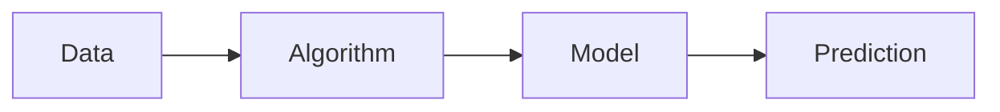
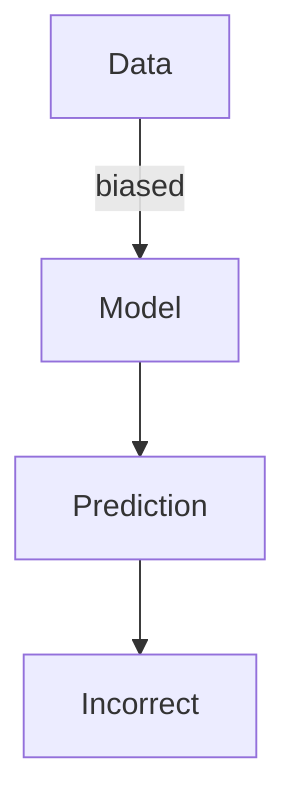

You're likely using machine learning every day without realizing it. Whether it's your email filter catching spam messages or your favorite streaming service recommending shows, machine learning is at work. But what exactly is machine learning, and how does it learn from data?

You might have heard that machine learning is a type of artificial intelligence (AI) that allows computers to learn patterns from data without being explicitly programmed. This means that instead of being given a set of rules to follow, a machine learning model is shown many examples of data and learns to recognize patterns on its own. 

## Quick summary
| Term | Description |
| --- | --- |
| Machine Learning | Learning patterns from data without explicit programming |
| Supervised Learning | Learning from labeled data to make predictions |
| Unsupervised Learning | Finding patterns in unlabeled data |
| Model | A mathematical representation of the patterns learned from data |
| Training | The process of teaching a model with data |
For instance, consider a music streaming service that wants to recommend songs to its users. The service can use machine learning to analyze the user's listening history and recommend songs that are similar in genre, tempo, and style. This is an example of supervised learning, where the model is trained on labeled data (the user's listening history) to make predictions (song recommendations). On the other hand, if the service wants to group its users into different categories based on their listening habits, it can use unsupervised learning to find patterns in the data without any prior labeling.

To illustrate this further, let's consider a second example. Suppose we want to build a machine learning model that can predict the price of a house based on its features, such as the number of bedrooms, square footage, and location. We can use supervised learning to train the model on a dataset of labeled houses, where each house is associated with its price. The model can then learn to recognize patterns in the data and make predictions about the price of new, unseen houses.

Another way to think about machine learning is to consider an analogy. Imagine you're trying to learn a new language, and you're given a set of example sentences to study. As you study the sentences, you start to recognize patterns in the language, such as the grammar and vocabulary. This is similar to how machine learning works, where the model is given a set of example data and learns to recognize patterns in it.

## How Machine Learning Works
Machine learning works by using algorithms to analyze data and learn from it. These algorithms can be thought of as a set of instructions that the computer follows to learn from the data. The goal of the algorithm is to find patterns in the data that can be used to make predictions or decisions. 

For example, a spam filter uses a machine learning algorithm to analyze the text of an email and determine whether it's likely to be spam or not. The algorithm looks for patterns in the data, such as certain words or phrases that are commonly used in spam emails, and uses those patterns to make a prediction. Here's a step-by-step procedure for how a spam filter might work:
1. **Data collection**: The spam filter collects a large dataset of emails, both spam and legitimate.
2. **Data preprocessing**: The filter preprocesses the data by removing any unnecessary information, such as punctuation and special characters.
3. **Model training**: The filter trains a machine learning model on the preprocessed data, using a supervised learning algorithm to learn the patterns that distinguish spam from legitimate emails.
4. **Model evaluation**: The filter evaluates the performance of the trained model on a separate dataset, to ensure that it's making accurate predictions.
5. **Deployment**: The filter deploys the trained model in a production environment, where it can analyze incoming emails and make predictions about whether they're spam or not.
Another example of machine learning in action is a self-driving car. The car uses a combination of sensors and machine learning algorithms to navigate through traffic, avoid obstacles, and make decisions about where to go. This is an example of reinforcement learning, where the model learns from trial and error by interacting with its environment.

To illustrate this further, let's consider a second example. Suppose we want to build a machine learning model that can predict the best route for a self-driving car to take. We can use reinforcement learning to train the model on a dataset of example routes, where each route is associated with a reward or penalty. The model can then learn to recognize patterns in the data and make predictions about the best route to take.

Here's a comparison table highlighting the different types of machine learning algorithms:
| Algorithm | Description | Example |
| --- | --- | --- |
| Supervised Learning | Learning from labeled data | Image classification |
| Unsupervised Learning | Finding patterns in unlabeled data | Customer segmentation |
| Reinforcement Learning | Learning from trial and error | Self-driving cars |

## Types of Machine Learning
There are several types of machine learning, including supervised and unsupervised learning. **Supervised learning** involves learning from labeled data, where the correct output is already known. For instance, if you're trying to teach a model to recognize pictures of dogs, you would show it many pictures of dogs and label them as such. **Unsupervised learning**, on the other hand, involves finding patterns in unlabeled data. 
Here's a comparison table highlighting the differences between supervised and unsupervised learning:
| Type | Description | Example |
| --- | --- | --- |
| Supervised Learning | Learning from labeled data | Image classification |
| Unsupervised Learning | Finding patterns in unlabeled data | Customer segmentation |
A common misconception about machine learning is that it's only useful for supervised learning tasks. However, unsupervised learning can be just as powerful, especially when dealing with large datasets where labeling would be impractical. For instance, a company might use unsupervised learning to group its customers into different segments based on their purchasing behavior, without needing to label each customer individually.

To illustrate this further, let's consider a second example. Suppose we want to build a machine learning model that can identify trends in customer purchasing behavior. We can use unsupervised learning to analyze a dataset of customer transactions and identify patterns in the data, such as clusters of customers with similar purchasing habits.

Here's a step-by-step procedure for using unsupervised learning to identify trends in customer purchasing behavior:
1. **Data collection**: Collect a dataset of customer transactions, including information about the products purchased and the date of purchase.
2. **Data preprocessing**: Preprocess the data by removing any unnecessary information and converting the data into a format that can be analyzed by the machine learning algorithm.
3. **Model training**: Train a machine learning model on the preprocessed data, using an unsupervised learning algorithm to identify patterns in the data.
4. **Model evaluation**: Evaluate the performance of the trained model by analyzing the patterns it has identified and determining whether they are meaningful and useful.
5. **Deployment**: Deploy the trained model in a production environment, where it can be used to identify trends in customer purchasing behavior and inform business decisions.

## Everyday Examples of Machine Learning
Here are 5 everyday examples of machine learning in action:
1. **Spam filters**: As mentioned earlier, spam filters use machine learning to analyze the text of an email and determine whether it's likely to be spam or not.
2. **Recommendations**: Streaming services like Netflix use machine learning to recommend shows based on your viewing history.
3. **Fraud detection**: Banks use machine learning to detect fraudulent transactions by analyzing patterns in spending data.
4. **Photo tagging**: Social media platforms use machine learning to recognize faces in photos and suggest tags.
5. **Map navigation**: GPS systems use machine learning to optimize routes and provide real-time traffic updates.
Another example of machine learning in everyday life is virtual assistants, such as Siri or Alexa. These assistants use machine learning to recognize voice commands and respond accordingly. They can also learn from user behavior and adapt to their preferences over time.

To illustrate this further, let's consider a second example. Suppose we want to build a machine learning model that can predict the best music playlist for a user based on their listening history. We can use machine learning to analyze the user's listening history and identify patterns in their music preferences, such as the genres and artists they tend to listen to.

Here's a step-by-step procedure for building a music recommendation system using machine learning:
1. **Data collection**: Collect a dataset of user listening history, including information about the songs and artists they have listened to.
2. **Data preprocessing**: Preprocess the data by removing any unnecessary information and converting the data into a format that can be analyzed by the machine learning algorithm.
3. **Model training**: Train a machine learning model on the preprocessed data, using a supervised learning algorithm to learn the patterns in the user's listening history.
4. **Model evaluation**: Evaluate the performance of the trained model by analyzing the music recommendations it generates and determining whether they are accurate and relevant.
5. **Deployment**: Deploy the trained model in a production environment, where it can be used to generate music recommendations for users.

## Limitations of Machine Learning
While machine learning is a powerful tool, it's not without its limitations. One major limitation is that machine learning models are only as good as the data they're trained on. If the data is biased or incomplete, the model will learn those biases and make incorrect predictions. 

Another limitation is that machine learning models can be complex and difficult to interpret. This can make it challenging to understand why a particular prediction was made. For instance, a machine learning model might predict that a customer is likely to churn, but it might be difficult to understand what factors contributed to that prediction. To address this limitation, researchers are working on developing more transparent and explainable machine learning models.
Here's a step-by-step procedure for addressing the limitations of machine learning:
1. **Data quality check**: Ensure that the data used to train the model is accurate, complete, and unbiased.
2. **Model selection**: Choose a machine learning algorithm that's suitable for the task at hand, and that can handle the complexity of the data.
3. **Model evaluation**: Evaluate the performance of the trained model on a separate dataset, to ensure that it's making accurate predictions.
4. **Model interpretation**: Use techniques such as feature importance or partial dependence plots to understand how the model is making predictions.
5. **Model updating**: Continuously update the model with new data, to ensure that it remains accurate and relevant over time.

To illustrate this further, let's consider a second example. Suppose we want to build a machine learning model that can predict the likelihood of a customer churning. We can use machine learning to analyze a dataset of customer behavior and identify patterns in the data that are associated with churn. However, if the data is biased or incomplete, the model may learn those biases and make incorrect predictions.

Here's a comparison table highlighting the limitations of machine learning:
| Limitation | Description | Example |
| --- | --- | --- |
| Biased data | The model learns biases in the data and makes incorrect predictions | A model that predicts loan approvals based on biased data may discriminate against certain groups of people.
| Complex models | The model is difficult to interpret and understand | A model that predicts customer churn may be complex and difficult to understand, making it challenging to identify the factors that contribute to churn.
| Limited data | The model is limited by the availability and quality of the data | A model that predicts product recommendations may be limited by the availability of data on customer purchasing behavior.

## Key Takeaways
* Machine learning allows computers to learn patterns from data without explicit programming.
* Supervised learning involves learning from labeled data, while unsupervised learning involves finding patterns in unlabeled data.
* Machine learning is used in many everyday applications, including spam filters, recommendations, and map navigation.
* Machine learning models can be limited by biased or incomplete data.
* Understanding the basics of machine learning can help you appreciate the technology that's shaping our world.
