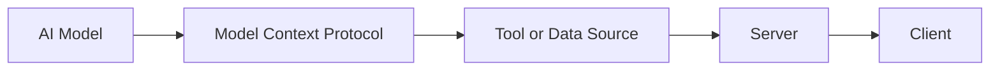
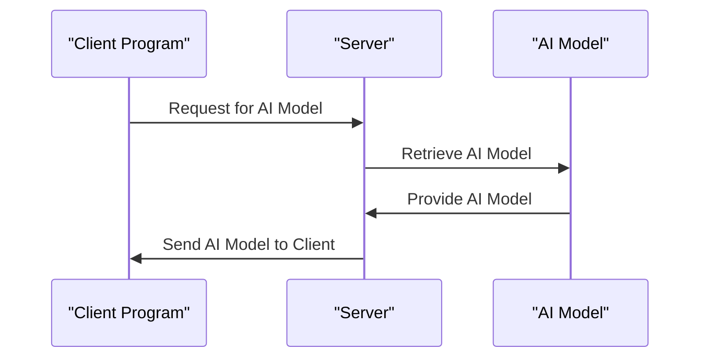
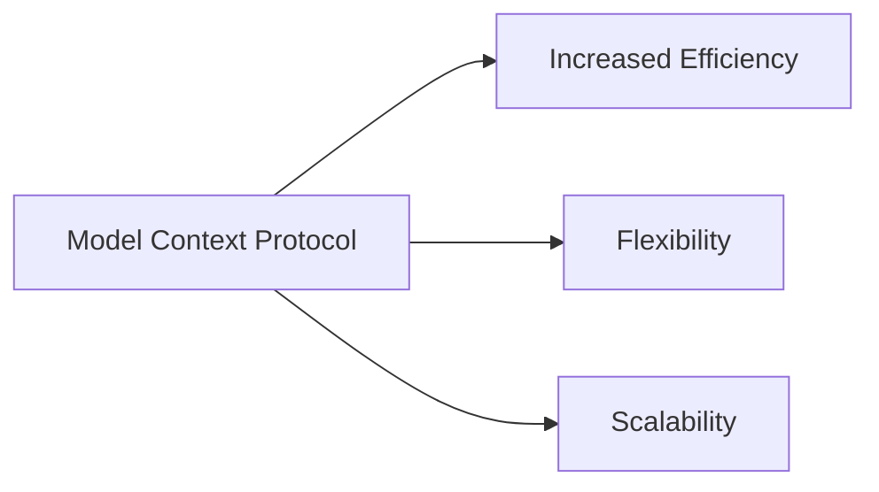

You're probably familiar with how different devices, like your phone and computer, can connect to each other using standardized ports or protocols, such as USB. This standardization makes it easy to plug in your devices and have them work seamlessly together. When it comes to Artificial Intelligence (AI), there's a similar need for standardization to connect AI models to various tools and data sources efficiently. This is where the Model Context Protocol (MCP) comes into play.

Imagine you're working on a project that involves using multiple AI models to analyze data from different sources. Without a standardized way to connect these models to the data and tools you need, the process can become complicated and time-consuming. The Model Context Protocol is designed to simplify this process by providing a standard way for AI models to communicate with each other and with external tools and data sources.

## Quick summary
| Term | Description |
| --- | --- |
| Model Context Protocol (MCP) | A standard protocol for connecting AI models to tools and data sources |
| AI Model | A program designed to perform a specific task, like image recognition or natural language processing |
| Server | A computer or system that provides services or data to other computers over a network |
| Client | A computer or system that requests services or data from a server |
| Standardization | The process of establishing a common standard for something, like the Model Context Protocol for AI models |

To illustrate the importance of standardization, consider a scenario where you're trying to connect different devices that use different types of plugs and sockets. Without a standard protocol, you would need multiple adapters and converters, making the process cumbersome and prone to errors. Similarly, in the context of AI models, standardization enables the development of more complex and sophisticated AI systems by allowing different models to communicate with each other seamlessly.

For instance, think of a smart home system that uses multiple AI models to control lighting, temperature, and security. Without standardization, integrating these models would be a daunting task. However, with the Model Context Protocol, it becomes much easier to connect these models and have them work together in harmony.

## What is the Model Context Protocol?
The Model Context Protocol is a set of rules that defines how AI models can communicate with each other and with external tools and data sources. It's like a common language that all AI models and tools can understand, making it easier to connect them and have them work together. This protocol is designed to be flexible and adaptable, so it can be used with different types of AI models and in various applications.

For example, consider a self-driving car that uses multiple AI models to analyze data from different sensors, such as cameras, lidar, and radar. The Model Context Protocol enables these models to communicate with each other and with the car's computer system, allowing the car to make decisions in real-time. This is just one example of how the Model Context Protocol can be used in real-world applications.

Another example is in the field of finance, where AI models can be used to analyze market trends and make predictions. The Model Context Protocol can be used to connect these models to financial data sources, such as stock prices and trading volumes, enabling more accurate and informed investment decisions.

## Why is Standardization Important?
Standardization is crucial in the development and deployment of AI models. Without a standard protocol, connecting AI models to tools and data sources can be a complex and time-consuming process. It's like trying to connect different devices that use different types of plugs and sockets. A standard protocol like the Model Context Protocol simplifies this process, making it easier to develop, deploy, and maintain AI models.

Here are some steps to follow when implementing the Model Context Protocol:
1. Define the scope of the project and identify the AI models and tools that need to be connected.
2. Determine the type of data that needs to be exchanged between the models and tools.
3. Choose a standard protocol, such as the Model Context Protocol, to use for communication.
4. Implement the protocol and test it to ensure that it is working correctly.
5. Deploy the AI models and tools, and monitor their performance to ensure that they are working together seamlessly.

Additionally, it's essential to consider the following best practices when implementing the Model Context Protocol:
* Use a modular design to make it easier to add or remove AI models and tools as needed.
* Use a standardized data format to ensure that data can be easily exchanged between models and tools.
* Use encryption and other security measures to protect sensitive data and prevent unauthorized access.

## What are Servers and Clients?
In the context of the Model Context Protocol, servers and clients play important roles. A server is a computer or system that provides services or data to other computers over a network. In the case of AI models, a server might provide access to a specific model or a dataset. A client, on the other hand, is a computer or system that requests services or data from a server. For example, a client might be a program that uses an AI model to analyze data.

To illustrate the difference between servers and clients, consider a scenario where you're using a web browser to access a website. The web browser is the client, and the website's server is the server. The client (web browser) requests data from the server (website), and the server responds by sending the requested data to the client.

| Server | Client |
| --- | --- |
| Provides services or data | Requests services or data |
| Typically runs on a powerful computer | Typically runs on a user's device |
| Can handle multiple requests simultaneously | Can only handle one request at a time |

For instance, in a cloud-based AI system, the server might be a cloud-based AI model that provides predictive analytics services, while the client might be a mobile app that requests predictions from the server.

## Real-World Examples
The Model Context Protocol has many real-world applications. For instance, it can be used to connect AI models to data sources in the cloud, making it easier to develop and deploy AI-powered applications. It can also be used to connect AI models to other AI models, enabling more complex and sophisticated AI systems.

Another example is in the field of healthcare, where AI models can be used to analyze medical images and diagnose diseases. The Model Context Protocol can be used to connect these models to medical imaging devices and electronic health records, enabling more accurate and efficient diagnosis and treatment.

For example, a hospital might use the Model Context Protocol to connect an AI model that analyzes MRI scans to a medical imaging device that produces the scans. The AI model can then analyze the scans and provide diagnoses to doctors, who can use the information to develop treatment plans.

## Benefits of the Model Context Protocol
The Model Context Protocol offers several benefits, including increased efficiency, flexibility, and scalability. By providing a standard way for AI models to communicate with each other and with external tools and data sources, the Model Context Protocol makes it easier to develop, deploy, and maintain AI models. This can lead to faster development times, lower costs, and improved performance.

Here are some benefits of using the Model Context Protocol:
* Increased efficiency: The Model Context Protocol simplifies the process of connecting AI models to tools and data sources, making it easier to develop and deploy AI-powered applications.
* Flexibility: The Model Context Protocol is designed to be flexible and adaptable, so it can be used with different types of AI models and in various applications.
* Scalability: The Model Context Protocol enables the development of more complex and sophisticated AI systems by allowing different models to communicate with each other seamlessly.

In addition to these benefits, the Model Context Protocol also enables the development of more transparent and explainable AI systems. By providing a standard way for AI models to communicate with each other and with external tools and data sources, the Model Context Protocol makes it easier to understand how AI models are making decisions and to identify potential biases or errors.

## Key Takeaways
* The Model Context Protocol is a standard protocol for connecting AI models to tools and data sources.
* Standardization is crucial in the development and deployment of AI models.
* Servers and clients play important roles in the Model Context Protocol, with servers providing services or data and clients requesting services or data.
* The Model Context Protocol has many real-world applications, including connecting AI models to data sources in the cloud and connecting AI models to other AI models.
* The Model Context Protocol offers several benefits, including increased efficiency, flexibility, and scalability.
